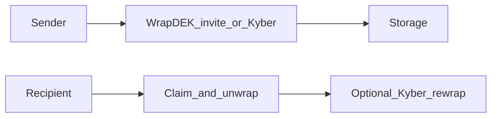

# Email & invite E2E — research archive

**Actionable executive plan (WaaP integration, open send, rollout):** [send_sign_flow_architecture.plan.md](send_sign_flow_architecture.plan.md)

This file keeps **research**: constraints, discarded paths, option trees, crypto bookkeeping, **WaaP vendor Q&A synthesis**, and how that interacts with Filosign’s **Kyber envelope** design. Read **§1** for the **invite-first crypto story** (still relevant for hybrid or fallback); **§0** for **WaaP**; everything after **§4** includes appendices.

---

## 0. WaaP + Account Pregeneration (vendor research)

**Source:** Internal Q&A with Human.tech — treat as **directional** until contracts and engineering deep-dives complete.

### 0.1 Deterministic address from email (pre-auth)

- **Account Pregeneration:** `POST` to `auth.waap.xyz/pregen-account` with email returns a **deterministic, idempotent EVM address** before the user logs in (vendor: same email always returns the same address).
- **Gating:** Endpoint is **abuse-controlled** — expect app credentials, allowlisting, or backend proxy—not a fully public anonymous API.
- **Filosign implication:** **Signer addresses** for `registerFile`, routing, and notifications can be resolved **before** the recipient completes a first-time wallet creation flow in whatever identity stack you use.

### 0.2 Headless signing

- **After first consent:** **Privileges** (scoped pre-approvals) and/or **async signing** so **subsequent** transactions can sign **without Web3 modals**.
- **First touch:** Standard **auth / consent** still applies—not literally zero UI before any consent.
- **Map to Filosign:** EIP-712 payloads, relayer submission, and Dilithium/WASM flows must align with WaaP session and signing APIs.

### 0.3 Commercial model (vendor position)

- **No** per-wallet or MAU SaaS fee to integrate (per vendor); **revenue share on user transaction activity** — validate in **legal/finance** against Filosign volume and signer demographics.

### 0.4 One email, one wallet across OAuth

- Same **email** resolves to the **same wallet** whether the user uses Google, Apple, or direct email (per vendor—confirm for your enabled providers).

### 0.5 Downtime and architecture

- **2PC:** key share client-side, share on vendor infrastructure; vendor frames **non-custodial** risk for funds; **signing/session** may still depend on liveness.
- **Filosign:** Own **retry, queue, support**, and user-visible status when identity or signing services are degraded.

### 0.6 Audit trails (IP, intent, metadata)

- **Not** a built-in WaaP product for IP + intent logging.
- **On-chain:** timestamps and signing **addresses**.
- **Filosign:** Application-layer logging for compliance bundles.

### 0.7 Interaction with §1–§2 (invite / Kyber)

- **Pregen solves EVM identity for an email**, not automatically the **`encryptionPublicKey`** used by [`useSendFile`](packages/react-sdk/src/hooks/files/useSendFile.ts) for **Kyber `KEM.encapsulate`**.
- **Strict E2E symmetric DEK delivery to “email only”** still hits the constraints in **§2** and **Appendix I** unless you add **published PQ keys**, **shared secret / bootstrap**, **vendor-supplied encrypt target**, or **trusted intermediary**.
- **WaaP + §1 invite path** can be **composed:** e.g. deterministic **on-chain signer** early, plus **split-channel or hybrid** only for the **DEK** until `encryptionPublicKey` exists—product chooses how much of §1 remains.

---

## 1. Selected prioritized flow (invite / bootstrap crypto story)

This is the **original** “email-first without prior connection” design. It remains valid **research** if the **encryption bridge** in the executive plan uses OOB bootstrap, hybrid wrap, or compliance-sensitive operator-visible channels.

### 1.0 Legacy note (connection / approve)

The codebase still has **share requests**, **email invites to register**, and **`approveSender`** / **`useApproveSender`**. That path is **not** the main send-and-sign story for mainnet positioning; direction is **open `registerFile` + inbox trust** (see executive plan), with connection-style flows **deprecated** or migrated off the critical path.

### 1.1 Product goals (two tracks)

| Track | Intent |
|--------|--------|
| **Crypto / routing** | Email-first and stranger-friendly sends: invite + claim establishes keys; optional **Kyber re-wrap** after the recipient registers. |
| **Social UX** | **No** on-chain **`approveSender` gate** before **`registerFile`**. **Recipient** gets **trusted inbox** vs **pending** via **Trust sender** + **contact** (after first **accept**). Abuse handled by **rate limits / mute / block**—**not** by blocking chain registration. |

### 1.2 Invite & bootstrap (split-channel default in this research track)

- **Baseline**: **Split-channel (A3)** — Filosign emails **link + routing**; **access code / OTP** stays **sender → recipient OOB**; ideally **never persisted** server-side; unwrap **client-side** after ciphertext download. **Exact KDF** belongs in `envelope-protocol` todo.
- **Optional modes** (weaker or niche): **A1** URL fragment claim secret; **A2** OTP in same email (single-channel, simpler UX, operator sees bootstrap if they compose mail); **manual** link-only; optional **OAuth “send from my inbox.”**  
  See **Appendix A** for variant table.

### 1.3 Post-onboard: Kyber re-wrap (chosen in this track)

After claim + recipient **`encryptionPublicKey`** exists: **re-wrap the same file DEK** for Kyber (**stable `pieceCid` / same ciphertext**), **delete invite unwrap artifacts**. This **does not rotate** the symmetric DEK; it **retires invite-only unwrap paths** and aligns ongoing access with registered keys.

**True DEK “invalidation” for the blob** requires **new symmetric DEK + re-encrypt + replace object** (new CID story)—**deferred** as non-default; see **§3** and **Appendix E**.

### 1.4 Chain & trust (replacement for old graph)

- **`FSFileRegistry` / `registerFile`**: Remove **`approvedSenders`** loop so **strangers can be listed as signers** without prior **`approveSender`** txs (**migration detail →** [send_sign_flow_architecture.plan.md](send_sign_flow_architecture.plan.md)).
- **Inbox trust** is **off critical path**: **DB / indexer** edges (**Trust sender**, **contact**), not a prerequisite to send.

### 1.5 Anchoring & sender obligation

- **MVP**: **Anchor-at-send** — **`RegisterFile` EIP-712 + submit in the same Send session** as upload (fits **`SIGNATURE_VALIDITY_PERIOD`** ~2m in [`FSFileRegistry.sol`](apps/contracts/src/FSFileRegistry.sol)).
- **Invariant**: **No second sender session** to finish registration (no “come back to sign **`registerFile`**”). **Optional later**: **Path B** — relayer submits **`registerFile` later** using **signature produced at Send** only if contract gains **longer, tightly bound validity** (security review). **Appendix F**, **Appendix H** (choreography).

### 1.6 Wallet ↔ email (audit)

- **Tier A (direction)**: **Commitment** over **normalized email + wallet (+ salt/scope)** — optional on-chain **`SignerEmailAttributed`/`signerEmailCommitment`**; pair with **EIP-712** attestation (implement as a small new util under `packages/react-sdk/src/utils/` when spec is fixed—see executive plan **commitments** todo). Raw email on-chain (**Tier C**) only with legal/PII decision. **Appendix H**.

### 1.7 Near-term vs later (roadmap snapshot for this research track)

| Horizon | Focus |
|---------|--------|
| **Near** | Split-channel invite MVP, **re-wrap** + mitigations, **remove `approvedSenders`**, **split inbox**, **commitment** + attestation wiring. |
| **Medium** | **Lit** PKP / Seal-style eval (**Appendix B**), or **passkeys** as recipient root—only if product wants threshold or device-bound semantics. |
| **Long** | **WKD / published pubkey** discovery for users who publish keys—**not** relied on for cold email. |

---

## 2. Problem shape (constraints)

1. **No public EVM address for an arbitrary email** without your mapping, user binding, or bootstrap secret—**pregen** (§0) addresses **mapping** when WaaP is in use; without it, encrypt-before-send to raw email still needs **OOB secret**, **directory key**, or **hosted/gate authority** (**Appendix I**).
2. **Current stack** ([`useSendFile`](packages/react-sdk/src/hooks/files/useSendFile.ts)): **Kyber `KEM.encapsulate`** to **registered** `encryptionPublicKey`s—**pairwise online KEM**, not anonymous mail, until an **invite path** or **vendor encrypt bridge** extends it.

---

## 3. Re-wrap vs DEK rotation (math, no hand-waving)

| Statement | Meaning |
|-----------|--------|
| **Re-wrap** | New **packaging** of the **same DEK** (invite wrap → Kyber wrap). **Same** `Enc(DEK, doc)` bytes. |
| **“Invalidate invite DEK for this ciphertext”** | Requires **new DEK** and **new ciphertext** at canonical storage (and **new `pieceCid`** if chain pins CID)—**recipient-led re-encrypt** possible; **re-wrap alone** insufficient. |
| **Operational win of re-wrap + artifact delete** | Server no longer helps recover DEK via **invite channel**; **Kyber-only** ongoing. Anyone who **already held** DEK + old blob still wins **for that copy**. |

Marketing: **“Invite channel retired”** ≠ **“symmetric DEK destroyed”** unless you ship rotation (**§1.3**).

---

## 4. Discarded, deferred, or non-primary paths

- **Signer-only `registerFile` / promotion without sender**: **Blocked** today—**`RegisterFile`** must recover **`sender`**, **`/files`** binds auth to sender wallet; **Appendix F**.
- **Ephemeral S3-only envelope → later “promotion” to canonical CID**: **Not primary**—multi-step, contract ordering friction; kept as **Appendix E**.
- **IBE / enterprise key escrow**: fits **identifier** UX but **central authority** semantics—**Appendix B**.
- **Single-channel OTP as default**: valid **convenience** path; **weaker vs Filosign-as-adversary** during invite vs **§1.2** split-channel.
- **Lit as drop-in replacement for pairwise Kyber**: **threshold-gated decryption** story, **not** same trust model—**Appendix B** before committing.
- **Heavy `onlyServer` finalize / delegation** for **`registerFile`**: only if **§1.5** Path A and bounded Path B are insufficient.

---

## Appendices

### Appendix A — Invite channel variants

| Variant | Bootstrap | Notes |
|---------|-------------|--------|
| **A3** (default in invite track) | Link from Filosign + **OOB code** from sender | Strongest honest story that **Filosign never holds** full unwrap capability **if** code never logs. |
| **A1** | **Secret in URL fragment** | Server may still template host part; fragment handling client-only. |
| **A2** | **OTP/body in Filosign email** | Easiest UX; **Filosign mail pipeline** may possess full bootstrap. |
| Manual | Sender distributes link + secret | Air-gap / paranoid. |
| OAuth send-from-sender | Unwrap secret composed in **sender’s** MUA | Hard on mobile; strong if done right. |

**Tiered product (research):** default **A3**; optional **A2**; enterprise **OAuth** where needed.

---

### Appendix B — Lit, IBE, WKD/pubkey directory, passkeys

- **Lit** ([overview](https://www.litprotocol.com), [docs](https://docs.dev.litprotocol.com/)): **PKP + OAuth/email**, **Lit Actions**; **Seal-style** gated decrypt = **threshold participation**—honest label **≠** in-app pairwise **Kyber to static pubkey**. **Pricing/metering** evolves—check current docs before PoC.
- **IBE / hosted identifier encryption**: workable in **enterprise**; implies **policy/escrow** expectations.
- **WKD / Autocrypt / org directory**: great when keys **exist**; **strangers** usually have **no** published key.
- **Passkeys/WebAuthn as recipient root**: first-open creates credential-bound keys; still **first-touch onboarding**; UX-heavy.

---

### Appendix C — Two-layer trust story & marketing

**Layer 1 — Ciphertext at rest:** Client encrypts before upload; DB/S3 see **ciphertext + wrapped DEKs**; no server-side PDF decrypt → **strong vs storage/DB compromise** for **plaintext**.

**Layer 2 — Invite bootstrap:** If **Filosign** composes **full unwrap material** in **single email**, adversary class includes **operator/mail subprocessor** at issue time. **Split-channel** restores **“Filosign didn’t possess access code”** if implementation is disciplined.

**Claims to pair:**

- **At rest**: ciphertext-only operations.
- **Invite window**: single-channel vs split-channel honesty (see above).
- **On-chain / Filecoin**: integrity, binding, durability—not automatically “operator cannot read” without **Layer 2** discipline.

---

### Appendix D — Re-wrap mitigation checklist (engineering)

- Split-channel default when used; **client-only** unwrap; **no** OTP/wrapped-DEK in logs/analytics.
- **TTL**, one-time invites, delete invite rows after re-wrap; rate-limit resolve/download.
- **Step-up auth** on first re-wrap API if policy requires.
- **USP**: two-layer wording (**§3**); do not claim **DEK rotation** unless shipped.

---

### Appendix E — Deferred: ephemeral staging + DEK rotation promotion

**Idea (not primary):** Staging object encrypted with **`DEK_temp`** → recipient decrypts → re-run production pipeline with **`DEK_prod`**, new **`pieceCid`**, **`registerFile`** on final blob → delete stager.

**Why deferred:** Needs **clean multi-phase** state machine; **`registerFile`** / signatures should target **final** CID; **sender read** during staging needs dual-wrap or local cache; **signer-alone** canonical registration still **impossible** without **sender** **`RegisterFile`** authorization **today** (**Appendix F**). Revisit only with **contract/product** changes.

---

### Appendix F — Codebase feasibility snapshot

- **Same math anywhere**: Any client with **plaintext**, **placement manifest**, **`encryptionPublicKey`s**, **`encodeFileData(sender,…)`** can run **`encryption.encrypt` + `KEM.encapsulate`** ([`useSendFile`](packages/react-sdk/src/hooks/files/useSendFile.ts)).
- **Ordering**: **`registerFile` before `registerFileSignature`** ([`FSFileRegistry.sol`](apps/contracts/src/FSFileRegistry.sol)); [`useSignFile`](packages/react-sdk/src/hooks/files/useSignFile.ts) after registration.
- **Sender cannot be “removed” from `RegisterFile` authorization** without **new** delegation/contract surface; **same-session** signing satisfies product (**§1.5**).
- **Until `approvedSenders` removed**, stranger signers **revert** `registerFile` regardless of ciphertext—**address in** [send_sign_flow_architecture.plan.md](send_sign_flow_architecture.plan.md).

| Step | Who | Note |
|------|-----|------|
| Build ciphertext + wraps | Sender (or anyone with plaintext+keys) | **`sender`** in encoded payload = real initiator |
| **`RegisterFile` + POST `/files`** | **Sender wallet session** | Auth + ECDSA recover |
| **`SignFile` + POST `…/sign`** | **Signer** | After file registered |

**Path B risks** (long-lived `RegisterFile` intent): narrow preimage, **deadline**, **nonce**, relay abuse—design with **`AcceptEnvelope`/policy** if used as gate—not in invite-track MVP.

---

### Appendix G — Why `approvedSenders` existed

[`FSFileRegistry`](apps/contracts/src/FSFileRegistry.sol) enforced **`approvedSenders(signer, sender)`** via [`FSManager`](apps/contracts/src/FSManager.sol): **spam/abuse** mitigation + explicit “**signer consented to be listed by this sender**.” **Tradeoff**: blocks **DocuSign-like cold send** until optional **`AcceptEnvelope`**-style evidence or **rule removal**. **Product direction**: **remove chain gate**; replace with **§1.4** inbox trust + server anti-abuse.

---

### Appendix H — Wallet ↔ email tiers & choreography sketches

| Tier | Content |
|------|---------|
| **A** | **`bytes32` commitment** (email+wallet+scope/salt); optional event; **EIP-712** attestation |
| **B** | **`partiesHash`** over ordered roles/commitments |
| **C** | **Plaintext email** on-chain/storage—GDPR/legal |

**Choreography (conceptual)** — **Path A**: optional invite staging POST → **same-session** `RegisterFile` → recipient auth/unwrap → **Trust/contact** → **`POST …/sign`**. **Path B**: Send session stores **signed registration intent** → relayer submits **`registerFile`** when valid → sign. **Duplicative detail** consolidated in [send_sign_flow_architecture.plan.md](send_sign_flow_architecture.plan.md) for execution.

---

### Appendix I — Honest feasibility

**Strict classical E2E to arbitrary email with zero bootstrap** is **not available** without at least one of: **published recipient keys**, **shared secret / OTP / passphrase**, or **trusted intermediary** (KMS, MPC, Lit-class policy).

Bridging invite-email UX to **registered Kyber** implies an **invite/claim substrate** (**§1–§2**) **or** another bridge (e.g. **§0** identity + explicit **encryptionPublicKey** publication / vendor material).

---
