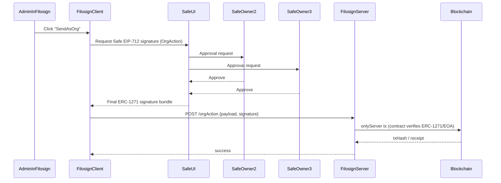

## Desired product outcome (re-stated)
- **Individuals**: keep current “EOA (or embedded EOA) signs” UX; no Safe required.
- **Enterprises**: allow an **Organization identity** that can be a **Safe/contract wallet**; orgs can have projects and members with roles.
- **Trustless verification**: after the fact, anyone can independently verify the on-chain record (who signed, what piece CID, timestamps/txs), even if Filosign disappears.
- **BYO Safe**: enterprises bring their existing Safe address; Filosign does not create/manage custody.

## Product tiers (final target)
### Tier 1 — Individual
- Single user account.
- Sender actions are performed **from the individual’s wallet** (EOA / embedded EOA).
- No org/project management required.

### Tier 2 — Teams
- Web2-style **organization + team member roles** (off-chain RBAC) for collaboration.
- **No Safe required**. Senders still send **from their own wallets** (EOA / embedded EOA), but the app records actions under an org/project context for workflow, audit logs, and reporting.
- Optional “maker/checker” workflow can be introduced off-chain (e.g., one admin prepares, another approves) without multisig.

### Tier 3 — Enterprise
- Everything in Teams plus enterprise add-ons (SSO/SCIM, deeper audit, custom policies).
- Optional **multisig governance** via **BYO Safe**:
  - org identity can be a Safe/contract wallet,
  - org-level approvals require Safe owner threshold,
  - enabled as a higher-tier feature (sold as governance/security, not a requirement).

## Safe mental model (so the UX makes sense)
- A **Safe** is a **contract wallet address** (the org identity) with:
  - a list of **owners** (usually EOAs like MetaMask/Ledger wallets), and
  - a **threshold** (e.g. 2-of-4 owners must approve).
- Safe “approval” happens in **Safe’s signing flow** (Safe UI + owners’ wallets). Filosign should not re-implement Safe owner management.
- **Not all owners need a Filosign account** to approve Safe prompts. Owners can approve with their wallets via Safe even if they never log into Filosign.

## Key constraints in current codebase
- Your contracts currently validate signatures via `ECDSA.recover(...) == expectedAddress`, which is **EOA-only** and rejects Safe/contract wallets.
- Your app’s DocuSign-like roles exist today at the **envelope/file level** (sender/signer/viewer stored in DB) but there is no **org/project/RBAC** system.
- Core flows are server-relayed (`onlyServer`), so the main change is **how you validate user authorization signatures**.

## What ERC‑1271 gives you (and why it’s the minimum on-chain enterprise upgrade)
- ERC‑1271 is the standard that lets a **contract wallet** (like Safe) say “this signature is valid for me.”
- Implementing ERC‑1271 support in your signature validation makes the system **additive**:
  - EOAs keep working.
  - Contract wallets (Safe) start working.
- This enables “org identity = Safe address” without needing on-chain org registries.

## Architecture: keep org/project/roles off-chain, keep proofs on-chain
### On-chain remains focused on immutable proofs
- File registration + signer set commitment + signature events.
- Sender approvals (sharing) and other meta-tx authorizations.

### Off-chain (DB/server) is where enterprise structure lives
Introduce:
- `organizations`
- `projects` (belongs to org)
- `org_members` (user ↔ org role)
- `project_members` (user ↔ project role)
- `org_wallets` (org identity addresses; can be EOA or Safe)
- `audit_logs` (enterprise expectation)

These tables gate *who is allowed to initiate actions* (send envelope, add participants, view project docs, etc.) while the **resulting signatures** remain verifiable on-chain.

## Onboarding & UX: individuals vs organizations
### Individuals (no Safe)
- Login as today (Privy/social/embedded EOA or external wallet).
- Create and send envelopes as an individual sender address.

### Teams (no Safe; org context + individual senders)
- Users log in as individuals.
- Create an org + projects in Filosign (DB).
- Invite teammates; assign org/project roles (off-chain RBAC).
- When a user sends an envelope “as the org,” the **on-chain sender is still the individual’s wallet**, but the org/project context and permissions are enforced off-chain and captured in audit logs.

### Enterprise (BYO Safe; multisig governance)
- User logs in as an individual (EOA) to the app.
- User creates an organization in the app (DB record).
- Org admin adds the org’s Safe address as an `org_wallet`.
- To prove control/authorization, the org requires a **Safe signature** (ERC‑1271) for a one-time “link org wallet” action.
- Thereafter, users can “act as org” on projects depending on org/project roles.

## Org authorization: chosen default (Pattern 1 — Safe signs, Filosign relays)
You chose the minimal enterprise-friendly approach:
- Filosign requests an **EIP-712 signature from the org Safe** for the specific org-level action.
- Safe owners approve asynchronously in Safe; once the threshold is met, the initiating admin’s browser receives the final signature.
- Filosign immediately submits the on-chain action using the existing server-relay pattern (`onlyServer`), attaching that signature.

This avoids needing a Safe “transaction queue” integration, webhooks, or polling Safe state: Filosign just waits for the Safe signature to be produced.

### Pattern 1 sequence (example)

## Org authorization UX options
You asked for pros/cons and how to implement both.

### Option 1: Require a Safe signature for each org-level action (max explicit consent)
- **Pros**:
  - Strongest “user-in-the-loop” posture.
  - Clean audit semantics: every org action has a corresponding Safe authorization.
  - No session theft concerns.
- **Cons**:
  - More friction; Safe signing can be slower (multi-approver).
  - Can feel heavy for frequent actions.
- **Implementation**:
  - Add an EIP-712 `OrgAction` typed message (actionType + parameters hash + nonce + deadline).
  - For each org-level API route, require this signature and validate it on-chain style (ERC‑1271-aware check).
  - Store nonce per org wallet address (DB or on-chain).

### Option 2: One Safe signature creates a short-lived “org session” (better UX)
- **Pros**:
  - Much better UX for active sessions (like “sudo mode”).
  - Still cryptographically anchored: Safe signature is the session grant.
- **Cons**:
  - You must secure session tokens carefully (httpOnly cookies, strict expiry, rotation).
  - Requires clear UX + audit logs (who created session, when, from where).
- **Implementation**:
  - Add endpoint `POST /orgs/:orgId/session/start` that requests a Safe signature over:
    - orgId
    - userId (or wallet)
    - sessionId
    - issuedAt / expiresAt
    - nonce
  - Server verifies the signature using ERC‑1271-aware verification and issues an **org-session JWT** (short TTL, e.g. 15–60 min).
  - Downstream org/project routes require this org-session token.
  - Audit log every session start + privileged action.

**Security guidance**: Option 2 is usually what enterprises prefer for usability, as long as it’s clearly scoped (short TTL) and logged.

## Contract changes (ERC‑1271 support)
Update signature verification in:
- `packages/contracts/src/FSKeyRegistry.sol`
- `packages/contracts/src/FSFileRegistry.sol`
- `packages/contracts/src/FSManager.sol`

Replace direct `ECDSA.recover == expected` checks with an abstraction:
- If `expected` is an EOA: ECDSA recover.
- If `expected` is a contract: call `isValidSignature` (ERC‑1271) or use OZ `SignatureChecker`.

This must be applied to every place you validate EIP‑712 signatures (register, sign, approve-sender).

### Rollout impact
- Because your contracts are not proxy-upgradeable, this is a **redeploy** of `FSManager` + registries.
- On testnet this is trivial. For mainnet, plan a clean cutover (new addresses) and keep old verification tooling available.

## SDK/server/client changes
- **Client**: when user selects “act as org Safe,” use a Safe-compatible provider to produce signatures.
- **Server**: keep relaying `onlyServer` contract calls, but accept signatures that may be Safe/1271.
- **DB**: add org/project/membership tables; keep file-level participants as today.

## Enterprise feature set (minimal first)
- Org creation + org wallet linking
- Project creation under org
- Roles: org_admin, project_admin, member, auditor
- Audit logs for org actions

## Billing (Polar) + free trial requirements
This plan assumes the Polar integration plan is used for payments and entitlements, with one key requirement:\\n
- **7-day free trial with no card** is **app-managed**, not Polar trial checkout (Polar trials collect payment info at checkout).\\n
Tie billing entitlements to the tier model:\\n
- Individual: entitlement attached to a user.\\n
- Teams: entitlement attached to an org (with per-seat limits enforced off-chain if needed).\\n
- Enterprise: entitlement attached to an org, plus Safe governance features.\\n
\\n
Implementation notes:\\n
- Use Polar checkout only when the user/org upgrades.\\n
- Use Polar webhooks to keep subscription state in sync.\\n
- Keep access gating authoritative in your DB (entitlements).\\n

## Files to touch (when you switch to implementation)
- Contracts:
  - `packages/contracts/src/FSFileRegistry.sol`
  - `packages/contracts/src/FSKeyRegistry.sol`
  - `packages/contracts/src/FSManager.sol`
- Server:
  - `packages/server/lib/db/schema/*` (new org/project tables)
  - `packages/server/api/routes/*` (orgs/projects/session)
- Client:
  - Org switcher UI + org session UX
  - Safe signature integration paths

## Effort estimate (relative)
- **ERC‑1271 support only (no org/projects UI)**: low-to-medium (contained contract + server validation changes).
- **Org/projects/RBAC MVP (off-chain) + org wallet linking**: medium.
- **Full enterprise polish (SSO/SCIM, advanced audit, seat mgmt)**: high (but independent of ERC‑1271).

## Notes (avoid surprises)
- ERC‑1271 support is **additive**: EOAs continue working; Safe/contract wallets start working.
- Because your contracts are not proxy-upgradeable, ERC‑1271 is deployed as a **new contract set** (testnet is easy; mainnet needs a clean cutover).
- Keeping org/project/RBAC off-chain does not weaken the “trustless signatures” guarantee, because the verifiable record is still on-chain.
