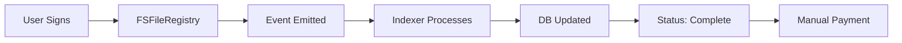
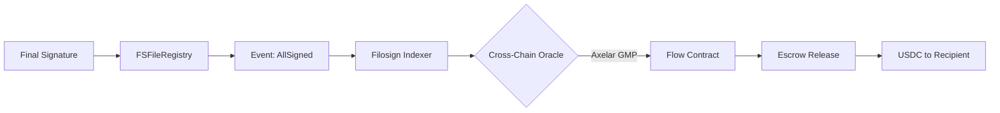
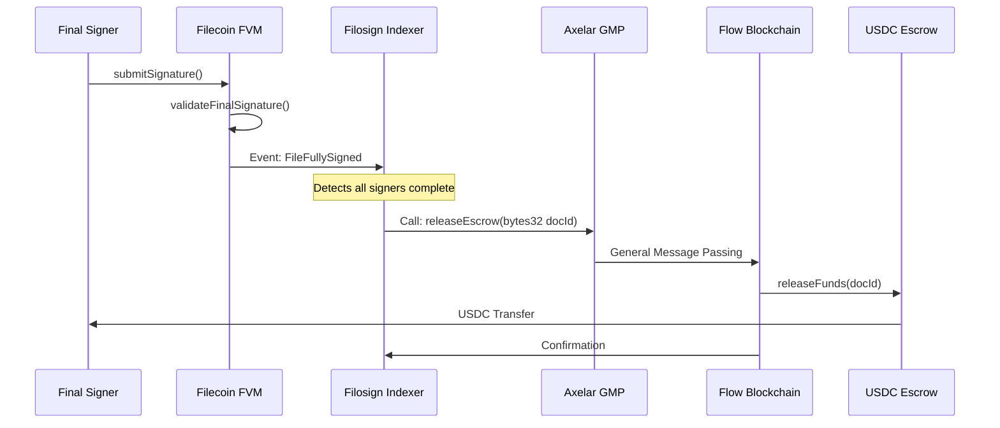

# Flow Integration Validation: Smart Escrow & Automated Payroll

## Executive Summary

**Verdict**: This integration is **HIGHLY RELEVANT** and provides significant value for Filosign's enterprise and freelance use cases. It transforms the platform from passive document signing to active contract execution with automated financial settlement.

**Strategic Fit Score: 8/10**

- Directly addresses enterprise payment automation needs
- Large bounty pool ($10,000) with clear implementation path
- Differentiates from competitors (DocuSign, etc.)
- Natural extension of existing "signature completion" flow

---

## Value Proposition Analysis

### Current State: Static Document Signing

```
Document Signed → Manual Payment Processing → Delayed Settlement
```

### Proposed State: Active Contract Execution

```
Document Signed → Automatic Escrow Release → Instant Payment
```

### Benefits by User Segment


| Segment           | Benefit                                      | Value Level |
| ----------------- | -------------------------------------------- | ----------- |
| **Freelancers**   | Guaranteed payment upon client signature     | Very High   |
| **Enterprises**   | Automated contractor payments, reduced admin | High        |
| **Legal Teams**   | Enforceable escrow with objective triggers   | High        |
| **Finance Depts** | Programmable payroll streams vs lump sums    | Medium-High |


### Unique Differentiation

- **DocuSign**: Static PDF signing only
- **HelloSign**: Same, no payment integration
- **Filosign + Flow**: Signed document = executed payment

---

## Technical Architecture Assessment

### Current Architecture (Filecoin FVM)




### Proposed Architecture (Filecoin + Flow)




### Cross-Chain Flow Details




---

## Implementation Feasibility

### Components Required


| Component                  | Complexity | Status | Notes                                |
| -------------------------- | ---------- | ------ | ------------------------------------ |
| **Flow Escrow Contract**   | Medium     | New    | Cadence USDC vault                   |
| **Indexer Oracle Logic**   | Medium     | Extend | Add Flow trigger to existing indexer |
| **Cross-Chain Messaging**  | High       | New    | Axelar GMP integration               |
| **Frontend Payment Setup** | Low        | New    | Escrow creation UI                   |
| **Database Updates**       | Low        | Extend | Track escrow status                  |


### Cadence Contract Structure

**New File:** `packages/flow/contracts/EscrowPayment.cdc` (simplified)

```cadence
pub contract FilosignEscrow {
    
    pub resource EscrowVault {
        pub let docId: String
        pub let amount: UFix64
        pub let payer: Address
        pub let recipient: Address
        pub var isReleased: Bool
        
        pub fun release(oracleProof: String) {
            // Verify oracle authorization
            pre {
                !self.isReleased: "Already released"
                FilosignEscrow.verifyOracleProof(oracleProof, self.docId)
            }
            
            // Transfer USDC to recipient
            self.isReleased = true
            // ... USDC transfer logic
        }
    }
    
    pub fun verifyOracleProof(proof: String, docId: String): Bool {
        // Verify Axelar cross-chain message
        // Check Filecoin signature completion
        return true
    }
}
```

---

## Risk & Challenge Analysis

### Technical Risks


| Risk                    | Likelihood | Impact | Mitigation                        |
| ----------------------- | ---------- | ------ | --------------------------------- |
| **Cross-chain latency** | High       | Medium | Build in confirmation thresholds  |
| **Oracle compromise**   | Low        | High   | Multi-sig oracle, Axelar security |
| **Flow network issues** | Low        | Medium | Fallback to manual release        |
| **USDC bridge risks**   | Medium     | Medium | Use native Flow USDC, not bridged |
| **Smart contract bugs** | Medium     | High   | Extensive testing, audits         |


### Business Risks


| Risk                | Assessment                                             |
| ------------------- | ------------------------------------------------------ |
| **User complexity** | Users must understand cross-chain mechanics            |
| **Gas costs**       | Two networks = double gas fees                         |
| **Regulatory**      | Automated payments may trigger money transmission laws |
| **Competition**     | Specialized escrow services (Escrow.com, etc.)         |


---

## Alternative Approaches

### Option 1: Native Filecoin Escrow (Simpler)

- Use FVM native escrow instead of Flow
- Single network, lower complexity
- **Trade-off**: Less performant for high-frequency payments

### Option 2: Third-Party Payment Rails

- Integrate Stripe/ACH instead of blockchain
- Better UX for traditional users
- **Trade-off**: Not on-chain, loses "decentralized" narrative

### Option 3: Hybrid (Recommended)

- Use Flow for streaming/recurring payments
- Keep Filecoin for one-time escrow
- User selects payment method

---

## Implementation Recommendations

### Phase 1: Simple Escrow (MVP)

**Scope**: One-time USDC payment on signature completion
**Timeline**: 3-4 weeks
**Bounty Fit**: High ($10,000 pool accessible)

**Components:**

1. Cadence escrow contract (hold USDC)
2. Indexer oracle service (watch FVM → call Flow)
3. Frontend escrow creation flow
4. Database escrow tracking

### Phase 2: Streaming Payroll (Advanced)

**Scope**: Continuous payment streams (e.g., $500/day for 30 days)
**Timeline**: 6-8 weeks
**Dependencies**: Phase 1 complete

**Components:**

1. Cadence streaming vault
2. Rate-limited releases
3. Cancellation/penalty logic

---

## Economic Analysis

### Cost Structure


| Item                   | Filecoin | Flow  | Total      |
| ---------------------- | -------- | ----- | ---------- |
| Document registration  | $0.01    | -     | $0.01      |
| Signature submission   | $0.005   | -     | $0.005     |
| Escrow creation        | -        | $0.02 | $0.02      |
| Cross-chain oracle     | $0.10    | $0.05 | $0.15      |
| Escrow release         | -        | $0.01 | $0.01      |
| **Total per contract** |          |       | **~$0.19** |


### Revenue Potential

- Escrow fees: 0.5-1% of payment value
- SaaS subscription for automated payments
- Premium feature: streaming payments

---

## Competitive Landscape


| Competitor          | Escrow | Automated     | Cross-Chain | Notes                                     |
| ------------------- | ------ | ------------- | ----------- | ----------------------------------------- |
| **DocuSign**        | ❌      | ❌             | ❌           | No payment integration                    |
| **Escrow.com**      | ✅      | ❌             | ❌           | Manual process, high fees (3.25%)         |
| **Request Network** | ✅      | ✅             | ❌           | Invoice-based, not document-triggered     |
| **Superfluid**      | ✅      | ✅ (streaming) | ❌           | No document signing connection            |
| **Filosign+Flow**   | ✅      | ✅             | ✅           | Unique: document signing triggers payment |


**Conclusion**: This combination is unique in the market

---

## Bounty Alignment

### Flow: The Future of Finance ($10,000 pool)

**Requirements Met:**

1. **Smart Escrow**: Cadence contract holds USDC until signature complete
2. **Automated Payroll**: Streaming payments triggered by document completion
3. **Cross-Chain**: Filecoin FVM → Flow via indexer/oracle
4. **Active Execution**: Not just signing, but financial settlement

**Bonus Point**: Combines well with other bounty integrations:

- World ID: Biometric verification before payment release
- Storacha: Document stored on Storacha, payment on Flow
- Zama: Confidential payment amounts

---

## Final Recommendation

### Go/No-Go Decision: **GO** ✅

**Priority**: Medium-High (after World ID, before Zama FHE)

**Reasoning:**

1. Clear market need (freelance/contractor payments)
2. Technical feasibility established
3. Large bounty pool ($10,000)
4. Strategic differentiation
5. Buildable within 4-6 weeks

**Suggested Sequence:**

1. World ID (biometric verification - highest value)
2. **Flow Escrow** (this feature - active payments)
3. Storacha (storage optimization)
4. Lit Protocol (if time permits)
5. Zama FHE (advanced feature)

---

## Implementation Sketch

### High-Level Steps

1. **Cadence Contract** (~1 week)
  - Create escrow vault resource
  - USDC integration
  - Oracle authentication
2. **Indexer Extension** (~1 week)
  - Watch for `FileFullySigned` event
  - Cross-chain message construction
  - Axelar GMP integration
3. **Oracle Service** (~1 week)
  - Validate signature completion
  - Sign release message
  - Call Flow contract
4. **Frontend** (~1 week)
  - Escrow creation UI
  - Payment amount input
  - Status tracking
5. **Testing** (~1 week)
  - Testnet deployment
  - End-to-end flow
  - Edge cases (disputes, etc.)

**Total Estimate**: 4-5 weeks with 2 developers

---

## Open Questions to Resolve

1. **Dispute Resolution**: How are payment disputes handled?
2. **Partial Payments**: Release portion after each signature?
3. **Cancellation**: Can payer cancel before all signatures?
4. **KYC Requirements**: Does escrow trigger money transmitter laws?
5. **Fallback**: What if Flow network is down?

These should be clarified before implementation begins.