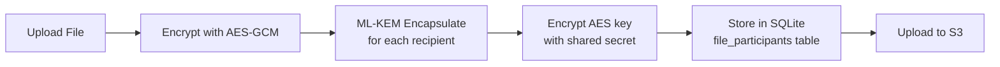

# Lit Protocol Integration Plan

## Overview

Replace the current ML-KEM-1024 + SQLite-based encryption with Lit Protocol V1 Naga SDK. Access control conditions will specify that only the sender's wallet and recipient wallets can decrypt, eliminating centralized key storage.

## Architecture Changes

### Current Flow (ML-KEM + SQLite)




### New Flow (Lit Protocol)

```mermaid
flowchart LR
    A[Upload File] --> B[Encrypt with Lit SDK<br/>set access conditions]
    B --> C[Access Control:<br/>walletAddress in [recipients]]
    C --> D[Upload encrypted blob<br/>+ metadata to S3]
    D --> E[SQLite stores only<br/>access condition hashes]
    E --> F[Recipient requests<br/>decryption from Lit]
```


## Implementation Steps

### Phase 1: Add Lit Protocol Dependencies

**Files:**

- `[packages/lib/react-sdk/package.json](packages/lib/react-sdk/package.json)` - Add `@lit-protocol/lit-node-client`
- `[packages/lib/crypto-utils/package.json](packages/lib/crypto-utils/package.json)` - Add Lit crypto dependencies

**Changes:**
Add `@lit-protocol/lit-node-client@^8.0.0` to dependencies.

---

### Phase 2: Create Lit Protocol Service Layer

**New Files:**

1. `[packages/lib/crypto-utils/src/lit/client.ts](packages/lib/crypto-utils/src/lit/client.ts)`
  - LitNodeClient initialization for Naga network (datil-dev/datil-test/datil)
  - Network config constants
2. `[packages/lib/crypto-utils/src/lit/encryption.ts](packages/lib/crypto-utils/src/lit/encryption.ts)`
  - `encryptWithAccessControl(data, authorizedWallets[])` function
  - Generates unified access control conditions
  - Returns encryptedBlob + accessControlHash
3. `[packages/lib/crypto-utils/src/lit/decryption.ts](packages/lib/crypto-utils/src/lit/decryption.ts)`
  - `decryptWithAuth(encryptedBlob, authSig)` function
  - Obtains decryption shares from Lit nodes
  - Returns decrypted data
4. `[packages/lib/crypto-utils/src/lit/access-control.ts](packages/lib/crypto-utils/src/lit/access-control.ts)`
  - `buildWalletAccessConditions(walletAddresses[])` helper
  - Creates Lit ACC (Access Control Conditions) for EVM addresses

---

### Phase 3: Update Database Schema

**File:** `[packages/server/lib/db/schema/file.ts](packages/server/lib/db/schema/file.ts)`

**Changes to `fileParticipants` table:**
Replace `kemCiphertext` and `encryptedEncryptionKey` columns with:

- `accessControlHash` (text) - Hash of the access control conditions
- `litHash` (text, optional) - Lit Protocol ciphertext hash for verification

**Migration:**

- Create new table schema
- Backward compatibility: Keep old columns nullable for existing files

---

### Phase 4: Update Server API Routes

**Files:**

1. `[packages/server/api/routes/files/index.ts](packages/server/api/routes/files/index.ts)`
  - Update `POST /files` - Accept `accessControlHash` instead of KEM data
  - Update `GET /files/:pieceCid` - Return access control conditions instead of encrypted keys
  - Remove KEM-specific endpoints
2. **[NEW]** `[packages/server/api/routes/lit/index.ts](packages/server/api/routes/lit/index.ts)`
  - `POST /lit/store-conditions` - Store access conditions for a file
  - `GET /lit/conditions/:pieceCid` - Retrieve access conditions for decryption

---

### Phase 5: Update React SDK Hooks

**Files:**

1. `[packages/lib/react-sdk/src/hooks/files/useSendFile.ts](packages/lib/react-sdk/src/hooks/files/useSendFile.ts)`
  - Replace ML-KEM encapsulation with Lit encryption
  - Current (lines 74-127): ML-KEM loop for each participant
  - New: Single Lit encryption call with all authorized wallets
  - Upload encrypted blob directly
2. `[packages/lib/react-sdk/src/hooks/files/useViewFile.ts](packages/lib/react-sdk/src/hooks/files/useViewFile.ts)`
  - Replace ML-KEM decapsulation with Lit decryption
  - Fetch access conditions from server
  - Generate authSig from wallet
  - Call Lit network for decryption
3. `[packages/lib/react-sdk/src/hooks/files/useFileInfo.ts](packages/lib/react-sdk/src/hooks/files/useFileInfo.ts)`
  - Update to return access control conditions instead of KEM ciphertexts

---

### Phase 6: Add Lit Context Provider

**New File:** `[packages/lib/react-sdk/src/context/LitProvider.tsx](packages/lib/react-sdk/src/context/LitProvider.tsx)`

- Initialize LitNodeClient on app load
- Handle network switching (dev/test/mainnet)
- Provide `useLitClient()` hook

**Update:** `[packages/lib/react-sdk/src/context/FilosignProvider.tsx](packages/lib/react-sdk/src/context/FilosignProvider.tsx)`

- Wrap with LitProvider
- Pass chain configuration

---

### Phase 7: Environment Configuration

**Files:**

- `[packages/server/.env.template](packages/server/.env.template)` - Add `LIT_NETWORK`, `LIT_RELAY_API_KEY`
- `[packages/client/.env.template](packages/client/.env.template)` - Add `VITE_LIT_NETWORK`

**New env vars:**

```bash
# Lit Protocol
LIT_NETWORK=datil-dev  # or datil-test, datil (mainnet)
LIT_RELAY_API_KEY=     # For minting PKPs (if needed)
LIT_CHAIN=ethereum     # Chain for auth signatures
```

---

### Phase 8: Testing & Validation

**Update Files:**

- `[test/src/App.tsx](test/src/App.tsx)` - Add Lit client initialization
- `[test/src/Test.tsx](test/src/Test.tsx)` - Update file upload/download tests for Lit flow

**Test Scenarios:**

1. Upload with multiple recipients (signers + viewers)
2. Download by authorized recipient
3. Download rejection for unauthorized wallet
4. Cross-device decryption

---

## Key Implementation Details

### Access Control Conditions Format

```typescript
const accessControlConditions = [
  {
    contractAddress: "",
    standardContractType: "",
    chain: "ethereum",
    method: "",
    parameters: [":userAddress"],
    returnValueTest: {
      comparator: "=",
      value: recipientAddress  // e.g., "0x123..."
    }
  }
];
```

### Encryption Flow Change

**Current (ML-KEM):**

```typescript
// Per-recipient encapsulation
for (const recipient of recipients) {
  const { ciphertext, sharedSecret } = KEM.encapsulate(recipient.publicKey);
  const encryptedKey = encryption.encrypt(fileKey, sharedSecret);
  // Store ciphertext + encryptedKey in DB
}
```

**New (Lit Protocol):**

```typescript
// Single encryption with access conditions
const { ciphertext, hash } = await lit.encrypt({
  data: fileData,
  accessControlConditions: buildWalletConditions(allRecipients),
});
// Store only hash in DB, upload ciphertext
```

### Decryption Flow Change

**Current:**

```typescript
// Fetch KEM ciphertext from DB
const { kemCiphertext, encryptedEncryptionKey } = await api.getFileKey();
const sharedSecret = KEM.decapsulate(kemCiphertext, privateKey);
const fileKey = encryption.decrypt(encryptedEncryptionKey, sharedSecret);
```

**New:**

```typescript
// Request decryption from Lit network
const authSig = await generateAuthSig(wallet);
const decryptedData = await lit.decrypt({
  ciphertext,
  accessControlConditions,
  authSig,
});
```

---

## Files Modified Summary


| Package        | Files                 | Type                   |
| -------------- | --------------------- | ---------------------- |
| `crypto-utils` | 4 new files (lit/)    | Add Lit service layer  |
| `react-sdk`    | 3 hooks + 1 context   | Update encryption flow |
| `server`       | 1 schema + 1-2 routes | Remove KEM storage     |
| `client`       | env templates         | Add Lit config         |
| `test`         | 2 files               | Update test flow       |


---

## Benefits of Migration

1. **Decentralized Access Control**: No encrypted keys stored in SQLite - Lit network manages access
2. **Programmable Permissions**: Can add time-based, token-gated, or other advanced conditions
3. **Reduced Server Liability**: Server never sees encryption keys or KEM material
4. **Cross-Chain Potential**: Lit supports multiple chains for access control
5. **Bounty Alignment**: Directly addresses "end-to-end encryption and programmable access controls" requirement

---

## Risk Considerations

1. **Lit Network Dependency**: Requires Lit nodes to be available for decryption
2. **Auth Signature UX**: Users must sign auth messages for Lit (additional prompts)
3. **Network Costs**: Lit network usage may have costs on mainnet
4. **Migration Complexity**: Existing files using ML-KEM need backward compatibility

---

## Recommended Migration Strategy

1. **Phase 1**: Implement Lit alongside existing ML-KEM (feature flag)
2. **Phase 2**: Test thoroughly in dev/test environment
3. **Phase 3**: Gradually migrate existing files (optional - can keep legacy support)
4. **Phase 4**: Remove ML-KEM code once Lit is stable

