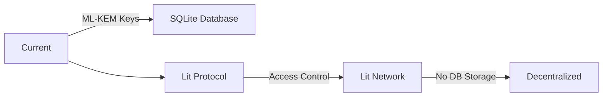
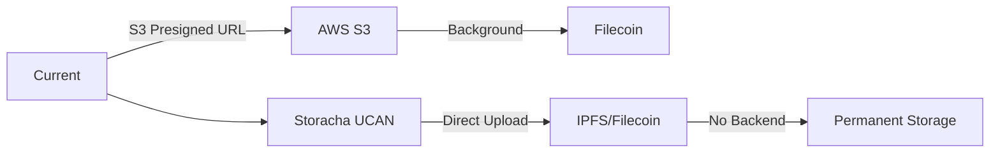
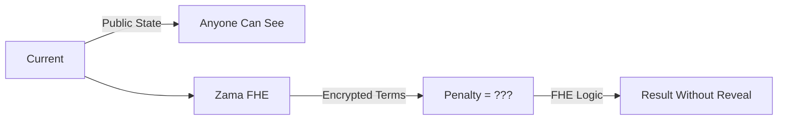
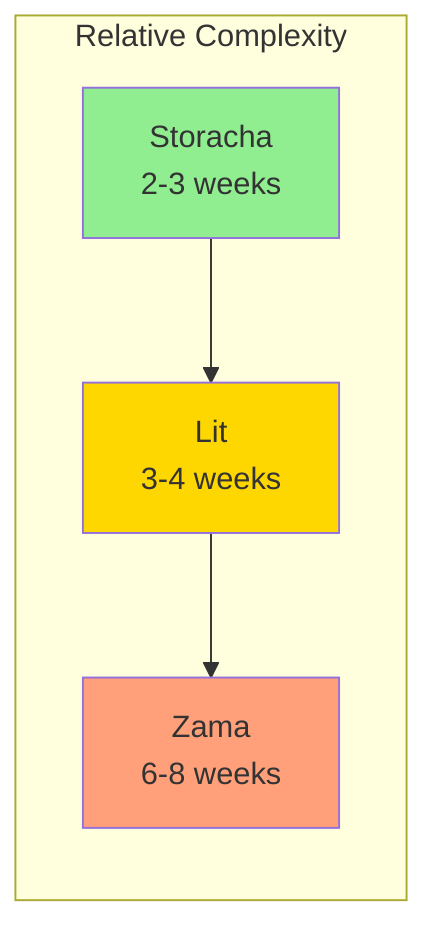
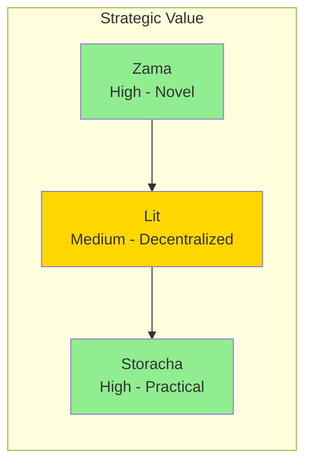
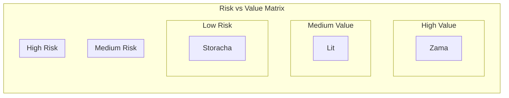

# Combined Validation: Lit Protocol, Storacha & Zama fhEVM

## Executive Summary


| Integration      | Verdict        | Score | Priority | Timeline  | Bounty |
| ---------------- | -------------- | ----- | -------- | --------- | ------ |
| **Lit Protocol** | CONDITIONAL GO | 6/10  | #4       | 3-4 weeks | $1,000 |
| **Storacha**     | GO             | 7/10  | #2       | 2-3 weeks | $500+  |
| **Zama fhEVM**   | DEFERRED       | 5/10  | #5       | 6-8 weeks | $5,000 |


**Overall Strategy**: Implement Storacha first (quick win), then evaluate Lit vs keeping current ML-KEM. Defer Zama until more mature.

---

## Side-by-Side Comparison

### 1. Lit Protocol: Decentralized Encryption

**What It Does:**
Replaces ML-KEM-1024 + SQLite key storage with Lit Protocol's network-based encryption. Access control conditions determine who can decrypt.




**Value Analysis:**


| Pros                                | Cons                                               |
| ----------------------------------- | -------------------------------------------------- |
| No centralized key storage          | Network dependency (Lit nodes must be online)      |
| Programmable access conditions      | Additional auth signatures required (UX friction)  |
| Cross-chain access control          | $1,000 bounty relatively small                     |
| Removes SQL injection risk for keys | Migration complexity - need backward compatibility |


**Verdict: CONDITIONAL GO** - Only if you want to remove all centralized key storage

**Key Question**: Is centralized SQLite storage actually a problem for your users?

- Current ML-KEM is working fine
- Lit adds network dependency
- Benefit is philosophical (decentralization) more than practical

---

### 2. Storacha: Decentralized Storage with UCAN

**What It Does:**
Replaces S3 temporary storage with Storacha (IPFS + Filecoin). Uses UCAN delegation for direct client-to-storage uploads without backend bandwidth.




**Value Analysis:**


| Pros                                | Cons                               |
| ----------------------------------- | ---------------------------------- |
| Removes S3 dependency               | UCAN learning curve                |
| No backend bandwidth costs          | Smaller bounty ($500)              |
| UCAN delegation is cutting-edge     | Filecoin deal delays (1-5 min)     |
| Direct client uploads               | Requires Storacha Space management |
| Targets Infrastructure track prizes | Additional complexity for sharing  |


**Verdict: GO** - Practical infrastructure improvement with reasonable effort

**Why This Wins:**

1. **Immediate Cost Savings**: No S3 egress fees
2. **Simpler Architecture**: Fewer moving parts than Lit
3. **Faster Implementation**: 2-3 weeks vs 3-4 for Lit
4. **Real Problem Solved**: S3 is actual centralized dependency

---

### 3. Zama fhEVM: Confidential Smart Contracts

**What It Does:**
Creates FHE-enabled contract version where financial terms (penalties, payments) are encrypted on-chain. Contract logic executes on encrypted data.




**Value Analysis:**


| Pros                             | Cons                                    |
| -------------------------------- | --------------------------------------- |
| True confidential on-chain logic | Very complex implementation (30+ hours) |
| $5,000 large bounty              | Zama network is new, limited tooling    |
| Novel technology showcase        | FHE gas costs significantly higher      |
| Enterprise privacy appeal        | Debugging encrypted state is difficult  |
|                                  | Overkill for most current use cases     |


**Verdict: DEFERRED** - Cool tech, but premature for current stage

**Why Defer:**

1. **High Complexity**: 6-8 weeks vs 2-3 for others
2. **Immature Ecosystem**: Limited docs, tooling, community
3. **Niche Use Case**: Only relevant for penalty clauses (rare feature)
4. **Risk vs Reward**: High effort for uncertain adoption

---

## Detailed Analysis by Dimension

### Implementation Complexity




| Integration  | Complexity  | Risk   | Why                                       |
| ------------ | ----------- | ------ | ----------------------------------------- |
| **Storacha** | Medium      | Low    | Well-documented SDK, clear patterns       |
| **Lit**      | Medium-High | Medium | New V1 Naga, network dependency           |
| **Zama**     | Very High   | High   | FHE concepts, new toolchain, limited docs |


### Strategic Value




| Integration  | Value  | Long-term             | Short-term                   |
| ------------ | ------ | --------------------- | ---------------------------- |
| **Storacha** | High   | Removes AWS lock-in   | Immediate cost savings       |
| **Lit**      | Medium | True decentralization | Minimal user-visible benefit |
| **Zama**     | High   | Category-defining     | Experimental, risky          |


### User Impact


| Integration  | User Benefit           | Friction                  | Adoption |
| ------------ | ---------------------- | ------------------------- | -------- |
| **Storacha** | Faster uploads         | Low (invisible)           | High     |
| **Lit**      | None visible           | Medium (extra signatures) | Low      |
| **Zama**     | Confidential penalties | High (complex UX)         | Very Low |


---

## Bounty Alignment Analysis

### Lit Protocol ($1,000)

**Requirements**: End-to-end encryption, programmable access controls
**Fit**: Good - replaces centralized encryption
**Verdict**: Low priority due to small bounty

### Storacha ($500+ Infrastructure Track)

**Requirements**: Decentralized storage, UCAN delegation
**Fit**: Excellent - direct replacement of S3
**Verdict**: High priority - enables larger track prizes

### Zama ($5,000)

**Requirements**: Confidential on-chain finance, FHE
**Fit**: Good - novel use case
**Verdict**: Medium priority - large bounty but high risk

### Combined Strategy

```
Storacha ($500) + Infrastructure Track ($50k) = Best ROI
vs
Zama ($5k) alone with 3x more effort
```

---

## Alternative: Keep Current Architecture

Before implementing any of these, consider:

**Current Architecture is Working:**

- ML-KEM + SQLite: Proven, fast, secure
- S3 + Synapse: Reliable, working background migration
- Public on-chain state: Transparent, auditable

**When to Change:**

- Lit: If you need "true decentralization" as a marketing point
- Storacha: If S3 costs become significant (>$100/month)
- Zama: If enterprise customers demand confidential penalties

---

## Recommended Implementation Order

### Phase 1: Storacha (Immediate - 2-3 weeks)

**Why First:**

- Quick win
- Reduces infrastructure costs
- UCAN is genuinely useful
- Smaller, more focused bounty

**Effort**: Medium
**ROI**: High

### Phase 2: Evaluate Lit (After Storacha - 1 week assessment)

**Decision Point:**

- Does your target market care about "decentralized encryption"?
- Are you willing to add network dependency?
- Can you handle the UX friction?

If YES: Implement (3-4 weeks)
If NO: Skip, keep ML-KEM

### Phase 3: Defer Zama (Post-MVP, 3-6 months)

**Revisit When:**

- You have enterprise customers asking for confidential penalties
- Zama ecosystem is more mature
- You have bandwidth for 6-8 week project

---

## Risk Matrix




| Integration | Value  | Risk   | Strategy |
| ----------- | ------ | ------ | -------- |
| Storacha    | Medium | Low    | Do now   |
| Lit         | Medium | Medium | Evaluate |
| Zama        | High   | High   | Defer    |


---

## Implementation Recommendations

### If You Have 2 Weeks:

**Do Only: Storacha**

- Replaces S3 with decentralized storage
- Quick win, visible infrastructure improvement
- Positions for Infrastructure track prizes

### If You Have 4 Weeks:

**Do: Storacha + Lit Evaluation**

- Week 1-2: Storacha
- Week 3: Build Lit POC
- Week 4: Decide to ship or skip Lit

### If You Have 8+ Weeks:

**Do: Storacha + Lit + Zama (in that order)**

- Storacha first (quick win)
- Lit second (if evaluation passes)
- Zama last (most complex, validate demand first)

---

## Final Verdicts

### Lit Protocol: CONDITIONAL GO (6/10)

**Implement IF:**

- You want "decentralized encryption" as marketing differentiator
- You're okay with network dependency
- You have time for 3-4 week implementation

**Skip IF:**

- Current ML-KEM meets your needs
- You want to minimize external dependencies
- Budget is tight (only $1,000 bounty)

### Storacha: GO (7/10)

**Implement:**

- Clear infrastructure improvement
- Removes AWS dependency
- UCAN delegation is genuinely useful
- Positions for larger track prizes

### Zama fhEVM: DEFER (5/10)

**Defer Because:**

- 6-8 weeks is too long for current stage
- Very few users need confidential penalties
- Ecosystem too immature
- High risk for uncertain reward

**Revisit When:**

- You have 3-6 months runway
- Enterprise customers demand it
- Zama ecosystem stabilizes

---

## Combined Bounty Strategy

### Maximum Prize Potential

```
Storacha ($500)
+ Infrastructure Track ($50,000 existing code)
+ Infrastructure Track ($6,000)
= $56,500 potential

vs

Zama alone ($5,000)
with 3x more effort
```

**Recommendation**: Focus on Storacha for maximum ROI, then selectively add others based on time remaining.