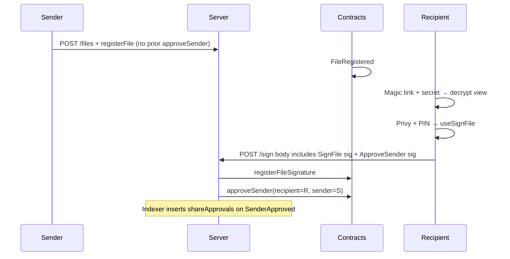

# Magic link + secret code onboarding (Privy architecture, no WaaP)

**Context:** Cold send aligned with [email_e2e_analysis_e9bcb7c8.plan.md](email_e2e_analysis_e9bcb7c8.plan.md); identity matches [send_sign_flow_architecture.plan.md](send_sign_flow_architecture.plan.md) §2 (**Privy + wagmi**), without assuming WaaP.

**Product intent:** Sender sends **without** becoming connections first and **without** recipient **`approveSender` before `registerFile`**. Recipient opens magic link → enters **secret code** → decrypt/view → signs. **Signing is explicit intent to trust the sender:** **`approveSender(recipient → sender)` runs automatically as part of the successful sign flow** (same semantics as today’s [`FSManager.approveSender`](apps/contracts/src/FSManager.sol), only **timing** changes).

---

## 1. Trust model change (connections ↔ signing)

| Before | After |
|--------|--------|
| **`registerFile`** reverts unless **`approvedSenders[signer][sender]`** ([`FSFileRegistry.sol`](apps/contracts/src/FSFileRegistry.sol)). | **`registerFile`** lists **any** signer addresses **without** prior on-chain approval. |
| Recipient manually **`approveSender`** via [`POST /sharing/approve`](apps/server/api/routes/sharing/index.ts) before sender can register them on a file. | Recipient **still** calls **`approveSender`**, but **bundled into document signing**: recipient ECDSA on **`ApproveSender`** ([`FSManager.validateApproveSenderSignature`](apps/contracts/src/FSManager.sol)) is produced **in the sign session**, server relays **`registerFileSignature`** then **`approveSender`**. |
| **`GET /users/profile/:q`** requires mutual **`shareApprovals`** edge ([`profile.ts`](apps/server/api/routes/users/profile.ts)) → blocks **`encryptionPublicKey`** for strangers → envelope relies on **accepted connections** ([`RecipientsSection`](apps/client/src/pages/dashboard/envelope/create/create/_components/RecipientsSection.tsx)). | Send flow resolves **Kyber pubkey** without prior DB “connection”; inbox/trust labels remain **product-side** (trusted vs pending). |

**Invariant:** [`approveSender`](apps/contracts/src/FSManager.sol) **still requires recipient’s EIP-712 signature** — it cannot be purely server-initiated. “Automatic” means **combined UX + API**, not skipping cryptography.

**Indexer:** **`SenderApproved`** continues to insert **`shareApprovals`** ([`process.ts`](apps/server/lib/indexer/process.ts)) — **`canSendTo`** / Connections UI stay coherent **after** first signed doc.

---

## 2. Actionable backlog (ordered by dependency)

### A. Contracts

1. **`FSFileRegistry.validateFileRegistrationSignature`** — Remove the loop `if (!manager.approvedSenders(signers_[i], sender_)) revert …` ([~232–236](apps/contracts/src/FSFileRegistry.sol)).
2. **Forge:** Cover **`registerFile`** with **unsigned/unapproved** signers; regression existing approved-path tests if any.
3. **Regenerate** contract defs consumed by [`apps/contracts/definitions`](apps/contracts/definitions) / TS ABIs per repo convention.

### B. Signing API + client (trust-on-sign)

4. **`packages/react-sdk` — [`useSignFile`](packages/react-sdk/src/hooks/files/useSignFile.ts)**  
   - After constructing **`SignFile`** EIP-712, read **`FSManager.approveNonce(recipient)`** (recipient = connected wallet).  
   - Sign **`ApproveSender`** exactly like [`useApproveSender`](packages/react-sdk/src/hooks/sharing/useApproveSender.ts) (domain **`FSManager`**, fields **`recipient`, `sender`, `nonce`, `deadline`**).  
   - **`sender`** = **`fileResponse.data.sender`** from **`GET /files/:pieceCid`**.  
   - Attach **`approveSender: { nonce, deadline, signature }`** to **`POST /files/:pieceCid/sign`** body.

5. **`apps/server` — [`POST /files/:pieceCid/sign`](apps/server/api/routes/files/index.ts)**  
   - Extend body schema with optional **`approveSender`** (same shape as **`POST /sharing/approve`** without **`establishMutualConnection`** unless product wants it).  
   - Order: **`registerFileSignature`** tx → **`FSManager.approveSender`** simulate/write with **`recipient = signer wallet`**, **`sender = file.sender`**.  
   - **Idempotency:** If **`approveSender`** reverts **`SenderAlreadyApproved`**, treat as success (no double fault).  
   - **Deadline:** enforce **`SIGNATURE_VALIDITY_PERIOD`** alignment (~2m on **`SignFile`**) vs **`ApproveSender`** deadline (~10m in hook today) — pick **short shared window** or **two-step second tx** if clock skew hurts.

6. **Optional:** After **`approveSender`** succeeds in-handler, call **`ensureReciprocalShareRequest`** ([`sharing.ts`](apps/server/api/handlers/sharing.ts)) so sender sees pending reverse connection — **product toggle**.

### C. Remove “must be connected” send gates

7. **Profile / pubkey resolution** — **`GET /users/profile/:q`** currently returns **401** without **`canSendTo ∨ canReceiveFrom`** ([503–514](apps/server/api/routes/users/profile.ts)). Implement **one** of:  
   - **Recommended:** **`GET /users/profile/:wallet/send-keys`** (authenticated): `{ walletAddress, encryptionPublicKey }` only; **rate-limit by caller**.  
   - **Alternative:** For **`isAddress(q)`** queries only, skip sharing check and strip response to pubkey + display-safe fields.

8. **`useProfilesByAddresses`** — Switch fetch URL to the new route (or adjusted behavior) so **[`add-sign/index.tsx`](apps/client/src/pages/dashboard/envelope/create/add-sign/index.tsx)** resolves **`encryptionPublicKey`** for **non-connection** recipients.

9. **`GET /sharing/can-send-to`** — Remove use from **send orchestration** if any UI/SDK gates on it for envelope (**currently unused** in `apps/client`; **`packages/test`** still demos **`useCanSendTo`** — update copy/tests).

10. **UI copy & flows** — **[`RecipientsSection.tsx`](apps/client/src/pages/dashboard/envelope/create/create/_components/RecipientsSection.tsx)** (“already connected”), **`AddRecipientDialog`**, onboarding/help text — describe **cold send + magic link**; connections page explains **trust after sign**.

11. **Sign page disclosure** — **[`apps/client/.../document/sign`](apps/client/src/pages/dashboard/document/sign/index.tsx)** — short notice: signing **records approval** so this sender can involve you again **unless you revoke** ([`revokeSender`](apps/contracts/src/FSManager.sol)).

### D. Documentation & handlers

12. **`materializePendingInvitesForEmail`** comment ([`sharing.ts`](apps/server/api/handlers/sharing.ts)) — clarify **`approveSender`** may now arrive via **sign bundle**, not only **`POST /sharing/approve`**.

13. **[`apps/contracts/README.md`](apps/contracts/README.md)** — Document **`registerFile`** no longer checks **`approvedSenders`**; **`approveSender`** remains **recipient-signed**, triggered **after signature** by policy.

### E. Magic-link / invite track (unchanged intent)

14–18. Same as prior plan: **invite envelope spec**, **schema/FK**, **`useSendFile` invite wrap**, **public magic-link route**, **optional Kyber re-wrap**, **minimal onboarding before `/sign`** — see §4 summary below.

### F. Verification

19. **`bun`** — **`forge test`** (contracts); **`bun check`**, **`bun tsc`**, **`bun run test`** after SDK/server/client edits.

---

## 3. Architecture sketch (with trust-on-sign)

---

## 4. Prior sections retained (concise)

**Research Q&A** — Signing **without** Filosign **`users`** row **still unsupported** today (Dilithium + JWT + FK); **invite decrypt** can remain account-optional; **Kyber re-wrap** after onboarding remains valid (same conclusions as in earlier drafts of this plan).

**References:** [email_e2e…](email_e2e_analysis_e9bcb7c8.plan.md), [send_sign…](send_sign_flow_architecture.plan.md).

---

## 5. Answer summary

| Topic | Conclusion |
|--------|------------|
| **Connections before send** | Removed **on-chain** by deleting **`approvedSenders`** check from **`registerFile`**; removed **off-chain** pubkey gate via dedicated **`send-keys`** (or equivalent). |
| **`approveSender`** | **Not removed** — moved to **automatic bundled submission after document signature**, still **recipient EIP-712**. |
| **Connections UI / DB** | **`shareApprovals`** still populated via **`SenderApproved`** events **after sign**. |
