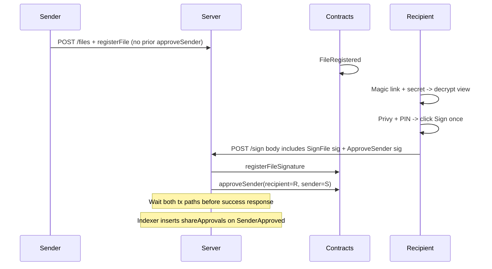

# Magic link + secret code onboarding (Privy architecture, no WaaP)

**Context:** Cold send aligned with [email_e2e_analysis_e9bcb7c8.plan.md](email_e2e_analysis_e9bcb7c8.plan.md); identity matches [send_sign_flow_architecture.plan.md](send_sign_flow_architecture.plan.md) section 2 (**Privy + wagmi**), without WaaP assumptions.

**Locked product decision:** Recipient should not see another approval prompt. Clicking **Sign** is sufficient intent. Server submits approval in the sign flow and waits for completion before success response.

---

## 1. Current state (already implemented)

- `FSFileRegistry.validateFileRegistrationSignature` no longer checks `approvedSenders` for recipients.
- `useSignFile` now produces both signatures in one user action:
  - SignFile EIP-712 + Dilithium
  - ApproveSender EIP-712
- `POST /files/:pieceCid/sign`:
  - accepts `approveSender` payload
  - runs `registerFileSignature` then `approveSender`
  - treats `SenderAlreadyApproved` as idempotent success
- `/users/profile/:q` currently returns `encryptionPublicKey` without a mutual-share requirement, enabling cold send key resolution.

**Clarified invariant:** No second prompt is required, but cryptography is still recipient-authorized (signature generated during sign action and relayed by server).

**Connection/indexer behavior:** `SenderApproved` continues populating `shareApprovals`, so Connections UI converges after first signed document.

---

## 2. Remaining backlog (ordered)

### A. UX and docs polish

1. Add sign-page disclosure copy: signing records sender approval; revocation is still possible via `revokeSender`.
2. Update sharing docs and handler comments to reflect trust-on-sign path (not only `POST /sharing/approve`).

### B. Product toggle decision (still open)

3. Decide whether to call `ensureReciprocalShareRequest` post-approval for reverse-request convenience UX.

### C. Magic-link invite track (main remaining scope)

4. Finalize invite-envelope cryptographic spec (KDF + AEAD, split-channel secret, TTL, no plaintext secret persistence).
5. Resolve schema strategy for unknown recipients (placeholder users vs FK relaxation vs invite sidecar).
6. Extend send flow for recipients missing `encryptionPublicKey` (invite wrap path + optional Kyber re-wrap).
7. Implement public magic-link route + server token validation + secret entry + client decrypt preview.
8. Optional: add authenticated re-wrap API and retire invite artifacts after onboarding.
9. Keep minimal onboarding required before `/sign` unless anonymous-sign architecture is explicitly approved.

### D. Verification and hardening

10. Add/refresh tests for:
   - registerFile without prior sender approval
   - sign flow including bundled `approveSender`
   - idempotent already-approved sender path
11. Run `forge test`, `bun check`, `bun tsc`, and `bun run test`.

---

## 3. Architecture sketch (authoritative)

---

## 4. Clarifications recorded from product direction

- No extra confirmation modal or second signing prompt for sender approval.
- "Server does it on behalf of user" means relay submission inside sign endpoint, not unsigned server-only trust mutation.
- Current sequencing is acceptable: sign tx path then approve path in same request, waiting for completion before returning success.

---

## 5. Status summary

| Topic | Conclusion |
|--------|------------|
| **Connections before send** | Removed in current implementation path (on-chain + profile lookup behavior). |
| **approveSender** | Bundled with sign action and submitted server-side in sign endpoint; no additional user prompt. |
| **Connections UI / DB** | `shareApprovals` is still populated via `SenderApproved` events after sign. |
| **Biggest remaining work** | Magic-link invite/decrypt pipeline, schema decisions, and final docs/tests. |
