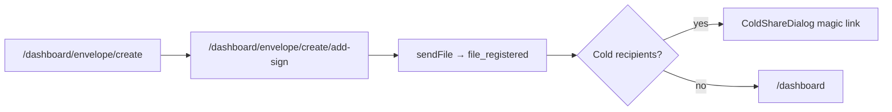
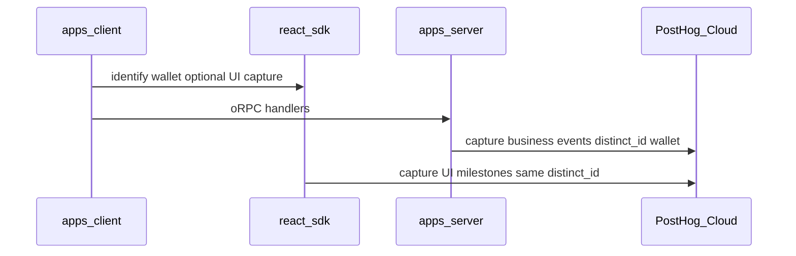

# Product Analytics integration (Filosign)

**Parent context:** Full PostHog roadmap lives in [posthog_server_analytics_97e51811.plan.md](.cursor/plans/posthog_server_analytics_97e51811.plan.md). This plan is **only Product Analytics**—the smallest path to one actionable funnel.

**Outcome when done:** In PostHog you can answer, per **persona** (sender, warm recipient, cold recipient): *where they drop before completing onboarding, sending, or signing*—and aggregate **activated senders**, **MAU**, and **invite/signature** counts for pricing. Traffic stays in **Cloudflare**; PostHog does not get `$pageview` or autocapture.

---

## Client flows (from `apps/client` — drives what to track)

**Critical gate:** Every user—including cold-invite and `/invite/$id` recipients—must pass **onboarding + Filosign session unlock** before [`DashboardProtector`](apps/client/src/lib/components/custom/DashboardProtector.tsx) shows documents. “Received invite” ≠ “can see documents” until `user_registered` + `auth_verified` (logged in).

### Personas and entry paths

| Persona | How they arrive | Client path to value |
|---------|-----------------|----------------------|
| **Sender** | Sign in at [`/`](apps/client/src/pages/sign-in.tsx) | Onboarding → dashboard → **create envelope** → **add-sign** → send |
| **Warm recipient** | Already on `file_participants`; opens from [`/dashboard/document/all`](apps/client/src/pages/dashboard/document/all/index.tsx) | Dashboard (after onboarding) → sign **without** `invite` query param |
| **Cold recipient** | Magic link `/?coldPieceCid&coldInvite` ([`buildColdInviteMagicLink`](apps/client/src/lib/routing/cold-invite-search.ts)) | Sign-in → onboarding (carries cold search) → [`/dashboard/document/sign?pieceCid&invite`](apps/client/src/routes/dashboard/document/sign/index.tsx) → passphrase → claim → sign |
| **Sharing-invite recipient** | [`/invite/$inviteId`](apps/client/src/pages/invite/index.tsx) (wallet connection, not a document) | Sign up → `pendingInviteId` in sessionStorage → claimed on [`/onboarding/welcome`](apps/client/src/pages/onboarding/welcome.tsx) → connections |

### Sender flow (2 UI steps → 1 server send)



- **Step 1** [`create/index.tsx`](apps/client/src/pages/dashboard/envelope/create/create/index.tsx): upload PDF + recipient emails (warm wallet or cold email-only via [`isColdRecipient`](apps/client/src/pages/dashboard/envelope/create/add-sign/send-envelope.ts)).
- **Step 2** [`add-sign/index.tsx`](apps/client/src/pages/dashboard/envelope/create/add-sign/index.tsx): place fields → `useSendFile` → server `filesRegister` + cold rows in `file_cold_invites` (7-day [`COLD_INVITE_TTL_DAYS`](apps/server/lib/domain/file-invites.ts)).

### Recipient signing (two modes)

[`useSignDocumentMode`](apps/client/src/pages/dashboard/document/sign/useSignDocumentMode.ts): `invite` in URL ⇒ **cold**; else **warm**.

| Mode | UI | Server milestones |
|------|-----|-------------------|
| **Warm** | [`WarmSignDocumentPage`](apps/client/src/pages/dashboard/document/sign/warm/WarmSignDocumentPage.tsx) — file in received list | `piece_ack` → draft → `piece_sign` |
| **Cold** | [`useColdInviteSignFlow`](apps/client/src/pages/dashboard/document/sign/useColdInviteSignFlow.ts) — Privy login, onboarding redirect if unregistered, recovery unlock, passphrase, `claimColdInvite` | `cold_invite_claimed` → then same sign path |

### Onboarding chain (all new users)

1. [`/onboarding`](apps/client/src/pages/onboarding/OnboardingPage.tsx) — name + `registerKeys` → `user_registered`
2. Optional recovery phrase dialog → [`/onboarding/welcome`](apps/client/src/pages/onboarding/welcome.tsx) — profile + **pending sharing invite claim**
3. Cold return: welcome button → **sign document** (not dashboard first)
4. Optional [`/onboarding/create-signature`](apps/client/src/routes/onboarding/create-signature.tsx) — not on critical path for v1 analytics
5. Dashboard: **Privy + `isLoggedIn`** via [`DashboardProtector`](apps/client/src/lib/components/custom/DashboardProtector.tsx) (recovery phrase gate)

**Client-only funnel risk:** Invited users can stall on sign-in, onboarding, email mismatch ([`ColdInviteNotForYouCallout`](apps/client/src/pages/onboarding/_components/ColdInviteNotForYouCallout.tsx)), or Filosign unlock—**before** any server file event. Track onboarding UI events (Step 4 below).

---

## What Product Analytics is (for you)

| You emit | PostHog UI gives you |
|----------|----------------------|
| Named events (`user_registered`, `file_registered`, …) with `distinct_id` = wallet | **Funnels**, **retention**, **cohorts**, trends over time |
| Person properties (`chain`, `registered_at`) | Filter segments (“testnet senders who never signed”) |

**Not in this phase:** replay, flags, experiments, errors, Astro, PostHog Web Analytics.

---

## Architecture (minimal)



**Identity rule:** Every `capture` uses the same normalized wallet (`0x…` lowercase) as JWT `sub` / [`context.userWallet`](apps/server/api/middleware/orpc-auth.ts).

**Privacy:** No email, names, document bytes, CIDs in bulk, JWTs, or IPs in event properties.

---

## Step 0 — PostHog project (manual, ~15 min)

1. Create/use one PostHog Cloud project (US or EU host—pick one, stick to it).
2. Copy **Project API key** (server) and note **Host** (e.g. `https://us.i.posthog.com`).
3. In project settings: **disable autocapture** for web (you will init client with `autocapture: false` anyway).
4. Do **not** enable Session Replay or Error Tracking yet.
5. Staging + production: set env; local: `POSTHOG_ENABLED=false`.

---

## Step 1 — Server plumbing (no handler changes yet)

**Files to add**

| File | Role |
|------|------|
| [`apps/server/lib/analytics/posthog.ts`](apps/server/lib/analytics/posthog.ts) | Lazy `PostHog` client; `captureEvent`, `identifyUser`, `shutdownPostHog`; no-op when disabled |
| [`apps/server/lib/analytics/events.ts`](apps/server/lib/analytics/events.ts) | `const` event names + property types (single source of truth) |
| [`apps/server/lib/analytics/track.ts`](apps/server/lib/analytics/track.ts) | `trackServerEvent({ distinctId, event, properties })` |

**Env** — extend [`apps/server/env.ts`](apps/server/env.ts):

```ts
POSTHOG_API_KEY: z.string().min(1).optional(),
POSTHOG_HOST: z.string().url().optional(), // default us.i.posthog.com in code
POSTHOG_ENABLED: z.coerce.boolean().default(false),
```

**Dependency:** `posthog-node` in [`apps/server/package.json`](apps/server/package.json).

**Lifecycle:** Call `shutdownPostHog()` on server process exit ([`apps/server/index.ts`](apps/server/index.ts)) so events flush.

**Super-properties** on init: `chain`, `service: filosign-server`.

**Test:** Unit test that `trackServerEvent` does nothing (no throw, no network) when `POSTHOG_ENABLED=false`.

---

## Step 2 — Event catalog (server P0 + client onboarding/signing)

Instrument **success paths only**, **after** DB/chain commit (server) or explicit UI milestone (client).

### Server P0 (billing / MAU / core product)

| Event | Handler | Properties (for your questions) |
|-------|---------|--------------------------------|
| `user_registered` | `userRegister` | `entry: organic \| cold_invite \| sharing_invite`, `has_invited_by` |
| `auth_verified` | `authVerify` | `role_hint: sender \| recipient` (if inferable); **MAU numerator** |
| `file_registered` | `filesRegister` | `signer_count`, `viewer_count`, `cold_invite_count`, `warm_signer_count` — **activated sender** |
| `cold_invite_created` | same handler (per email or once with count) | `is_signer`, `expires_in_days: 7` — **invites sent** |
| `cold_invite_claimed` | `filesColdInviteClaim` | — **invites claimed** |
| `sharing_invite_claimed` | `sharingInviteClaim` | — wallet connection invites |
| `piece_acknowledged` | `pieceAck` | `mode: warm \| cold` — recipient engaged |
| `piece_signed` | `pieceSign` | `mode`, `field_count_bucket` — **documents signed** |
| `envelope_fully_signed` | `pieceSign` when last required signer completes | `signer_count`, `days_since_register` |

Defer `file_upload_started` until needed—sender flow uses client-prepared bytes; upload may be implicit in `sendFile`. Optional later.

**Person properties on sender (from `file_registered`):** increment `lifetime_files_sent`, `lifetime_cold_invites_sent`, `lifetime_recipient_slots` (signers+viewers+cold).

**Expiry (7 days):** `cold_invite_expired` is **not** emitted by client—add a **daily server job** scanning `file_cold_invites` where `expiresAt < now` and no claim; counts **expired invites**.

### Client P0 (onboarding gate + sender UI blind spots)

| Event | Where | Why |
|-------|-------|-----|
| `onboarding_started` | [`OnboardingPage`](apps/client/src/pages/onboarding/OnboardingPage.tsx) mount | Invited users who never finish setup |
| `onboarding_completed` | [`welcome.tsx`](apps/client/src/pages/onboarding/welcome.tsx) `handleSubmit` | Unblocks dashboard / cold sign |
| `cold_invite_mismatch_shown` | sign-in / cold sign when wrong email | Explains drop before claim |
| `envelope_compose_submitted` | create form submit → navigates to add-sign | Step 1 done |
| `envelope_send_clicked` | add-sign send start | Step 2 intent |
| `envelope_send_succeeded` | after `sendFile` success | Pairs with `file_registered`; property `had_cold_recipients` |
| `cold_share_dialog_shown` | [`ColdShareDialog`](apps/client/src/pages/dashboard/envelope/create/add-sign/_components/ColdShareDialog.tsx) | Sender copied link |

Use super-property `persona: sender \| warm_recipient \| cold_recipient` set on first identifiable action.

**Anonymous:** public `inviteByToken` — no capture in v1, or `$process_person_profile: false` with session id only.

---

## Step 3 — Funnels in PostHog UI (match client flows)

After staging events flow, create **three funnels** (not one generic pipeline):

### Funnel A — Sender activation (subscription metric)

`user_registered` → `onboarding_completed` → `envelope_compose_submitted` → `file_registered` → (`piece_signed` by any signer on their envelope, or `envelope_fully_signed`)

Answers: **activated senders**, send volume, drop between compose and send.

### Funnel B — Cold recipient (MAU + invite conversion)

`cold_invite_created` (filter by sender) **not in same funnel** — use trends for sent count.

Recipient side: `onboarding_started` (with `entry=cold_invite`) → `onboarding_completed` → `cold_invite_claimed` → `piece_signed`

Answers: **invites claimed**, signing conversion, onboarding friction for invitees.

### Funnel C — Warm recipient

`auth_verified` → `piece_acknowledged` (`mode=warm`) → `piece_signed`

Answers: registered recipients signing from dashboard list.

### Cohorts for pricing / cost

| Cohort | Definition |
|--------|------------|
| **Paying-relevant senders** | `file_registered` ≥ 1 |
| **MAU senders** | `auth_verified` or `file_registered` in last 30 days |
| **MAU recipients** | `piece_acknowledged` or `piece_signed` or `cold_invite_claimed` in last 30 days |
| **Stuck invitee** | `onboarding_started` + no `onboarding_completed` in 7d |
| **Expired cold invites** | from `cold_invite_expired` trend (job) |

**Quota:** ~12 event types × modest volume — stay under 1M/mo if no autocapture.

---

## Step 4 — Minimal client (optional but recommended for one blind spot)

The server never sees **envelope builder started**—only upload/register. Add a thin client layer **without** session replay.

**react-sdk** — new [`packages/react-sdk/src/analytics/`](packages/react-sdk/src/analytics/):

- `PostHogProvider` — init `posthog-js` with `autocapture: false`, `capture_pageview: false`, `capture_pageleave: false`
- `useAnalyticsIdentify(wallet)` — `posthog.identify(wallet)` when wallet is known
- `captureAppEvent(name, props)` — typed wrapper using [`events.ts`](apps/server/lib/analytics/events.ts) shared names or a small client-only enum

**peerDependency:** `posthog-js` (app installs).

**apps/client:** env `VITE_POSTHOG_KEY`, `VITE_POSTHOG_HOST`, `VITE_POSTHOG_ENABLED`; wrap in [`main.tsx`](apps/client/src/main.tsx) inside `FilosignProvider`; call `useAnalyticsIdentify` from dashboard auth boundary (e.g. [`DashboardProtector`](apps/client/src/lib/components/custom/DashboardProtector.tsx)).

See **Client P0** table in Step 2 (onboarding + envelope + cold mismatch). Defer field-placement granularity until Funnel A/B are reviewed.

---

## Step 5 — Verify end-to-end

Checklist on **staging** with `POSTHOG_ENABLED=true`:

- [ ] **Sender:** onboarding → create → add-sign → send (warm + cold recipient)
- [ ] **Cold recipient:** magic link → onboarding → claim → sign
- [ ] **Warm recipient:** dashboard → document/all → sign
- [ ] PostHog person merges server + client events for one wallet
- [ ] Funnels A/B/C non-zero on staging
- [ ] Local dev with `POSTHOG_ENABLED=false`: `bun run sanity` unchanged

---

## Rollout order (do one step at a time)

1. Step 0 (PostHog project)
2. Step 1 (server plumbing + tests)
3. Step 2 (5 server events)
4. Step 3 (funnel in UI—validate before more code)
5. Step 4 (client identify + `envelope_create_started`) if funnel step 2→3 drop is unclear
6. Later PRs: sharing events, `rpc_failed`, retention insight—**not** this plan

---

## Out of scope (this plan only)

- Session Replay, Feature Flags, Experiments, Error Tracking, Surveys, Workflows, Logs, Data Warehouse, LLM Analytics
- PostHog Web Analytics / Astro script
- Full 15+ event taxonomy from parent plan
- Telegram changes ([`apps/server/lib/analytics/logger.ts`](apps/server/lib/analytics/logger.ts) stays as-is)

---

## After Product Analytics ships

Parent plan next slices: **Session Replay** (sampled) → **Feature Flags** → optional **Error Tracking**.
