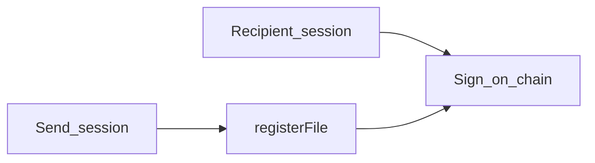

# Send & sign — executive plan (WaaP replaces Privy)

**Invite / split-channel / threat-model research:** [email_e2e_analysis_e9bcb7c8.plan.md](email_e2e_analysis_e9bcb7c8.plan.md)

**WaaP docs (reference only):** [WaaP for Apps](https://docs.wallet.human.tech/for-apps), [Quick Start](https://docs.wallet.human.tech/for-apps/start), [Sign](https://docs.wallet.human.tech/for-apps/sign), [EVM methods](https://docs.wallet.human.tech/for-apps/methods/evm), [Privileges](https://docs.wallet.human.tech/for-apps/privilege), [@human.tech/waap-sdk](https://www.npmjs.com/package/@human.tech/waap-sdk)

This plan scopes WaaP work to **what Filosign already does with Privy**: one identity provider, embedded EVM wallet for `wagmi` / `useWalletClient`, and **EIP-712 typed-data signing** for contracts (often **without visible modal** after onboarding, same as Privy embedded today). It is **not** a general WaaP product integration guide.

---

## 1. Outcomes

| Outcome                    | Definition                                                                                                                                                                                                                                                                     |
| -------------------------- | ------------------------------------------------------------------------------------------------------------------------------------------------------------------------------------------------------------------------------------------------------------------------------ |
| **Identity**               | **WaaP** replaces **Privy** for login, session, and **EVM address** used by wagmi → `FilosignProvider` → `eip712signature` / contracts. Optional **pregen** for email→address before first app login.                                                                          |
| **Unchanged product core** | **Filosign registration** after social login: PIN, `walletKeyGen`, `POST /users/profile`, indexer, **Dilithium JWT** (`useAuthedApi`), **Kyber** in `useSendFile`, `useSignFile`, compliance — same responsibilities; only the **OAuth/wallet/identity token** source changes. |
| **Send**                   | Same-session **encrypt → upload → EIP-712 `RegisterFile` → `POST /files`** (anchor-at-send).                                                                                                                                                                                   |
| **Open listing**           | Remove on-chain `approvedSenders` prerequisite from `registerFile` validation.                                                                                                                                                                                                 |
| **Headless parity**        | After onboarding, **no visible signing modal on every action** (Privy embedded behavior today). WaaP: confirm **Privileges / async** apply to `**eth_signTypedData_v4`** (see §5.1 and §6), not only `eth_sendTransaction`.                                                    |
| **Inbox**                  | Trusted vs pending remains **off-chain** (DB / UX).                                                                                                                                                                                                                            |

---

## 2. Current Privy-based stack (what we are preserving)

### 2.1 Client (`apps/client/`)

| Piece                                                                                    | Role                                                                                                                                                                                                                                                                                                                                                                                                                                                                 |
| ---------------------------------------------------------------------------------------- | -------------------------------------------------------------------------------------------------------------------------------------------------------------------------------------------------------------------------------------------------------------------------------------------------------------------------------------------------------------------------------------------------------------------------------------------------------------------- |
| `[lib/context/privy-provider.tsx](apps/client/src/lib/context/privy-provider.tsx)`       | `PrivyProvider`: `appId`, `loginMethods: ["email","google"]`, **embedded Ethereum** `createOnLogin: "users-without-wallets"`.                                                                                                                                                                                                                                                                                                                                        |
| `[lib/context/wagmi-provider.tsx](apps/client/src/lib/context/wagmi-provider.tsx)`       | `**createConfig` from `@privy-io/wagmi`** — wires Privy embedded wallet into wagmi.                                                                                                                                                                                                                                                                                                                                                                                  |
| `[lib/context/filosign-provider.tsx](apps/client/src/lib/context/filosign-provider.tsx)` | `**useWalletClient()**` from wagmi → passes `wallet` into `FilosignProvider` (react-sdk). **No Privy import** — only needs a viem-compatible wallet client.                                                                                                                                                                                                                                                                                                          |
| `[main.tsx](apps/client/src/main.tsx)`                                                   | Provider order: `PrivyProvider` → `WagmiProvider` → `FilosignProvider`.                                                                                                                                                                                                                                                                                                                                                                                              |
| **Auth / gating**                                                                        | `usePrivy()` (`ready`, `authenticated`, `login`, `logout`, `user`) in [sign-in](apps/client/src/pages/sign-in.tsx), [invite](apps/client/src/pages/invite/index.tsx), [DashboardProtector](apps/client/src/lib/components/custom/DashboardProtector.tsx), [OnboardingProtector](apps/client/src/pages/onboarding/_components/OnboardingProtector.tsx), [useConnectButtonLogic](apps/client/src/lib/components/custom/useConnectButtonLogic.ts), user dropdowns, etc. |
| **Registration bridge**                                                                  | [set-pin](apps/client/src/pages/onboarding/set-pin.tsx): `**useIdentityToken()`** → `identityToken` passed to `**useLogin({ pin, idToken: identityToken })**`. Requires Privy dashboard **identity tokens** enabled.                                                                                                                                                                                                                                                 |
| **Email sync**                                                                           | [ProfileEmailSync](apps/client/src/lib/components/custom/ProfileEmailSync.tsx): on Privy auth, `**useSyncPrivyEmail`** → `POST /users/profile/sync-privy-email`.                                                                                                                                                                                                                                                                                                     |
| **Linked accounts UI**                                                                   | [LinkedAccountsSection](apps/client/src/pages/dashboard/profile/LinkedAccountsSection.tsx): reads **Privy `User`**, unlink email via Privy.                                                                                                                                                                                                                                                                                                                          |
| **CSP**                                                                                  | [vite/security-headers.ts](apps/client/vite/security-headers.ts): Privy / WalletConnect allowlists — update for WaaP origins when known.                                                                                                                                                                                                                                                                                                                             |

### 2.2 React SDK (`packages/react-sdk/`)

| Piece                                                                                         | Role                                                                                                                                                                                                                                              |
| --------------------------------------------------------------------------------------------- | ------------------------------------------------------------------------------------------------------------------------------------------------------------------------------------------------------------------------------------------------- |
| `[hooks/auth/useLogin.ts](packages/react-sdk/src/hooks/auth/useLogin.ts)`                     | First-time: `**walletKeyGen(wallet, { dilithium })`**, EIP-712 `FSKeyRegistry`, `**POST /users/profile**` with `idToken` + keys + `walletAddress`. **Wallet = wagmi client** (today from Privy). Returning user: PIN unlock; **no Privy import**. |
| `[hooks/auth/useAuthedApi.ts](packages/react-sdk/src/hooks/auth/useAuthedApi.ts)`             | JWT: **Dilithium** sign nonce — **independent of Privy** after registration.                                                                                                                                                                      |
| `[hooks/users/useSyncPrivyEmail.ts](packages/react-sdk/src/hooks/users/useSyncPrivyEmail.ts)` | Thin mutation to `**/users/profile/sync-privy-email`** — rename/repoint to the **new** email+wallet binding endpoint once server drops Privy.                                                                                                     |

### 2.3 Server — what `idToken` / `identityToken` do today (`apps/server/`)

All of this is **wallet↔email binding and `privyDid`**, not Dilithium JWT auth (that stays on `/auth/nonce` + `/auth/verify`).

| Route / helper                                                                      | Token field                                                   | Purpose                                                                                                                                                                                                                                                                                                                            |
| ----------------------------------------------------------------------------------- | ------------------------------------------------------------- | ---------------------------------------------------------------------------------------------------------------------------------------------------------------------------------------------------------------------------------------------------------------------------------------------------------------------------------- |
| `**POST /users/profile**` (`[profile.ts](apps/server/api/routes/users/profile.ts)`) | `idToken` (comment: Privy **identity** JWT, not access token) | `[verifyPrivyTokenWithWallet](apps/server/lib/utils/privy.ts)` verifies JWT, checks linked wallets include `walletAddress`, extracts **canonical email** + `**privyDid`**, then server submits `**registerKeygenData**` and `[processTransaction](apps/server/lib/indexer/process.ts)` inserts `users` with that email/`privyDid`. |
| `**POST /users/profile/sync-privy-email**`                                          | `identityToken`                                               | Same verifier family → `**verifiedPrivyEmailForWallet**` → update `**users.email**`, `[materializePendingInvitesForEmail](apps/server/api/handlers/sharing.ts)`.                                                                                                                                                                   |
| `**POST /users/profile/set-primary-email**`                                         | `identityToken` + chosen email                                | `**verifiedLinkedEmailsForWallet**` — email must appear on Privy user.                                                                                                                                                                                                                                                             |

**Target:** Replace those verifiers with **Human-controlled binding**: e.g. **pregen** (email → deterministic address) plus a **Human-signed or server-side Human API** check that the **session email matches** the row you upsert—**no Privy server SDK** required for that linkage. First-time `POST /users/profile` still needs **some** trusted proof that `walletAddress` belongs to the human who owns `email` (pregen response, OAuth callback to BFF, etc.—product picks one).

**Bottom line:** Privy today is **only** the **shell** (who is logged in + embedded EVM signer + **Privy JWT to bind wallet+email on the server**). **Filosign crypto and API auth stay.**

---

## 3. Target: same architecture, WaaP instead of Privy

| Today (Privy)                                             | Target (WaaP)                                                                                                                                                                                                       |
| --------------------------------------------------------- | ------------------------------------------------------------------------------------------------------------------------------------------------------------------------------------------------------------------- |
| `PrivyProvider` + Privy config                            | `initWaaP` + replace root provider; config mirrors **email + Google** (and any extra methods product wants).                                                                                                        |
| `@privy-io/wagmi` `createConfig`                          | **Official WaaP + wagmi v2 connector** ([Quick Start](https://docs.wallet.human.tech/for-apps/start)) so `useWalletClient()` keeps working **unchanged** inside `FilosignProvider`.                                 |
| `usePrivy().login` / `authenticated` / `logout`           | `window.waap.login`, `eth_requestAccounts` / `getLoginMethod`, `logout` — reimplement **connect button** and **route protectors** with the same state machine (`loading` → `signin` → `get-started` → `dashboard`). |
| `useIdentityToken` → `useLogin` `idToken`                 | **Human binding instead of Privy JWT:** pregen (or session exchange) proves **email ↔ address**; server trusts **Human API / signed pregen payload**, not `@privy-io/node`.                                         |
| Privy dashboard “hide signing modals” for embedded wallet | **WaaP:** confirm headless path for `**eth_signTypedData_v4`** (see §5.1, §6). **Relayer** submits txs; user still **signs** structured data in the provider (WaaP 2PC) — no modal does not mean “no signature.”    |
| `useSyncPrivyEmail` + Privy `identityToken`               | **Same binding story:** client sends verified email + wallet (from WaaP session or pregen); server validates via **Human** and updates `users.email` / invites — **no Privy identity token**.                       |

---

## 4. Document encryption bridge (unchanged problem)

`[useSendFile](packages/react-sdk/src/hooks/files/useSendFile.ts)` still needs `**encryptionPublicKey`** (Kyber) per participant — **not** inferable from EVM address alone. **Pregen** helps **signer address** and routing; bridge options remain: keys after first Filosign registration, vendor-supplied pre-login encrypt target, or interim wrap — see [email_e2e](email_e2e_analysis_e9bcb7c8.plan.md) if product needs OOB.

---

## 5. WaaP integration — Filosign-scoped checklist

Use official docs only for **methods we need**; ignore Sui, agents, unrelated recipes.

1. **Bootstrap:** `initWaaP` once; `window.waap` EIP-1193 ([for-apps](https://docs.wallet.human.tech/for-apps), [EVM methods](https://docs.wallet.human.tech/for-apps/methods/evm)).
2. **Parity with `useWalletClient`:** Wagmi connector from WaaP quick-start so **no changes** to `FilosignProvider` props shape if possible.
3. **EIP-712:** `eth_signTypedData_v4` with connected address ([Sign](https://docs.wallet.human.tech/for-apps/sign)) — same entry points as today’s wallet client `signTypedData`.
4. **Headless / repeat signs:** Privileges + async event flow for **scoped** operations ([Privileges](https://docs.wallet.human.tech/for-apps/privilege)); **do not assume** it covers typed data until §6 is answered (`eip712signature` / EIP-712 from `@filosign/contracts`).
5. **Email:** `requestEmail` when you need verified email in UI; align with server user row.
6. **Events:** `accountsChanged`, `chainChanged`, `disconnect` — same as any EIP-1193 app ([EVM methods](https://docs.wallet.human.tech/for-apps/methods/evm)).
7. **Package:** pin `@human.tech/waap-sdk` (e.g. 2.x per [npm](https://www.npmjs.com/package/@human.tech/waap-sdk)); trust **human.tech docs + `dist` types**, not npm readme typos.

### 5.1 EIP-712 vs “I never see a dialog” (Privy today)

- **Modal vs no modal** is **UX**. **EIP-712** is the **on-chain message format** your contracts verify (`FSFileRegistry`, `FSKeyRegistry`, `FSManager` use structured typed data and `eip712signature` from `@filosign/contracts`). The verifier **hashes** inputs per **EIP-712**; you cannot swap in `**personal_sign`** on the same flows **without changing contracts** to a different verification scheme.
- So Filosign **still “cares about” EIP-712** in the sense: **signatures must be over the typed payloads the contracts expect** — same as with Privy when you see nothing; the wallet is still doing `**signTypedData` / `eth_signTypedData_v4`** under the hood.
- **WaaP public docs:** [Sign messages and data](https://docs.wallet.human.tech/for-apps/sign) documents `**eth_signTypedData_v4`** for EVM typed data (EIP-712). They also document `**personal_sign**` for raw strings — that is **not** a substitute for your registry flows unless you redesign verification.
- **Open product question (not “does EIP-712 exist?”):** whether **headless / Privileges** apply to `**eth_signTypedData_v4`** the same way as for `**eth_sendTransaction` + `withPT**` — [Privileges](https://docs.wallet.human.tech/for-apps/privilege) is written mainly around **transactions**; confirm with Human for **repeat typed-data** signing without a modal.

### 5.2 Headless signing in WaaP docs — what is `withPT`?

- **Yes, headless exists for at least one path:** [Privileges](https://docs.wallet.human.tech/for-apps/privilege) describes **pre-approved scopes** via `requestPermissionToken`, then `**eth_sendTransaction`** with `**withPT: true**` on the **request** (alongside `method` / `params`). Valid txs in scope are **signed in the background** (async events: `waap_sign_pending` → … → `waap_tx_confirmed`). So **headless = no blocking modal for that transaction path** after the user once approves the privilege.
- `**withPT`:** shorthand for **“with Permission Token”** — use an already-granted **Privilege** so the wallet can **auto-sign** eligible `eth_sendTransaction` calls subject to **allowedAddresses**, **chainId**, **USD spend cap**, and **expiry**.
- **Programmatic setup vs Privy-style dashboard:** Your app **calls** `requestPermissionToken(params)` in code whenever you want (e.g. immediately after onboarding). **You** choose `params` in JS — there is no Filosign-specific line in the fetched docs that says “set privileges only in a remote dashboard without code.” **However**, the docs state that **granting** a privilege **“will prompt a modal asking [the user] to approve the specific limits”** ([Privileges](https://docs.wallet.human.tech/for-apps/privilege)) — so it is **not** the same as a **pure dev-side toggle** that skips **all** user consent for that scope. Headless applies to **subsequent** `eth_sendTransaction` + `withPT` that stay within the granted limits. **Ask Human** if they offer **project-level / enterprise** pre-approved policies with different UX.
- **Typed data (EIP-712):** the same doc set does **not** clearly extend `withPT` to `**eth_signTypedData_v4`**; the [Sign](https://docs.wallet.human.tech/for-apps/sign) page still frames normal signing as **user consent via modal**. Treat **712 headless** as **unconfirmed until Human answers** (§6 Q1).

---

## 6. Questions for Human.tech (remaining)

Wallet+email binding for `POST /users/profile` is **not** listed here: plan assumes **pregen + Human-verified session/email** (or BFF-trusted pregen response) replaces Privy `verifyIdentityToken` — confirm exact **server verification** steps with Human engineering.

| #   | Question                                                                                                                                                                                                                                                                                                         | Why                                                                                                          |
| --- | ---------------------------------------------------------------------------------------------------------------------------------------------------------------------------------------------------------------------------------------------------------------------------------------------------------------- | ------------------------------------------------------------------------------------------------------------ |
| 1   | **Headless typed data:** does **Privileges / async** support `**eth_signTypedData_v4`** (EIP-712) with **no modal** after grant, or only `**eth_sendTransaction` + `withPT`**? (Docs **do** list `eth_signTypedData_v4`; [Privileges](https://docs.wallet.human.tech/for-apps/privilege) doc is **tx-centric**.) | Match Privy: **EIP-712** payloads unchanged; only the **signing UX** should stay invisible after onboarding. |
| 2   | **Pregen HTTP** — auth, response schema, staging base URL, rate limits?                                                                                                                                                                                                                                          | Cold recipient **address**; server may call pregen directly.                                                 |
| 3   | **Encryption pubkey** for pregen identity (HPKE / ECIES)?                                                                                                                                                                                                                                                        | Optional; only if closing §4 without waiting for Kyber registration.                                         |
| 4   | **Gas / sponsorship** — `projectId` / gastank if Filosign ever wants WaaP to sponsor from their stack (optional; you already relay).                                                                                                                                                                             | Clarify overlap with **your** relayer.                                                                       |
| 5   | **CSP / iframe origins** for production?                                                                                                                                                                                                                                                                         | Replace Privy entries in [security-headers](apps/client/vite/security-headers.ts).                           |

---

## 7. Invariants

- On-chain: `registerFile` before `registerFileSignature` — [FSFileRegistry.sol](apps/contracts/src/FSFileRegistry.sol).
- `pieceCid` from final ciphertext; persist blob before treating registration as success; S3 fallback if Filecoin lags.

---

## 8. Workstreams → owners

| Workstream           | Primary touchpoints                                                                                                                                                                                                                                                                                                                                                          |
| -------------------- | ---------------------------------------------------------------------------------------------------------------------------------------------------------------------------------------------------------------------------------------------------------------------------------------------------------------------------------------------------------------------------- |
| **Client**           | [privy-provider.tsx](apps/client/src/lib/context/privy-provider.tsx) → WaaP; [wagmi-provider.tsx](apps/client/src/lib/context/wagmi-provider.tsx); [main.tsx](apps/client/src/main.tsx); all `usePrivy` / `useIdentityToken` pages; [ProfileEmailSync](apps/client/src/lib/components/custom/ProfileEmailSync.tsx); [security-headers](apps/client/vite/security-headers.ts) |
| **React SDK**        | [useLogin.ts](packages/react-sdk/src/hooks/auth/useLogin.ts) (token param name/verification); [useSyncPrivyEmail.ts](packages/react-sdk/src/hooks/users/useSyncPrivyEmail.ts) rename + API path                                                                                                                                                                              |
| **Server**           | [profile.ts](apps/server/api/routes/users/profile.ts) + [privy.ts](apps/server/lib/utils/privy.ts): drop Privy JWT verification; implement **Human pregen / session** binding for `POST /users/profile` + email sync; indexer `privyDid` → neutral `externalIdentityId` or Human id                                                                                          |
| **Contracts / send** | [FSFileRegistry](apps/contracts/src/FSFileRegistry.sol), [useSendFile](packages/react-sdk/src/hooks/files/useSendFile.ts), [send-envelope.ts](apps/client/src/pages/dashboard/envelope/create/add-sign/send-envelope.ts)                                                                                                                                                     |

### 8.1 `packages/test` — WaaP spike (minimal onboarding first)

**Why:** [App.tsx](packages/test/src/App.tsx) today uses **two fixed Anvil private-key** `viem` clients ([wallet1](packages/test/src/App.tsx), [wallet2](packages/test/src/App.tsx)) and [Test.tsx](packages/test/src/Test.tsx) calls `useLogin` with `skipToken: true` — **no Privy**. That is ideal for **keeping regression harness stable** while adding a **separate** WaaP surface to exercise the real Human SDK.

**Phase A — minimal onboarding (this iteration):**

- Add dependency **`@human.tech/waap-sdk`** to [packages/test/package.json](packages/test/package.json) (pin to a version aligned with repo / Human docs; hoisted `node_modules` may already contain it — still declare explicitly).
- **Env-gate** so CI and default dev stay unchanged, e.g. `VITE_WAAP_DEMO=1` plus `VITE_WAAP_PROJECT_ID` (and optional `useStaging` / `VITE_WAAP_USE_STAGING`) — project id from [Human Playground](https://docs.wallet.human.tech/playground) or dashboard.
- **Single `initWaaP`** in [main.tsx](packages/test/src/main.tsx) or top of [App.tsx](packages/test/src/App.tsx) inside one `useEffect` (never double-init across the two panes).
- New small component (e.g. `src/waap/WaapOnboardingDemo.tsx`): after init resolves, **Login** → `window.waap.login()`, **Show address** from `eth_requestAccounts`, **Logout** → `window.waap.logout()`, optional **auto-connect** on mount per [Quick Start](https://docs.wallet.human.tech/for-apps/start).
- **UI placement:** full-width strip **below** the existing two-column `<main>` layout, or a **third column**, so the current Filosign dual-user tests are untouched when the gate is off.

**Phase B (later, not required for “minimal onboarding”):** wire **wagmi** + Human’s **WaaP connector** pattern (see [waap-wagmi-nextjs](https://github.com/holonym-foundation/waap-examples) / docs) and pass `useWalletClient().data` into `FilosignProvider` so `useLogin` / contracts paths can be tried against a real embedded signer — depends on chain alignment with [VITE_CHAIN](packages/test/vite.config.ts) and Human-supported networks.

**CSP / dev server:** if the iframe is blocked locally, document required Vite `server.headers` or `connect-src` / `frame-src` allowlists (mirror eventual [security-headers](apps/client/vite/security-headers.ts) work in §2.1).

---

## 9. Rollout

- Optional **first**: run the **`packages/test` WaaP harness** (§8.1) to validate `initWaaP`, login, and accounts before the full `apps/client` swap.
- Staging: **feature parity** with current flow (sign-in → onboarding PIN → dashboard → send → sign) with **WaaP-only** identity.
- Regression: JWT auth, file send, file sign, profile email, linked accounts behavior.
- Remove or gate Privy env vars after cutover.

---

## 10. Out of scope

General WaaP features not used by Filosign (Sui, agents, unrelated demos). Long-lived deferred `registerFile` signatures; full DEK rotation unless separate initiative.