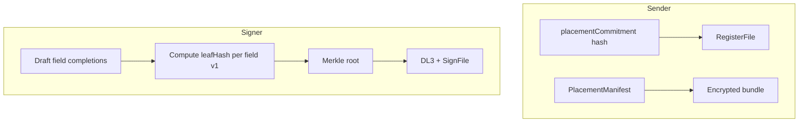

# Signature placement redesign

This document splits **what we implement now** (end-to-end verified flow) from **future sprints** (graphical signature evidence, storage, polish).

---

## Locked decisions (launch)

| Topic | Decision |
|--------|----------|
| **Completions root** | **Merkle tree from day one** — **`completionsRoot`** is the **Merkle root** over per-field leaves. **No** linear V1 aggregate → **no** migration from linear to Merkle later. |
| **Leaf content (launch)** | **Deterministic structured leaf only** — **`leafSchemaVersion = 1`**. No SVG, fonts, or S3 blobs in the proof path until a future sprint explicitly bumps the leaf schema. |
| **Assignment** | **One signer per field.** Sender picks signer per box; two signers ⇒ two boxes. |
| **Envelope** | **One PDF per envelope** (validation). |
| **Signing UX** | **Draft + resume**; **single** final **SignFile** when all **required** fields for that signer are satisfied. |

---

## Deterministic leaf schema (v1 — launch)

**Purpose**: Reproducible **`leafHash`** per `(field, document, layout, signer)` without graphical assets.

**Suggested preimage** (implement in `packages/shared` with **viem `encodeAbiParameters`** or equivalent so TS ↔ Solidity stay aligned):

| Field | Type | Notes |
|--------|------|--------|
| `leafSchemaVersion` | `uint8` | **`1`** for deterministic-only launch. |
| `fieldId` | `bytes32` | `keccak256(utf8(uuid))` or stable id from manifest. |
| `placementCommitment` | `bytes32` | Same value registered on-chain for the file. |
| `pieceCidDigest` | `bytes32` | `keccak256(bytes(pieceCid))` — fixes variable CID string length in encoding. |
| `signer` | `address` | Lowercase-normalized **0x** address for hashing consistency. |

```text
leafHash = keccak256( abi.encode(
  leafSchemaVersion,
  fieldId,
  placementCommitment,
  pieceCidDigest,
  signer
))
```

**Merkle construction**

- Build one **`leafHash`** per completed **required** (and chosen optional) field for **this signer** from manifest.
- **Sort leaves** deterministically (e.g. by **`fieldId`** bytes ascending) **before** pairing — document order in spec + tests.
- **Binary Merkle**: `parent = keccak256(abi.encodePacked(left, right))` (or project-standard pairing — **pick one**, pin in tests). **Odd leaf count**: duplicate last leaf or use standard sentinel — **must be fixed and tested**.

**On-chain / DL3**

- Include **`completionsRoot`** (Merkle root), **`placementCommitment`**, **`leafSchemaVersion`**, **`pieceCid`** (human-readable ok in JSON side), and **`cidIdentifier`** / hashes as already used for registration.
- **`completionsSchemeVersion`** in DL3 JSON aligns with **`leafSchemaVersion`** for auditing.

---

## Architecture (launch path)



---

## Current implementation scope (this sprint)

Ship the **full pipeline** with **deterministic leaves + Merkle**; harden server verification and contracts.

1. **`packages/shared`**
   - `PlacementManifest` schema + canonical serialization → **`placementCommitment`**.
   - **Leaf v1** encoding + **Merkle** builder + unit tests (vectors for tree edge cases).
2. **Contracts**
   - **`RegisterFile`**: **`placementCommitment`** (`bytes32`).
   - **`SignFile` / DL3 binding**: **`completionsRoot`** (**Merkle root**), **`leafSchemaVersion`** (or packed **`signingAttestation`** `bytes32` if gas-minimal — document tradeoff).
   - **Legacy**: existing registrations **without** placement commitment remain on old path until separately migrated (file/content story unchanged).
3. **Server**
   - Draft endpoints: record completed **`fieldId`**s per `(pieceCid, signer)`.
   - **Finalize**: load manifest (decrypt path or trusted index), **recompute every leaf** and **Merkle root**, verify client-supplied root matches; verify Dilithium over extended message; relay **`SignFile`**.
4. **React SDK**
   - Expose manifest after decrypt; build sign payload with **Merkle root** + **`leafSchemaVersion: 1`**.
5. **Client (minimal)**
   - Placeholder overlays + **cannot submit** until required fields marked complete (even if “signature” is only a confirm action for now).
6. **Send path**
   - Embed manifest in encrypted payload; **`documents.length === 1`** guard.

**Explicitly out of this sprint** (see Future scope): SVG files, S3 signature buckets, canonical SVG normalization, font pipelines, golden SVG fixtures, PDF rendering polish.

---

## Future scope (later sprints)

| Item | Description |
|------|-------------|
| **Leaf schema v2+ (SVG)** | Include **`keccak256(canonicalSvgUtf8)`** (or similar) **inside** leaf preimage **or** as leaf replacement recipe; bump **`leafSchemaVersion`** / **`completionsSchemeVersion`** — **no** Merkle algorithm migration, only leaf definition change. |
| **Canonical SVG pipeline** | Parser/normalizer, golden tests, pinned tooling — **separate sprint** after core flow is stable. |
| **Private S3 + DB URLs** | Store SVG blobs for audit/evidence; presigned access; PII posture — **after** leaf schema binds graphical content. |
| **Fonts / typed styling** | Only relevant once SVG or render pipeline exists; **not** in deterministic-only launch. |
| **Rich PDF tooling** | pdf.js / PDF-lib overlays, pixel-perfect placement — polish after backend proven. |
| **Multi-document envelopes** | Optional scale-out; model already **one manifest per PDF**. |

---

## PlacementManifest (schema sketch)

- `version`: manifest format version (distinct from **`leafSchemaVersion`**).
- `fields[]`: `id`, `pageIndex`, `rect` (fixed-point), **`assignedSigner`**, `required`, `type` (extensible).

---

## Draft / resume

- Persist **which `fieldId`s are complete** per signer (and timestamps if needed).
- **No** SVG upload in launch path — completion can be a **button per field** that records intent for v1 deterministic leaf.
- Single **on-chain** **`SignFile`** after all **required** fields done.

---

## Risk mitigations (launch)

| Risk | Mitigation |
|------|------------|
| Leaf / Merkle mismatch TS vs Solidity | Shared **`encodeAbiParameters`** vectors; optional small Solidity **pure** helper for on-chain verification later. |
| Merkle odd-leaf / ordering bugs | Spec sort key + duplicate rule + fixture tests. |
| Forged root | Server **recomputes** full tree from manifest + signer + **`pieceCid`**. |
| Legacy files | Old **`signaturePosition`** JSON path vs new **`placementCommitment`** — explicit feature flag / migration story for **sender**, not Merkle-vs-linear (avoided). |

---

## Reference (historical)

Earlier explorations considered **linear aggregate**, **SVG-first leaves**, **font params**, and **Merkle as future** — **superseded** by: **Merkle from day one**, **deterministic leaves first**, **SVG/S3 in a later sprint**.

Legacy four-tuple **`signaturePosition`** in encrypted JSON remains until envelope/send flow migrates to **`PlacementManifest`**.
