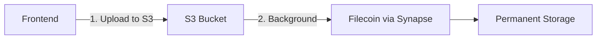
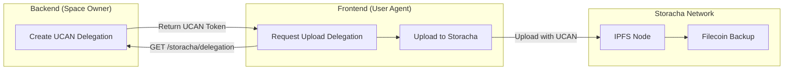
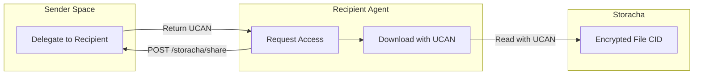

# Storacha UCAN Integration Plan

## Overview

Replace S3 temporary storage with Storacha's decentralized IPFS/Filecoin storage. Use UCAN (User Controlled Authorization Networks) delegation chains so the backend can delegate storage capabilities to frontend clients and document recipients, enabling:

- Direct client-to-Storacha uploads (no backend bandwidth)
- Recipient access via UCAN delegation chains
- Permanent decentralized storage with IPFS CIDs

## Architecture Changes

### Current Flow (S3 + Filecoin Migration)




### New Flow (Storacha with UCAN)




### Document Sharing with UCAN Chains




---

## Implementation Steps

### Phase 1: Add Storacha Dependencies

**Files:**

- `[packages/lib/react-sdk/package.json](packages/lib/react-sdk/package.json)` - Add `@storacha/client`
- `[packages/server/package.json](packages/server/package.json)` - Add `@storacha/client`

**Dependencies:**

```bash
bun add @storacha/client
```

---

### Phase 2: Backend Storacha Service Layer

**New Files:**

1. **[NEW]** `[packages/server/lib/storacha/client.ts](packages/server/lib/storacha/client.ts)`
  - Initialize Storacha client with server Space
  - Load Space from `STORACHA_SPACE_DID` and `STORACHA_DELEGATION` env vars
  - Use `Signer.parse()` with server private key
2. **[NEW]** `[packages/server/lib/storacha/delegations.ts](packages/server/lib/storacha/delegations.ts)`
  - `createUploadDelegation(agentDID, expiration)` - Delegate `space/blob/add`, `space/index/add`, `filecoin/offer`, `upload/add`
  - `createReadDelegation(agentDID, cid, expiration)` - Delegate read access for specific CID
  - `serializeDelegation(delegation)` - Archive to Uint8Array for transport
3. **[NEW]** `[packages/server/api/routes/storacha/index.ts](packages/server/api/routes/storacha/index.ts)`
  - `POST /storacha/delegation/upload` - Get upload delegation for frontend
  - `POST /storacha/delegation/access` - Get read delegation for specific CID
  - `POST /storacha/share` - Create delegation chain for document recipient

---

### Phase 3: Frontend Storacha Integration

**New Files:**

1. **[NEW]** `[packages/lib/react-sdk/src/storacha/client.ts](packages/lib/react-sdk/src/storacha/client.ts)`
  - Initialize Storacha client with ephemeral Agent DID
  - `requestUploadDelegation()` - Fetch delegation from backend
  - `uploadWithDelegation(file, delegation)` - Upload using delegated UCAN
2. **[NEW]** `[packages/lib/react-sdk/src/storacha/download.ts](packages/lib/react-sdk/src/storacha/download.ts)`
  - `requestAccessDelegation(cid)` - Get read delegation from backend
  - `fetchFromStoracha(cid, delegation)` - Download file using UCAN

---

### Phase 4: Update File Upload Flow

**Modified Files:**

1. **[MODIFY]** `[packages/lib/react-sdk/src/hooks/files/useSendFile.ts](packages/lib/react-sdk/src/hooks/files/useSendFile.ts)`
  **Current Flow (lines 129-149):**

```typescript
   // 1. Get S3 presigned URL from backend
   const uploadStartResponse = await api.rpc.postSafe(...)
   // 2. Upload encrypted data to S3
   const uploadResponse = await fetch(uploadStartResponse.data.uploadUrl, ...)
   

```

   **New Flow:**

```typescript
   // 1. Get UCAN delegation from backend
   const delegationResponse = await api.rpc.postSafe(
     { delegation: z.instanceof(Uint8Array) },
     "/storacha/delegation/upload",
     { agentDID: client.agent.did() }
   );
   
   // 2. Deserialize delegation and add to client
   const delegation = await Delegation.extract(delegationResponse.data.delegation);
   const space = await client.addSpace(delegation.ok);
   await client.setCurrentSpace(space.did());
   
   // 3. Upload directly to Storacha
   const cid = await client.uploadFile(new File([encryptedData], pieceCid.toString()));
   

```

1. **[MODIFY]** `[packages/server/api/routes/files/index.ts](packages/server/api/routes/files/index.ts)`
  **Remove:**
  - `POST /files/upload/start` (no longer needed - Storacha handles auth)
  - `GET /:pieceCid/s3` (replaced by Storacha direct access)
   **Update:** `POST /files` registration endpoint
  - Remove S3 validation (lines 107-122)
  - Accept CID from Storacha instead of pieceCid from S3
  - Register CID on-chain via FSFileRegistry

---

### Phase 5: Update File Download Flow

**Modified Files:**

1. **[MODIFY]** `[packages/lib/react-sdk/src/hooks/files/useViewFile.ts](packages/lib/react-sdk/src/hooks/files/useViewFile.ts)`
  **Current:**

```typescript
   // 1. Get S3 presigned URL
   const { presignedUrl } = await api.rpc.getSafe(..., `/files/${pieceCid}/s3`);
   // 2. Fetch from S3
   const response = await fetch(presignedUrl);
   

```

   **New:**

```typescript
   // 1. Request UCAN delegation for this CID
   const delegationResponse = await api.rpc.postSafe(
     ..., 
     "/storacha/delegation/access",
     { cid, recipient: wallet.account.address }
   );
   
   // 2. Deserialize and use delegation
   const delegation = await Delegation.extract(delegationResponse.data.delegation);
   
   // 3. Fetch from Storacha using UCAN
   const response = await fetchFromStoracha(cid, delegation.ok);
   

```

---

### Phase 6: Document Sharing via UCAN Chains

**New Capability:** Enable recipients to access files directly from Storacha without backend proxy.

**Implementation:**

1. **[NEW]** `[packages/server/api/routes/storacha/share.ts](packages/server/api/routes/storacha/share.ts)`
  - `POST /storacha/share` 
  - Body: `{ cid, recipientDID, expiration }`
  - Creates UCAN delegation from sender Space to recipient Agent
  - Stores delegation reference in database
2. **[MODIFY]** `[packages/server/lib/db/schema/file.ts](packages/server/lib/db/schema/file.ts)`
  - Add `storachaCid` column to `files` table (replaces/pairs with pieceCid)
  - Add `storachaDelegations` table for tracking UCAN delegation chains:

```typescript
     {
       id: uuid primary key,
       filePieceCid: text references files,
       recipientWallet: text,
       delegationHash: text, // Hash of UCAN delegation
       expiresAt: timestamp,
       ...timestamps
     }
     

```

---

### Phase 7: Environment Configuration

**Files:**

- `[packages/server/.env.template](packages/server/.env.template)`
- `[packages/server/env.ts](packages/server/env.ts)`

**New Variables:**

```bash
# Storacha Configuration
STORACHA_SPACE_DID=did:key:...          # Server's Space DID
STORACHA_DELEGATION=                    # Base64 delegation from CLI
STORACHA_PRIVATE_KEY=Mg...              # Server Agent private key
STORACHA_NETWORK=mainnet                # or testnet

# Optional: Relay service for email-based auth
STORACHA_RELAY_URL=https://up.storacha.network
```

---

### Phase 8: Remove/Deprecate S3

**Files:**

- `[packages/server/lib/s3/client.ts](packages/server/lib/s3/client.ts)` - Can be removed or kept for migration
- Remove S3 env vars from validation

**Migration Strategy:**

1. Keep existing files in S3 for backward compatibility
2. New uploads go directly to Storacha
3. Gradually migrate S3 files to Storacha (background job)

---

## UCAN Delegation Details

### Upload Delegation Structure

```typescript
const abilities = [
  'space/blob/add',      // Add blobs to space
  'space/index/add',     // Add to IPFS index
  'filecoin/offer',      // Offer to Filecoin
  'upload/add'           // Upload capability
];

const delegation = await client.createDelegation(
  audienceDID,           // Frontend Agent DID
  abilities,
  { 
    expiration: Math.floor(Date.now() / 1000) + (60 * 60), // 1 hour
    restrictions: {
      // Optional: size limits, content types
    }
  }
);
```

### Read Access Delegation

```typescript
const readDelegation = await client.createDelegation(
  recipientDID,
  ['space/blob/get', 'upload/get'],
  {
    expiration: Math.floor(Date.now() / 1000) + (7 * 24 * 60 * 60), // 7 days
    restrictions: {
      resources: [`ipfs://${cid}`]  // Limit to specific CID
    }
  }
);
```

### UCAN Chain for Sharing

```
Sender Space (did:key:ABC)
  └─delegates──► Backend Agent (did:key:SERVER)
                   └─delegates──► Recipient Agent (did:key:RECIPIENT)
```

---

## Files Modified Summary


| Package     | Files                   | Type                                   |
| ----------- | ----------------------- | -------------------------------------- |
| `server`    | 3 new (storacha/)       | Storacha service layer                 |
| `server`    | 1 route file            | New `/storacha` routes                 |
| `server`    | 1 schema file           | Add storacha columns/delegations table |
| `server`    | 1 env file              | Storacha config                        |
| `react-sdk` | 2 new files (storacha/) | Client upload/download                 |
| `react-sdk` | 2 hooks                 | Update useSendFile, useViewFile        |
| `client`    | env templates           | Storacha network config                |


---

## Bounty Alignment

### Storacha Bounty Requirements

1. **Decentralized Storage**: Replace S3 with Storacha (IPFS + Filecoin)
2. **UCAN Delegation Chains**: Document sharing via UCAN delegation to recipients
3. **Infrastructure Track**: Directly targets "Existing Code" and "Infrastructure" prizes

### Additional Benefits

1. **No Backend Bandwidth**: Clients upload/download directly to Storacha
2. **Permanent Storage**: Filecoin backing ensures long-term availability
3. **Content Addressing**: IPFS CIDs for verifiable document integrity
4. **Familiar UX**: Users still see pieceCid but backed by Storacha instead of S3

---

## Implementation Complexity vs Lit Protocol


| Aspect           | Lit Protocol                     | Storacha                          |
| ---------------- | -------------------------------- | --------------------------------- |
| **Encryption**   | Network-based (Lit nodes)        | Client-side (keep current)        |
| **Key Storage**  | No keys stored (Lit manages)     | Keep current ML-KEM + SQLite      |
| **Auth Model**   | Wallet signatures for decryption | UCAN delegation chains            |
| **Network Dep**  | High (requires Lit nodes)        | Medium (Storacha service)         |
| **Code Changes** | High (replace crypto layer)      | Medium (replace storage layer)    |
| **Bounty Fit**   | NextGen AI Apps ($1,000)         | Storacha + Infrastructure ($500+) |
| **Timeline**     | Complex, more time               | Moderate, fits March 16           |


**Recommendation**: Storacha is more achievable by March 16 with UCAN delegation as the key feature, while maintaining your existing ML-KEM encryption layer.