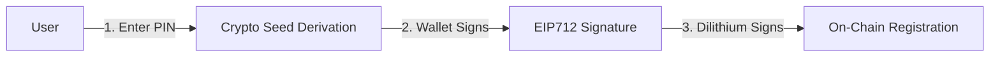
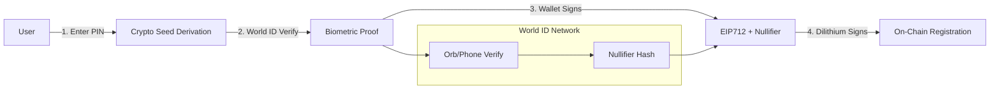

# World ID Biometric Integration Plan

## Overview

Add World ID as a third authentication factor for document signing, upgrading from 2FA (PIN + wallet) to 3FA (PIN + wallet + biometrics). World ID's iris-based Proof of Personhood ensures only real humans can sign documents, preventing AI/bot signatures.

## Architecture Changes

### Current 2FA Flow




### New 3FA Flow with World ID




---

## Implementation Steps

### Phase 1: World ID Developer Portal Setup

**Prerequisites (Manual Steps):**

1. Create app at [https://developer.world.org](https://developer.world.org)
2. Note down:
  - `app_id` (e.g., `app_xxxxx`)
  - `rp_id` (e.g., `rp_xxxxx`)
  - `signing_key` (keep secret, for backend only)
3. Create Incognito Action named `sign-document`
4. Configure signal format: wallet address + pieceCid

**Environment Variables:**

```bash
# packages/server/.env
WORLD_ID_RP_ID=rp_xxxxx
WORLD_ID_SIGNING_KEY=sk_xxxxx  # Never expose to frontend
WORLD_ID_APP_ID=app_xxxxx

# packages/client/.env
VITE_WORLD_ID_APP_ID=app_xxxxx
```

---

### Phase 2: Add World ID Dependencies

**Files:**

- `[packages/lib/react-sdk/package.json](packages/lib/react-sdk/package.json)`
- `[packages/server/package.json](packages/server/package.json)`

**Dependencies:**

```bash
bun add @worldcoin/idkit @worldcoin/idkit-core
```

---

### Phase 3: Backend RP Signature Endpoint

**New File:** `[packages/server/api/routes/worldid/index.ts](packages/server/api/routes/worldid/index.ts)`

**Implementation:**

```typescript
import { signRequest } from "@worldcoin/idkit/signing";
import { Hono } from "hono";
import { authenticated } from "@/api/middleware/auth";
import env from "@/env";

export default new Hono()
  .post("/rp-signature", authenticated, async (ctx) => {
    const { action, signal } = await ctx.req.json();
    
    // Generate RP signature to prevent impersonation
    const { sig, nonce, createdAt, expiresAt } = signRequest(
      action,
      env.WORLD_ID_SIGNING_KEY,
      { signal } // Optional: bind to wallet+document
    );
    
    return ctx.json({
      sig,
      nonce,
      created_at: createdAt,
      expires_at: expiresAt,
      rp_id: env.WORLD_ID_RP_ID,
    });
  })
  
  .post("/verify", authenticated, async (ctx) => {
    const { rp_id, idkitResponse } = await ctx.req.json();
    
    // Forward to World ID Developer Portal for verification
    const response = await fetch(
      `https://developer.world.org/api/v4/verify/${rp_id}`,
      {
        method: "POST",
        headers: { "content-type": "application/json" },
        body: JSON.stringify(idkitResponse),
      }
    );
    
    const result = await response.json();
    
    if (!response.ok) {
      return ctx.json({ error: result }, 400);
    }
    
    // Extract nullifier hash for on-chain storage
    const nullifierHash = idkitResponse.responses?.[0]?.nullifier;
    
    return ctx.json({
      success: true,
      nullifierHash,
      verified: true,
    });
  });
```

**Update Router:** `[packages/server/api/routes/router.ts](packages/server/api/routes/router.ts)`

```typescript
import worldid from "./worldid";
// ...
export const apiRouter = new Hono()
  // ... existing routes
  .route("/worldid", worldid);
```

---

### Phase 4: Create World ID React Hook

**New File:** `[packages/lib/react-sdk/src/hooks/auth/useWorldID.ts](packages/lib/react-sdk/src/hooks/auth/useWorldID.ts)`

**Implementation:**

```typescript
import { IDKit, orbLegacy } from "@worldcoin/idkit-core";
import { useState, useCallback } from "react";
import { useFilosignContext } from "../../context/FilosignProvider";

interface WorldIDProof {
  nullifierHash: string;
  proof: any;
  verified: boolean;
}

export function useWorldID() {
  const { api, wallet } = useFilosignContext();
  const [isVerifying, setIsVerifying] = useState(false);

  const verifyHuman = useCallback(async (
    action: string,
    signal?: string
  ): Promise<WorldIDProof | null> => {
    if (!wallet) throw new Error("Wallet not connected");
    
    setIsVerifying(true);
    
    try {
      // 1. Get RP signature from backend
      const rpSig = await api.rpc.postSafe(
        { sig: z.string(), nonce: z.string(), created_at: z.number(), expires_at: z.number() },
        "/worldid/rp-signature",
        { action, signal }
      );
      
      // 2. Create IDKit request
      const request = await IDKit.request({
        app_id: import.meta.env.VITE_WORLD_ID_APP_ID,
        action,
        rp_context: {
          rp_id: rpSig.data.rp_id,
          nonce: rpSig.data.nonce,
          created_at: rpSig.data.created_at,
          expires_at: rpSig.data.expires_at,
          signature: rpSig.data.sig,
        },
        allow_legacy_proofs: true,
        environment: "production", // Use "staging" for testing
      }).preset(orbLegacy({ signal: signal || "" }));
      
      // 3. Open World App (via QR/URL) and wait for proof
      const response = await request.pollUntilCompletion();
      
      // 4. Verify proof in backend
      const verifyResult = await api.rpc.postSafe(
        { nullifierHash: z.string(), verified: z.boolean() },
        "/worldid/verify",
        { rp_id: rpSig.data.rp_id, idkitResponse: response }
      );
      
      return {
        nullifierHash: verifyResult.data.nullifierHash,
        proof: response,
        verified: verifyResult.data.verified,
      };
    } finally {
      setIsVerifying(false);
    }
  }, [api, wallet]);

  return { verifyHuman, isVerifying };
}
```

---

### Phase 5: Update Smart Contract

**Modified File:** `[packages/contracts/src/FSFileRegistry.sol](packages/contracts/src/FSFileRegistry.sol)`

**Changes:**

1. **Update SIGN_FILE_TYPEHASH to include nullifier hash:**

```solidity
// Old
bytes32 private constant SIGN_FILE_TYPEHASH =
    keccak256(
        "SignFile(bytes32 cidIdentifier,address sender,address signer,bytes20 dl3SignatureCommitment,uint256 timestamp,uint256 nonce)"
    );

// New - Add worldIdNullifier
bytes32 private constant SIGN_FILE_TYPEHASH =
    keccak256(
        "SignFile(bytes32 cidIdentifier,address sender,address signer,bytes20 dl3SignatureCommitment,bytes32 worldIdNullifier,uint256 timestamp,uint256 nonce)"
    );
```

1. **Update FileRegistration struct to store nullifier:**

```solidity
struct FileRegistration {
    bytes32 cidIdentifier;
    address sender;
    mapping(address => bool) signers;
    uint8 signersCount;
    mapping(address => bytes) signatures;
    mapping(address => bytes32) worldIdNullifiers; // NEW: Store nullifier per signer
    uint256 timestamp;
}
```

1. **Update registerFileSignature function:**

```solidity
function registerFileSignature(
    string calldata pieceCid_,
    address sender_,
    address signer_,
    bytes20 dl3SignatureCommitment_,
    bytes32 worldIdNullifier_, // NEW parameter
    uint256 timestamp_,
    bytes calldata signature_
) external onlyServer {
    require(
        validateFileSigningSignature(
            pieceCid_,
            sender_,
            signer_,
            dl3SignatureCommitment_,
            worldIdNullifier_, // Pass to validation
            timestamp_,
            signature_
        ),
        InvalidSignature()
    );

    bytes32 cidId = cidIdentifier(pieceCid_);
    FileRegistration storage file = _fileRegistrations[cidId];
    if (file.timestamp == 0) revert FileNotRegistered();
    if (file.signatures[signer_].length != 0) revert AlreadySigned();
    if (file.worldIdNullifiers[signer_] != bytes32(0)) revert AlreadyVerified(); // Prevent replay
    
    file.signatures[signer_] = signature_;
    file.worldIdNullifiers[signer_] = worldIdNullifier_; // Store nullifier

    nonce[signer_]++;
    emit FileSigned(cidId, sender_, signer_, uint48(timestamp_), worldIdNullifier_);
}
```

1. **Update validateFileSigningSignature:**

```solidity
function validateFileSigningSignature(
    string calldata pieceCid_,
    address sender_,
    address signer_,
    bytes20 dl3SignatureCommitment_,
    bytes32 worldIdNullifier_, // NEW parameter
    uint256 timestamp_,
    bytes calldata signature_
) public view returns (bool) {
    require(
        block.timestamp <= timestamp_ + SIGNATURE_VALIDITY_PERIOD,
        SignatureExpired()
    );

    FileRegistration storage file = _fileRegistrations[cidIdentifier(pieceCid_)];
    if (!file.signers[signer_]) revert InvalidSigner();
    if (file.sender != sender_) revert InvalidSender();

    bytes32 cidId = cidIdentifier(pieceCid_);
    bytes32 structHash = keccak256(
        abi.encode(
            SIGN_FILE_TYPEHASH,
            cidId,
            sender_,
            signer_,
            dl3SignatureCommitment_,
            worldIdNullifier_, // Include in hash
            timestamp_,
            nonce[signer_]
        )
    );
    bytes32 digest = _hashTypedDataV4(structHash);
    address recovered = ECDSA.recover(digest, signature_);
    return recovered == signer_;
}
```

1. **Update FileSigned event:**

```solidity
event FileSigned(
    bytes32 indexed cidIdentifier,
    address indexed sender,
    address indexed signer,
    uint48 timestamp,
    bytes32 worldIdNullifier // NEW: Include nullifier in event
);
```

1. **Add getter for nullifier:**

```solidity
function getWorldIdNullifier(
    bytes32 cidId,
    address signer
) external view returns (bytes32) {
    return _fileRegistrations[cidId].worldIdNullifiers[signer];
}
```

**Update Interface:** `[packages/contracts/src/interfaces/IFSFileRegistry.sol](packages/contracts/src/interfaces/IFSFileRegistry.sol)`

```solidity
function registerFileSignature(
    string calldata pieceCid_,
    address sender_,
    address signer_,
    bytes20 dl3SignatureCommitment_,
    bytes32 worldIdNullifier_, // Add to interface
    uint256 timestamp_,
    bytes calldata signature_
) external;

function getWorldIdNullifier(bytes32 cidId, address signer) external view returns (bytes32);
```

---

### Phase 6: Update React SDK useSignFile Hook

**Modified File:** `[packages/lib/react-sdk/src/hooks/files/useSignFile.ts](packages/lib/react-sdk/src/hooks/files/useSignFile.ts)`

**Changes:**

1. **Import World ID hook:**

```typescript
import { useWorldID } from "../auth/useWorldID";
```

1. **Add World ID verification before signing:**

```typescript
export function useSignFile() {
  const { contracts, wallet, api, wasm } = useFilosignContext();
  const { action: cryptoAction } = useCryptoSeed();
  const { verifyHuman, isVerifying } = useWorldID(); // Add World ID

  return useMutation({
    mutationFn: async (args: { pieceCid: string }) => {
      let success = false;
      const { pieceCid } = args;
      const timestamp = Math.floor(Date.now() / 1000);

      if (!contracts || !wallet || !wasm.dilithium) {
        throw new Error("not connected");
      }

      await cryptoAction(async (seed: Uint8Array) => {
        // ... existing file fetch ...
        
        // 1. WORLD ID VERIFICATION (NEW STEP)
        const signal = `${wallet.account.address}:${pieceCid}:${timestamp}`;
        const worldIdProof = await verifyHuman("sign-document", signal);
        
        if (!worldIdProof?.verified) {
          throw new Error("World ID verification failed");
        }
        
        // ... existing Dilithium signing ...
        
        const dl3SignatureCommitment = computeCommitment([toHex(dl3Signature)]);

        // 2. EIP712 signature now includes World ID nullifier
        const signature = await eip712signature(contracts, "FSFileRegistry", {
          types: {
            SignFile: [
              { name: "cidIdentifier", type: "bytes32" },
              { name: "sender", type: "address" },
              { name: "signer", type: "address" },
              { name: "dl3SignatureCommitment", type: "bytes20" },
              { name: "worldIdNullifier", type: "bytes32" }, // NEW
              { name: "timestamp", type: "uint256" },
              { name: "nonce", type: "uint256" },
            ],
          },
          primaryType: "SignFile",
          message: {
            cidIdentifier,
            sender,
            signer: wallet.account.address,
            dl3SignatureCommitment,
            worldIdNullifier: worldIdProof.nullifierHash, // Include nullifier
            timestamp: BigInt(timestamp),
            nonce: BigInt(nonce),
          },
        });

        // 3. Send to backend with nullifier
        const signResponse = await api.rpc.postSafe(
          {},
          `/files/${pieceCid}/sign`,
          {
            signature,
            timestamp,
            dl3Signature: toHex(dl3Signature),
            worldIdNullifier: worldIdProof.nullifierHash, // Include nullifier
          },
        );

        success = signResponse.success;
      });

      return success;
    },
  });
}
```

---

### Phase 7: Update Backend Sign Endpoint

**Modified File:** `[packages/server/api/routes/files/index.ts](packages/server/api/routes/files/index.ts)`

**Update `POST /:pieceCid/sign`:**

1. **Accept worldIdNullifier in request:**

```typescript
const rawBody = await ctx.req.json();
const parsedBody = z
  .object({
    signature: zHexString(),
    timestamp: z.number(),
    dl3Signature: zHexString(),
    worldIdNullifier: zHexString(), // NEW: Accept nullifier
  })
  .safeParse(rawBody);
```

1. **Forward to contract with nullifier:**

```typescript
const { signature, timestamp, dl3Signature, worldIdNullifier } = parsedBody.data;

// ... existing validation ...

const txHash = await FSFileRegistry.write.registerFileSignature([
  pieceCid,
  fileRecord.sender,
  participantRecord.wallet,
  dl3SignatureCommitment,
  worldIdNullifier, // NEW: Pass nullifier to contract
  BigInt(timestamp),
  signature,
]);
```

1. **Store in database:**

```typescript
await db.insert(fileSignatures).values({
  filePieceCid: pieceCid,
  signer: participantRecord.wallet,
  evmSignature: signature,
  dl3Signature: dl3Signature,
  worldIdNullifier: worldIdNullifier, // NEW
  onchainTxHash: txHash,
  createdAt: new Date(timestamp * 1000),
});
```

**Update Database Schema:** `[packages/server/lib/db/schema/file.ts](packages/server/lib/db/schema/file.ts)`

```typescript
export const fileSignatures = t.pgTable(
  "file_signatures",
  {
    // ... existing columns ...
    dl3Signature: tHex().notNull(),
    worldIdNullifier: tHex(), // NEW: Store nullifier (nullable for legacy)
    onchainTxHash: t.text(),
    ...timestamps,
  },
  // ...
);
```

---

### Phase 8: Create World ID Verification UI

**New File:** `[packages/client/src/lib/components/custom/WorldIDButton.tsx](packages/client/src/lib/components/custom/WorldIDButton.tsx)`

**Implementation:**

```typescript
import { IDKitRequestWidget, orbLegacy } from "@worldcoin/idkit";
import { Button } from "@/components/ui/button";
import { useState } from "react";

interface WorldIDButtonProps {
  onVerified: (nullifierHash: string) => void;
  pieceCid: string;
}

export function WorldIDButton({ onVerified, pieceCid }: WorldIDButtonProps) {
  const [open, setOpen] = useState(false);

  return (
    <>
      <Button onClick={() => setOpen(true)}>
        Verify with World ID
      </Button>
      
      {/* IDKit widget will be opened via the hook */}
    </>
  );
}
```

---

### Phase 9: Update Environment Validation

**Modified File:** `[packages/server/env.ts](packages/server/env.ts)`

**Add World ID env validation:**

```typescript
export default z.object({
  // ... existing env vars ...
  WORLD_ID_RP_ID: z.string(),
  WORLD_ID_SIGNING_KEY: z.string(),
  WORLD_ID_APP_ID: z.string(),
}).parse(process.env);
```

**Modified File:** `[packages/client/env.ts](packages/client/env.ts)`

```typescript
export default z.object({
  // ... existing ...
  VITE_WORLD_ID_APP_ID: z.string(),
}).parse(import.meta.env);
```

---

### Phase 10: Testing & Validation

**Test Scenarios:**

1. **Happy Path:**
  - User initiates signature
  - World ID verification succeeds
  - Nullifier hash captured
  - Signature submitted with nullifier
  - Contract stores nullifier on-chain
2. **Replay Protection:**
  - Try to reuse nullifier for same document
  - Contract should reject: `AlreadyVerified()`
3. **Wrong Person:**
  - Different World ID user tries to sign
  - Nullifier hash differs, valid new signature
4. **Legacy Documents:**
  - Pre-World ID signatures remain valid
  - Optional nullifier field in DB

---

## Files Modified Summary


| Package     | Files                 | Type                                 |
| ----------- | --------------------- | ------------------------------------ |
| `server`    | 2 new routes          | World ID RP signature + verification |
| `server`    | 1 route file modified | Add nullifier to sign endpoint       |
| `server`    | 1 schema file         | Add worldIdNullifier column          |
| `server`    | 1 env file            | World ID config                      |
| `react-sdk` | 1 new hook            | useWorldID.ts                        |
| `react-sdk` | 1 hook modified       | useSignFile.ts                       |
| `contracts` | 1 contract modified   | FSFileRegistry.sol                   |
| `contracts` | 1 interface modified  | IFSFileRegistry.sol                  |
| `client`    | 1 new component       | WorldIDButton.tsx                    |
| `client`    | 1 env file            | VITE_WORLD_ID_APP_ID                 |


---

## Bounty Alignment

### World Build 3: Human-Centric App Challenge ($5,000 pool)

**Requirements Met:**

1. **Human-Centric**: World ID iris biometrics prove humanness
2. **3FA Implementation**: PIN + Wallet + Biometrics
3. **Anti-AI/Bot**: Orb verification prevents automated signatures
4. **On-Chain Proof**: Nullifier hash permanently stored on FVM
5. **Privacy Preserving**: Zero-knowledge proofs, no PII revealed

**Unique Value Proposition:**

- First e-signature platform with biometric human verification
- Mathematically impossible for AI/bots to forge signatures
- Permanent audit trail of "human-ness" on Filecoin blockchain

---

## Implementation Timeline Estimate


| Phase                  | Time             | Complexity   |
| ---------------------- | ---------------- | ------------ |
| Portal Setup           | 1-2 hours        | Manual       |
| Dependencies           | 30 min           | Low          |
| Backend RP Endpoint    | 2 hours          | Medium       |
| useWorldID Hook        | 3 hours          | Medium       |
| Smart Contract Updates | 4 hours          | High         |
| useSignFile Update     | 2 hours          | Medium       |
| Database Migration     | 1 hour           | Low          |
| Testing                | 3 hours          | Medium       |
| **Total**              | **~16-20 hours** | **Moderate** |


---

## Risk Considerations

1. **World ID Availability**: Requires users to have completed Orb verification
2. **App Store Compliance**: World App dependency
3. **Testnet vs Mainnet**: Use staging for development
4. **Nullifier Uniqueness**: One nullifier per action per person (by design)
5. **Gas Costs**: Additional calldata for nullifier hash

