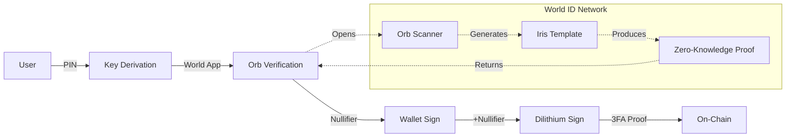

# World ID Biometric Integration Validation

## Executive Summary

**Verdict**: This integration is **HIGHLY RELEVANT** with significant security value, especially for high-value contracts and enterprise use cases requiring strong identity assurance.

**Strategic Fit Score: 9/10**

- Unique 3FA offering (PIN + Wallet + Biometrics) - unprecedented in e-signature space
- Addresses growing AI/bot threat
- Large bounty pool ($5,000) with clear value proposition
- Strong enterprise appeal for high-value agreements
- Privacy-preserving (zero-knowledge proofs)

---

## Value Proposition Analysis

### Current 2FA Model

```
PIN (Knowledge) + Wallet (Possession) = 2FA
```

**Vulnerability**: An AI/bot with stolen credentials could potentially sign

### Proposed 3FA Model

```
PIN (Knowledge) + Wallet (Possession) + Biometrics (Inherence) = 3FA
```

**Security**: Mathematical proof of human execution, AI cannot spoof

### Threat Model Assessment


| Threat                   | Current 2FA               | With World ID 3FA                        |
| ------------------------ | ------------------------- | ---------------------------------------- |
| **AI signature forgery** | Possible with credentials | **Impossible** - no iris                 |
| **Bot automation**       | Possible                  | **Prevented** - requires human           |
| **Credential theft**     | High risk                 | **Mitigated** - biometrics required      |
| **Deepfake video**       | N/A                       | **Prevented** - Orb verification         |
| **Account takeover**     | High risk                 | **High security** - all 3 factors needed |


### Benefits by User Segment


| Segment                  | Benefit                                            | Value Level |
| ------------------------ | -------------------------------------------------- | ----------- |
| **Enterprise Legal**     | Irrefutable proof of human execution               | Very High   |
| **Financial Services**   | Compliance with strong authentication requirements | Very High   |
| **High-Value Contracts** | Prevents automated signature attacks               | Very High   |
| **Government**           | Meets highest identity assurance standards         | High        |
| **Regular Users**        | Additional security (may see as friction)          | Medium      |


---

## Market & Competitive Analysis

### Competitive Landscape


| Competitor              | Biometric Auth    | Human Verification    | Notes                                   |
| ----------------------- | ----------------- | --------------------- | --------------------------------------- |
| **DocuSign**            | ❌ SMS only        | ❌                     | No biometric factor                     |
| **Adobe Sign**          | ❌ Password only   | ❌                     | Standard 2FA                            |
| **HelloSign**           | ❌ Email only      | ❌                     | No human verification                   |
| **Docusign Identify**   | ✅ ID verification | ❌                     | Government ID, not biometric            |
| **Jumio/Onfido**        | ✅ Face match      | ❌                     | Document-based, not proof of personhood |
| **Filosign + World ID** | ✅ Iris biometrics | ✅ Proof of Personhood | **Unique** - only World ID offers this  |


**Key Insight**: No e-signature platform currently offers biometric proof of personhood. This is a unique differentiator.

### Market Timing

**Why Now:**

1. **AI Explosion**: ChatGPT, Claude, and other AI make automated attacks easier
2. **Deepfake Concerns**: Video signatures becoming untrustworthy
3. **Regulatory Pressure**: EU AI Act requiring human-in-the-loop for important decisions
4. **World ID Maturation**: Network is live, orbs operational, SDK stable

**Risk of Waiting:**

- Competitors may adopt similar biometrics
- First-mover advantage in "human-verified signatures"

---

## Technical Architecture Assessment

### Current 2FA Flow


### Proposed 3FA Flow




### Integration Complexity Analysis


| Component                  | Complexity | Risk   | Notes                                      |
| -------------------------- | ---------- | ------ | ------------------------------------------ |
| **IDKit Widget**           | Low        | Low    | Well-documented React SDK                  |
| **RP Signature Backend**   | Medium     | Medium | Requires secure key management             |
| **Smart Contract Updates** | Medium     | Medium | Breaking change to signature format        |
| **Orb Availability**       | Medium     | High   | Users must have completed Orb verification |
| **World App Dependency**   | Low        | Medium | Requires mobile app installation           |
| **Testing**                | Medium     | Low    | Can use simulator for dev                  |


---

## Risk & Challenge Analysis

### Technical Risks


| Risk                   | Likelihood | Impact   | Mitigation                          |
| ---------------------- | ---------- | -------- | ----------------------------------- |
| **Orb access limited** | High       | High     | Offer alternative for non-Orb users |
| **World App required** | High       | Medium   | Clear onboarding instructions       |
| **RP key compromise**  | Low        | Critical | HSM storage, rotation policy        |
| **Network downtime**   | Low        | Medium   | Fallback to 2FA mode                |
| **User friction**      | High       | Medium   | Make optional for low-value docs    |
| **Privacy concerns**   | Medium     | Medium   | Educate on zero-knowledge proofs    |


### Business Risks


| Risk                       | Assessment                               |
| -------------------------- | ---------------------------------------- |
| **Adoption friction**      | Users may skip if Orb access difficult   |
| **Geographic limitations** | Orbs not available in all countries      |
| **Regulatory uncertainty** | Biometric data laws vary by jurisdiction |
| **Sam Altman controversy** | Worldcoin has faced regulatory scrutiny  |
| **Vendor lock-in**         | Dependent on Worldcoin Foundation        |


### Mitigation Strategies

1. **Optional Implementation**: Make World ID optional, not mandatory
  - High-value contracts: Required
  - Standard documents: Optional (2FA sufficient)
2. **Fallback Mode**: If World ID unavailable, fall back to 2FA
  - Document type determines required security level
3. **Geographic Rollout**: Target Orb-available regions first
  - Initial: Europe, Asia, select US cities
  - Phase 2: Expand as Orb network grows

---

## Alternative Approaches

### Option 1: Document-Based Biometrics (Simpler)

- Use Jumio/Onfido for selfie + ID match
- Lower friction (no Orb visit needed)
- **Trade-off**: Less "proof of personhood" strength, more document fraud risk

### Option 2: Hardware Biometrics (Higher Security)

- YubiKey Bio (fingerprint)
- WebAuthn with biometric authenticators
- **Trade-off**: Hardware required, no "unique human" proof

### Option 3: No Biometrics (Status Quo)

- Keep 2FA (PIN + wallet)
- Accept AI/bot risk
- **Trade-off**: Vulnerable to automated attacks as AI improves

### Recommendation: Hybrid Approach

- **Default**: PIN + Wallet (2FA)
- **High-Value**: PIN + Wallet + World ID (3FA)
- **Enterprise Option**: Toggle required auth level per document type

---

## Implementation Considerations

### User Experience Flow

**Current (2FA):**

```
1. Click "Sign Document"
2. Enter PIN
3. Wallet prompt
4. Signature complete
```

**Proposed (3FA):**

```
1. Click "Sign Document"
2. Enter PIN
3. World ID popup
4. Scan QR with World App
5. Orb verification (if needed)
6. Wallet prompt
7. Signature complete
```

**Friction Analysis:**

- Additional step: +30-60 seconds
- World App required: Install if not present
- Orb verification: One-time, then instant

### Privacy Considerations

**World ID Privacy Model:**

- ✅ **No personal data stored**: Only nullifier hash on-chain
- ✅ **Zero-knowledge**: Proof of personhood without revealing identity
- ✅ **Decentralized**: No centralized biometric database
- ✅ **User control**: User owns their identity, can revoke

**Filosign Stance:**

- Store only nullifier hash (random identifier)
- No biometric data touches our servers
- Compliant with GDPR, CCPA

---

## Economic Analysis

### Cost Structure


| Item                        | Cost       | Notes               |
| --------------------------- | ---------- | ------------------- |
| **World ID Network**        | Free       | Currently no fees   |
| **Gas (nullifier storage)** | ~$0.02     | Additional calldata |
| **Development**             | ~2-3 weeks | 1 developer         |
| **RP Infrastructure**       | Minimal    | AWS Lambda/Edge     |
| **Total per signature**     | ~$0.02     | Negligible          |


### Revenue Potential

**Premium Feature Positioning:**

- "World ID Verified" badge: $5/document
- Enterprise 3FA tier: +$20/user/month
- Legal-grade signatures: +$50/document

**ROI Calculation:**

- Dev cost: ~$10,000 (3 weeks @ $3k/week)
- Bounty: $5,000 (covers 50%)
- Break-even: ~500 "verified" signatures

---

## Bounty Alignment

### World Build 3: Human-Centric App Challenge ($5,000 pool)

**Requirements Met:**

1. ✅ **Human-Centric**: World ID iris verification proves humanness
2. ✅ **Anti-AI/Bot**: Only real humans with unique biometrics can sign
3. ✅ **On-Chain Proof**: Nullifier hash stored permanently on FVM
4. ✅ **3FA**: PIN + Wallet + Biometrics = highest security class
5. ✅ **Privacy-Preserving**: Zero-knowledge, no PII revealed

**Unique Value Proposition:**

- World's first biometrically-verified e-signature
- Mathematically impossible for AI to forge
- Irrefutable proof of human execution

---

## Comparison with Other Planned Integrations


| Integration       | Security Value | User Friction | Bounty  | Priority |
| ----------------- | -------------- | ------------- | ------- | -------- |
| **World ID**      | Very High      | Medium        | $5,000  | **#1**   |
| **Storacha**      | Medium         | Low           | $500    | #2       |
| **Lit Protocol**  | High           | Medium        | $1,000  | #3       |
| **Flow Payments** | Medium         | Medium        | $10,000 | #4       |
| **Zama FHE**      | High           | High          | $5,000  | #5       |


**Recommendation**: Implement World ID first - highest security impact with reasonable effort.

---

## Final Recommendation

### Go/No-Go Decision: **GO** ✅✅ (Strong Yes)

**Priority**: **#1 - Implement First**

**Reasoning:**

1. **Unprecedented security**: Only platform offering biometric proof of personhood
2. **Clear market need**: AI/bot threats are growing
3. **Strong differentiation**: No competitor offers this
4. **Manageable scope**: ~2-3 weeks implementation
5. **Privacy-aligned**: Zero-knowledge, user-controlled
6. **Future-proof**: As AI improves, human verification becomes essential

**Suggested Implementation Sequence:**

1. **World ID** (this feature - 2-3 weeks)
2. **Flow** (payments - 4-6 weeks)
3. **Storacha** (storage optimization - 2-3 weeks)
4. **Lit Protocol** (if time permits - 3-4 weeks)
5. **Zama FHE** (advanced enterprise feature - 6-8 weeks)

---

## Success Metrics

**Adoption KPIs:**

- % of high-value documents using World ID: Target >50%
- User completion rate: Target >80%
- Support tickets related to World ID: Target <5%

**Security KPIs:**

- Bot signatures prevented: Track attempts
- User satisfaction with security: Survey >4.5/5

---

## Open Questions to Resolve

1. **Should World ID be mandatory or optional?**
  - Recommendation: Optional with "verified" badge incentive
2. **What document value threshold triggers 3FA requirement?**
  - Recommendation: Configurable per organization ($10k default)
3. **How to handle users without World ID?**
  - Recommendation: Clear onboarding flow, fallback to 2FA
4. **Which countries to prioritize?**
  - Recommendation: Orb-available: Germany, Spain, Portugal, Singapore, etc.
5. **Integration with existing 2FA or replacement?**
  - Recommendation: Addition (PIN + Wallet + World ID), not replacement

