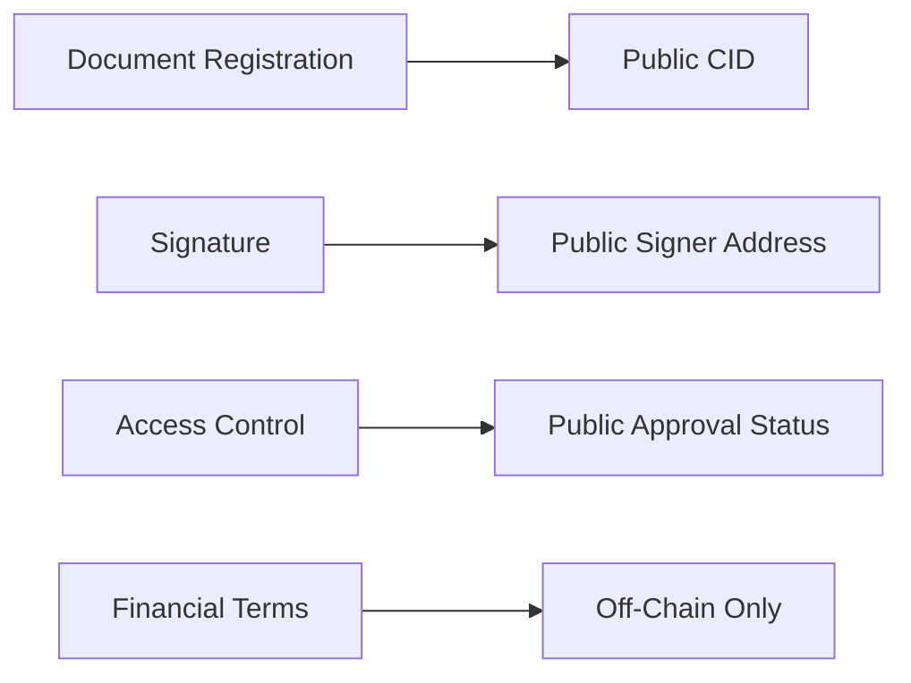
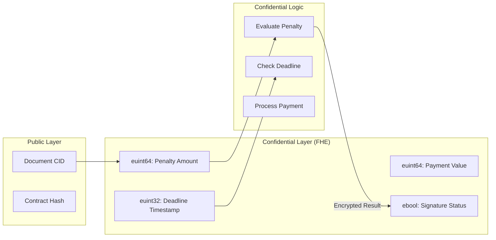

# Zama fhEVM Confidential Contract Logic Plan

## Overview

Build a specialized FHE-enabled version of Filosign's FSManager using Zama's fhEVM (Fully Homomorphic Encryption Virtual Machine). This enables:

- Encrypted financial terms stored on-chain (penalty amounts, payment values)
- Confidential signature workflow state (who signed remains private)
- Automated rule execution on encrypted data (evaluate penalties without revealing amounts)
- Enterprise-grade privacy for sensitive contract terms

## Architecture

### Current Architecture (Public On-Chain State)




### New Confidential Architecture (fhEVM)




---

## Implementation Steps

### Phase 1: Setup Zama fhEVM Dependencies

**Files:**

- `[packages/contracts/package.json](packages/contracts/package.json)`

**Dependencies:**

```bash
bun add @fhevm/solidity
bun add -d fhevm-hardhat-plugin
```

**Hardhat Config Update:** `[packages/contracts/hardhat.config.ts](packages/contracts/hardhat.config.ts)`

```typescript
import "fhevm-hardhat-plugin";

export default {
  // ... existing config
  networks: {
    // Add Zama testnet
    zama: {
      url: "https://rpc.zama.ai",
      chainId: 8009,
      accounts: [process.env.PRIVATE_KEY],
    },
    // Local fhevm devnet
    fhevm: {
      url: "http://localhost:8545",
      chainId: 31337,
    },
  },
};
```

---

### Phase 2: Create Confidential File Registry (FHE Version)

**New File:** `[packages/contracts/src/FHEFSFileRegistry.sol](packages/contracts/src/FHEFSFileRegistry.sol)`

**Implementation:**

```solidity
// SPDX-License-Identifier: AGPL-3.0-or-later
pragma solidity ^0.8.26;

import { FHE, euint64, euint32, ebool, externalEuint64, externalEuint32 } from "@fhevm/solidity/lib/FHE.sol";
import { ZamaEthereumConfig } from "@fhevm/solidity/config/ZamaConfig.sol";
import "./interfaces/IFHEFSFileRegistry.sol";

/**
 * @title FHEFSFileRegistry
 * @notice Confidential document registry with encrypted financial terms
 * @dev Uses Zama fhEVM for fully homomorphic encrypted contract logic
 */
contract FHEFSFileRegistry is ZamaEthereumConfig, IFHEFSFileRegistry {
    
    // Encrypted financial terms for a document
    struct ConfidentialTerms {
        euint64 penaltyAmount;        // Encrypted penalty for late signing
        euint64 paymentAmount;        // Encrypted payment value
        euint32 deadline;             // Encrypted deadline timestamp
        ebool requiresPayment;        // Whether payment is required
    }
    
    // Encrypted signature state (not visible on-chain)
    struct ConfidentialSignature {
        ebool hasSigned;              // Encrypted boolean - has this signer signed?
        euint64 signedAt;             // Encrypted timestamp of signature
        bytes32 nullifierHash;        // Public: World ID nullifier (if used)
    }
    
    // Document registration with public + confidential data
    struct FHERegistration {
        bytes32 cidIdentifier;        // Public: document CID
        address sender;               // Public: document sender
        ConfidentialTerms terms;      // Confidential: financial terms
        uint8 signersCount;           // Public: number of signers
        mapping(address => ConfidentialSignature) signatures;
        bool termsSet;                // Public: have terms been initialized?
    }
    
    mapping(bytes32 => FHERegistration) private _registrations;
    
    // ... inherit server checks, etc.
    
    /**
     * @notice Register a document with encrypted financial terms
     * @param pieceCid_ Document CID
     * @param sender_ Document sender
     * @param signers_ Array of signer addresses
     * @param encryptedPenalty Encrypted penalty amount (externalFHE type)
     * @param encryptedPayment Encrypted payment amount
     * @param encryptedDeadline Encrypted deadline timestamp
     * @param inputProof ZK proof of encryption validity
     */
    function registerFileWithTerms(
        string calldata pieceCid_,
        address sender_,
        address[] calldata signers_,
        externalEuint64 encryptedPenalty,
        externalEuint64 encryptedPayment,
        externalEuint32 encryptedDeadline,
        bytes calldata inputProof
    ) external onlyServer {
        // Convert external encrypted types to internal FHE types
        euint64 penalty = FHE.fromExternal(encryptedPenalty, inputProof);
        euint64 payment = FHE.fromExternal(encryptedPayment, inputProof);
        euint32 deadline = FHE.fromExternal(encryptedDeadline, inputProof);
        
        bytes32 cidId = cidIdentifier(pieceCid_);
        FHERegistration storage reg = _registrations[cidId];
        
        require(reg.sender == address(0), "File already registered");
        
        reg.cidIdentifier = cidId;
        reg.sender = sender_;
        reg.signersCount = uint8(signers_.length);
        reg.termsSet = true;
        
        // Store encrypted terms
        reg.terms = ConfidentialTerms({
            penaltyAmount: penalty,
            paymentAmount: payment,
            deadline: deadline,
            requiresPayment: FHE.gt(payment, FHE.asEuint64(0)) // payment > 0?
        });
        
        // Grant decryption permissions
        FHE.allowThis(penalty);
        FHE.allowThis(payment);
        FHE.allowThis(deadline);
        
        // Allow sender to decrypt
        FHE.allow(penalty, sender_);
        FHE.allow(payment, sender_);
        FHE.allow(deadline, sender_);
        
        emit FileRegisteredWithTerms(cidId, sender_, uint32(block.timestamp));
    }
    
    /**
     * @notice Confidential signature registration
     * @dev Evaluates penalty logic on encrypted data without revealing amounts
     */
    function registerConfidentialSignature(
        string calldata pieceCid_,
        address signer_,
        bytes calldata signature_,
        externalEuint64 encryptedSignTime,  // Encrypted signature timestamp
        bytes calldata inputProof
    ) external onlyServer {
        bytes32 cidId = cidIdentifier(pieceCid_);
        FHERegistration storage reg = _registrations[cidId];
        
        require(reg.termsSet, "Terms not set");
        require(isSigner(cidId, signer_), "Not a signer");
        
        euint64 signTime = FHE.fromExternal(encryptedSignTime, inputProof);
        
        // CONFIDENTIAL LOGIC: Check if signed after deadline
        // This comparison happens on encrypted values!
        ebool afterDeadline = FHE.gt(signTime, reg.terms.deadline);
        
        // CONFIDENTIAL LOGIC: Calculate penalty if late
        // Penalty = afterDeadline ? penaltyAmount : 0
        euint64 appliedPenalty = FHE.select(afterDeadline, reg.terms.penaltyAmount, FHE.asEuint64(0));
        
        // Store encrypted signature state
        reg.signatures[signer_] = ConfidentialSignature({
            hasSigned: FHE.asEbool(true),
            signedAt: signTime,
            nullifierHash: bytes32(0) // Set separately if using World ID
        });
        
        // Grant permissions for signer to decrypt their penalty status
        FHE.allow(appliedPenalty, signer_);
        FHE.allow(appliedPenalty, reg.sender);
        
        emit ConfidentialSignatureRegistered(cidId, signer_, signTime);
    }
    
    /**
     * @notice Check if signature is late (returns encrypted boolean)
     * @dev Caller must have decryption permissions
     */
    function isSignatureLate(
        bytes32 cidId,
        address signer
    ) external view returns (ebool) {
        ConfidentialSignature storage sig = _registrations[cidId].signatures[signer];
        require(FHE.isInitialized(sig.signedAt), "Not signed");
        
        return FHE.gt(sig.signedAt, _registrations[cidId].terms.deadline);
    }
    
    /**
     * @notice Get encrypted penalty for a late signature
     */
    function getLatePenalty(bytes32 cidId) external view returns (euint64) {
        return _registrations[cidId].terms.penaltyAmount;
    }
    
    // Helper functions
    function cidIdentifier(string calldata pieceCid_) public pure returns (bytes32) {
        return keccak256(abi.encodePacked(pieceCid_));
    }
    
    function isSigner(bytes32 cidId, address who) public view returns (bool) {
        // ... existing logic
    }
    
    // Events
    event FileRegisteredWithTerms(bytes32 indexed cidId, address indexed sender, uint32 timestamp);
    event ConfidentialSignatureRegistered(bytes32 indexed cidId, address indexed signer, euint64 signedAt);
}
```

---

### Phase 3: Create Interface for FHE Contract

**New File:** `[packages/contracts/src/interfaces/IFHEFSFileRegistry.sol](packages/contracts/src/interfaces/IFHEFSFileRegistry.sol)`

```solidity
// SPDX-License-Identifier: AGPL-3.0-or-later
pragma solidity ^0.8.26;

import { externalEuint64, externalEuint32, euint64, euint32, ebool } from "@fhevm/solidity/lib/FHE.sol";

interface IFHEFSFileRegistry {
    function registerFileWithTerms(
        string calldata pieceCid_,
        address sender_,
        address[] calldata signers_,
        externalEuint64 encryptedPenalty,
        externalEuint64 encryptedPayment,
        externalEuint32 encryptedDeadline,
        bytes calldata inputProof
    ) external;
    
    function registerConfidentialSignature(
        string calldata pieceCid_,
        address signer_,
        bytes calldata signature_,
        externalEuint64 encryptedSignTime,
        bytes calldata inputProof
    ) external;
    
    function isSignatureLate(bytes32 cidId, address signer) external view returns (ebool);
    function getLatePenalty(bytes32 cidId) external view returns (euint64);
}
```

---

### Phase 4: Create FHE Contract Manager

**New File:** `[packages/contracts/src/FHEFSManager.sol](packages/contracts/src/FHEFSManager.sol)`

```solidity
// SPDX-License-Identifier: AGPL-3.0-or-later
pragma solidity ^0.8.26;

import "./FHEFSFileRegistry.sol";
import "./FSKeyRegistry.sol";

/**
 * @title FHEFSManager
 * @notice Manager for confidential document signing with FHE
 */
contract FHEFSManager {
    address public fheFileRegistry;
    address public keyRegistry;
    address public immutable server;
    
    // Track which documents use confidential mode
    mapping(bytes32 => bool) public isConfidential;
    
    constructor() {
        server = msg.sender;
        fheFileRegistry = address(new FHEFSFileRegistry());
        keyRegistry = address(new FSKeyRegistry());
    }
    
    /**
     * @notice Register a document with confidential financial terms
     */
    function registerConfidentialFile(
        string calldata pieceCid,
        address sender,
        address[] calldata signers,
        externalEuint64 encryptedPenalty,
        externalEuint64 encryptedPayment,
        externalEuint32 encryptedDeadline,
        bytes calldata inputProof
    ) external onlyServer {
        bytes32 cidId = keccak256(abi.encodePacked(pieceCid));
        isConfidential[cidId] = true;
        
        FHEFSFileRegistry(fheFileRegistry).registerFileWithTerms(
            pieceCid,
            sender,
            signers,
            encryptedPenalty,
            encryptedPayment,
            encryptedDeadline,
            inputProof
        );
    }
    
    modifier onlyServer() {
        require(msg.sender == server, "Only server");
        _;
    }
}
```

---

### Phase 5: React SDK - FHE Encryption Utilities

**New File:** `[packages/lib/react-sdk/src/fhe/encryption.ts](packages/lib/react-sdk/src/fhe/encryption.ts)`

```typescript
import { createInstance, FheInstance } from "fhevmjs";

let fheInstance: FheInstance | null = null;

/**
 * Initialize FHE instance for encryption
 */
export async function initFHE() {
  if (!fheInstance) {
    fheInstance = await createInstance({
      network: "zama", // or "local" for devnet
      gatewayUrl: "https://gateway.zama.ai",
    });
  }
  return fheInstance;
}

/**
 * Encrypt a number for FHE contract
 */
export async function encryptUint64(value: bigint): Promise<Uint8Array> {
  const fhe = await initFHE();
  const encrypted = fhe.encrypt64(value);
  return encrypted;
}

/**
 * Encrypt a 32-bit unsigned integer
 */
export async function encryptUint32(value: number): Promise<Uint8Array> {
  const fhe = await initFHE();
  const encrypted = fhe.encrypt32(value);
  return encrypted;
}

/**
 * Encrypt boolean value
 */
export async function encryptBool(value: boolean): Promise<Uint8Array> {
  const fhe = await initFHE();
  const encrypted = fhe.encryptBool(value);
  return encrypted;
}

/**
 * Create input proof for externalFHE types
 */
export async function createInputProof(
  contractAddress: string,
  signerAddress: string,
  encryptedValue: Uint8Array
): Promise<Uint8Array> {
  const fhe = await initFHE();
  const proof = await fhe.generateInputProof({
    contractAddress,
    userAddress: signerAddress,
    encryptedValue,
  });
  return proof;
}
```

---

### Phase 6: React SDK - Confidential File Upload Hook

**New File:** `[packages/lib/react-sdk/src/hooks/files/useConfidentialSendFile.ts](packages/lib/react-sdk/src/hooks/files/useConfidentialSendFile.ts)`

```typescript
import { useMutation } from "@tanstack/react-query";
import { useFilosignContext } from "../../context/FilosignProvider";
import { encryptUint64, encryptUint32, createInputProof } from "../../fhe/encryption";

interface ConfidentialTerms {
  penaltyAmount: bigint;  // In wei/smallest unit
  paymentAmount: bigint;
  deadline: number;       // Unix timestamp
}

export function useConfidentialSendFile() {
  const { contracts, wallet, api } = useFilosignContext();

  return useMutation({
    mutationFn: async (args: {
      pieceCid: string;
      signers: string[];
      terms: ConfidentialTerms;
    }) => {
      if (!wallet || !contracts) throw new Error("Not connected");

      // 1. Encrypt financial terms client-side
      const encryptedPenalty = await encryptUint64(args.terms.penaltyAmount);
      const encryptedPayment = await encryptUint64(args.terms.paymentAmount);
      const encryptedDeadline = await encryptUint32(args.terms.deadline);

      // 2. Generate input proofs for each encrypted value
      const penaltyProof = await createInputProof(
        contracts.FHEFSManager.address,
        wallet.account.address,
        encryptedPenalty
      );
      
      // Combine proofs (or send separately based on contract design)
      const combinedProof = combineProofs([penaltyProof /* ... */]);

      // 3. Register confidential file via backend
      const response = await api.rpc.postSafe(
        {},
        "/files/confidential",
        {
          pieceCid: args.pieceCid,
          signers: args.signers,
          encryptedPenalty: Buffer.from(encryptedPenalty).toString("base64"),
          encryptedPayment: Buffer.from(encryptedPayment).toString("base64"),
          encryptedDeadline: Buffer.from(encryptedDeadline).toString("base64"),
          inputProof: Buffer.from(combinedProof).toString("base64"),
        }
      );

      return response.success;
    },
  });
}
```

---

### Phase 7: React SDK - Confidential Signing Hook

**New File:** `[packages/lib/react-sdk/src/hooks/files/useConfidentialSignFile.ts](packages/lib/react-sdk/src/hooks/files/useConfidentialSignFile.ts)`

```typescript
import { useMutation } from "@tanstack/react-query";
import { encryptUint64, createInputProof } from "../../fhe/encryption";

export function useConfidentialSignFile() {
  const { contracts, wallet, api, wasm } = useFilosignContext();

  return useMutation({
    mutationFn: async (args: { pieceCid: string }) => {
      const timestamp = Math.floor(Date.now() / 1000);

      // 1. Get current timestamp encrypted
      const encryptedSignTime = await encryptUint64(BigInt(timestamp));
      const inputProof = await createInputProof(
        contracts.FHEFSFileRegistry.address,
        wallet.account.address,
        encryptedSignTime
      );

      // 2. Create regular Dilithium signature (not encrypted)
      // ... existing signature logic ...

      // 3. Submit confidential signature
      const response = await api.rpc.postSafe(
        {},
        `/files/${args.pieceCid}/confidential-sign`,
        {
          signature: dilithiumSignature,
          encryptedSignTime: Buffer.from(encryptedSignTime).toString("base64"),
          inputProof: Buffer.from(inputProof).toString("base64"),
        }
      );

      return response.success;
    },
  });
}
```

---

### Phase 8: Backend API - Confidential File Routes

**New File:** `[packages/server/api/routes/fhe-files/index.ts](packages/server/api/routes/fhe-files/index.ts)`

```typescript
import { Hono } from "hono";
import { authenticated } from "@/api/middleware/auth";
import { fheContracts } from "@/lib/evm";

export default new Hono()
  .post("/confidential", authenticated, async (ctx) => {
    const {
      pieceCid,
      signers,
      encryptedPenalty,
      encryptedPayment,
      encryptedDeadline,
      inputProof,
    } = await ctx.req.json();

    const sender = ctx.var.userWallet;

    // Forward to FHE contract
    const txHash = await fheContracts.FHEFSManager.write.registerConfidentialFile(
      pieceCid,
      sender,
      signers,
      Buffer.from(encryptedPenalty, "base64"),
      Buffer.from(encryptedPayment, "base64"),
      Buffer.from(encryptedDeadline, "base64"),
      Buffer.from(inputProof, "base64")
    );

    // Store in database
    await db.insert(confidentialFiles).values({
      pieceCid,
      sender,
      txHash,
      isConfidential: true,
    });

    return respond.ok(ctx, { txHash }, "Confidential file registered", 201);
  })

  .post("/:pieceCid/confidential-sign", authenticated, async (ctx) => {
    const pieceCid = ctx.req.param("pieceCid");
    const { signature, encryptedSignTime, inputProof } = await ctx.req.json();
    const signer = ctx.var.userWallet;

    const txHash = await fheContracts.FHEFSFileRegistry.write.registerConfidentialSignature(
      pieceCid,
      signer,
      signature,
      Buffer.from(encryptedSignTime, "base64"),
      Buffer.from(inputProof, "base64")
    );

    return respond.ok(ctx, { txHash }, "Confidential signature registered", 200);
  });
```

---

### Phase 9: Database Schema for Confidential Files

**Modified File:** `[packages/server/lib/db/schema/file.ts](packages/server/lib/db/schema/file.ts)`

```typescript
// Add new table for confidential documents
export const confidentialFiles = t.pgTable(
  "confidential_files",
  {
    pieceCid: t.text().notNull().primaryKey(),
    sender: tEvmAddress().notNull(),
    fheTxHash: tHex().notNull(),  // Transaction on Zama network
    isConfidential: t.boolean().notNull().default(true),
    hasEncryptedTerms: t.boolean().notNull().default(true),
    ...timestamps,
  },
  (table) => [
    t.index("idx_confidential_sender").on(table.sender),
  ]
);

// Add to fileSignatures table
export const fileSignatures = t.pgTable(
  "file_signatures",
  {
    // ... existing columns ...
    isConfidential: t.boolean().notNull().default(false),
    fheSignatureTxHash: tHex(),  // If signed via FHE contract
  },
  // ...
);
```

---

### Phase 10: Environment Configuration

**Files:**

- `[packages/server/.env.template](packages/server/.env.template)`
- `[packages/client/.env.template](packages/client/.env.template)`

**New Variables:**

```bash
# Zama fhEVM Configuration
ZAMA_RPC_URL=https://rpc.zama.ai
ZAMA_CHAIN_ID=8009
FHE_GATEWAY_URL=https://gateway.zama.ai
FHE_KMS_URL=https://kms.zama.ai

# Contract Addresses (Zama Network)
FHE_FS_MANAGER_ADDRESS=0x...
FHE_FS_FILE_REGISTRY_ADDRESS=0x...

# For local devnet
FHEVM_DEVNET_URL=http://localhost:8545
```

---

### Phase 11: Docker Devnet Setup

**New File:** `[packages/contracts/docker-compose.fhevm.yml](packages/contracts/docker-compose.fhevm.yml)`

```yaml
version: '3'
services:
  fhevm:
    image: zamaai/fhevm-devnet:latest
    ports:
      - "8545:8545"
    environment:
      - NETWORK=fhevm
```

**Script:** `[packages/contracts/scripts/run-fhevm-local.sh](packages/contracts/scripts/run-fhevm-local.sh)`

```bash
#!/bin/bash
docker compose -f docker-compose.fhevm.yml up -d
echo "FHEVM devnet running on http://localhost:8545"
```

---

## Files Modified Summary


| Package     | Files            | Type                                         |
| ----------- | ---------------- | -------------------------------------------- |
| `contracts` | 3 new contracts  | FHEFSManager, FHEFSFileRegistry, Interface   |
| `contracts` | 1 config         | Hardhat fhevm plugin                         |
| `contracts` | 1 docker compose | Local devnet setup                           |
| `react-sdk` | 3 new files      | FHE encryption utilities, confidential hooks |
| `server`    | 1 new route      | FHE file registration endpoints              |
| `server`    | 1 schema update  | confidential_files table                     |
| `server`    | 1 env update     | Zama network configuration                   |


---

## Bounty Alignment

### Zama: Confidential Onchain Finance ($5,000 pool)

**Requirements Met:**

1. **Confidential On-Chain Logic**: Financial terms (penalties, payments) stored as encrypted integers (euint64/euint32)
2. **FHE Computation**: Contract evaluates rules on encrypted data without decryption
  - `isLate = FHE.gt(signTime, deadline)` - comparison on encrypted timestamps
  - `penalty = FHE.select(isLate, penaltyAmount, 0)` - conditional on encrypted data
3. **Enterprise Privacy**: Sensitive contract terms never visible on public blockchain
4. **Automated Execution**: Penalties applied automatically via homomorphic computation

**Unique Value Proposition:**

- World's first e-signature platform with confidential financial terms
- Penalty enforcement without revealing penalty amounts
- Compliance with enterprise privacy requirements (GDPR, etc.)
- Integration with existing PIN + wallet + biometric (World ID) for 4FA

---

## Example Use Cases

### 1. Late Signature Penalty (Primary Bounty Use Case)

```solidity
// Encrypted terms
penaltyAmount = encrypt(1000 USD)
deadline = encrypt(March 16, 2025 5:00 PM)

// Confidential evaluation
if (signTime > deadline) {
    applyPenalty(penaltyAmount);  // Amount stays encrypted!
}
```

### 2. Tiered Payment System

```solidity
// Different payment amounts based on signature order
firstSignerPayment = encrypt(5000 USD)
secondSignerPayment = encrypt(3000 USD)

// Compute payment homomorphically
payment = FHE.select(isFirstSigner, firstSignerPayment, secondSignerPayment);
```

### 3. Confidential Voting on Documents

```solidity
// Vote counts encrypted throughout
yesVotes = euint64
noVotes = euint64

// Tally computed without revealing individual votes
result = FHE.gt(yesVotes, noVotes);
```

---

## Implementation Timeline Estimate


| Phase                    | Time          | Complexity |
| ------------------------ | ------------- | ---------- |
| Dependencies Setup       | 2 hours       | Medium     |
| FHE Contract Development | 8 hours       | High       |
| FHE Encryption Utils     | 4 hours       | High       |
| React SDK Hooks          | 6 hours       | High       |
| Backend Integration      | 4 hours       | Medium     |
| Testing with Devnet      | 6 hours       | High       |
| **Total**                | **~30 hours** | **High**   |


---

## Risk Considerations

1. **Network Availability**: Zama network required for FHE operations
2. **Gas Costs**: FHE operations are more expensive than standard EVM
3. **Key Management**: KMS dependency for decryption
4. **Debugging**: Encrypted state makes debugging harder
5. **User Education**: Users must understand confidential vs public mode

