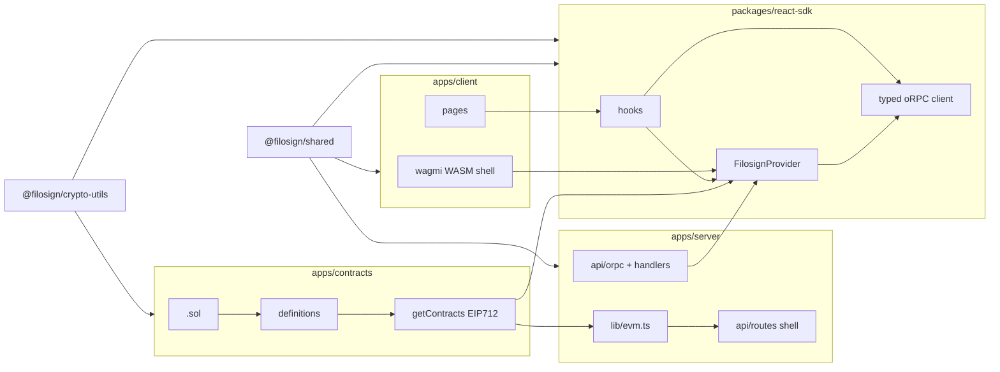

# AGENTS.md — Filosign

LLM/agent map: **packages**, **boundaries**, **data flow**, **[skills](#skills)**. Always read `[.cursor/rules/](.cursor/rules/)`; if repo rules conflict with this doc on the same detail, **narrow rule wins** until both change.

| Rule file                                                                 | Use                                                                                                 |
| ------------------------------------------------------------------------- | --------------------------------------------------------------------------------------------------- |
| [contracts-testing.mdc](.cursor/rules/contracts-testing.mdc)              | Before editing `apps/contracts/test/` or `src/*.sol` (see [TESTING.md](apps/contracts/TESTING.md)) |
| [preamble.mdc](.cursor/rules/preamble.mdc)                                | Discipline, `bun check`, `tsc`, tests                                                             |
| [apps/web/patterns.mdc](.cursor/rules/apps/web/patterns.mdc)              | `safe`/`tryCatch`, `respond`, Hono middleware, `lib/`                                               |
| [app.mdc](.cursor/rules/app.mdc)                                          | Never edit `apps/contracts/definitions/`** (generated)                                              |
| [apps/web/api-routes.mdc](.cursor/rules/apps/web/api-routes.mdc)          | Hono routes + SDK consumer pattern—see [API](#api)                                                  |

## Packages

| Path                    | npm                      | Role                                                                            |
| ----------------------- | ------------------------ | ------------------------------------------------------------------------------- |
| `apps/client`           | `@filosign/client`       | Vite UI, Privy/wagmi, Dilithium bootstrap—**thin**; logic via `@filosign/react` |
| `apps/server`           | `@filosign/server`       | Hono, Drizzle, Privy; **`rpc.runtime`** (`/api/rpc`), server-side `chainKey`/contracts |
| `apps/contracts`        | `@filosign/contracts`    | Solidity, `definitions/`, `getContracts`, EIP-712 helpers; **tests:** `apps/contracts/test/`, [TESTING.md](apps/contracts/TESTING.md)                       |
| `apps/astro`            | —                        | Marketing                                                                       |
| `packages/react-sdk`    | `@filosign/react`        | `FilosignProvider`, typed `rpc` (`RPCLink`), subtree **`rpcQuery`**, `FilosignSession`, hooks |
| `packages/shared`       | `@filosign/shared`       | Types, Zod, manifests, commitments (browser+server)                             |
| `packages/crypto-utils` | `@filosign/crypto-utils` | KEM, crypto, cold-invite; SDK + contracts tooling                               |
| `packages/test`         | `test`                   | Dev harness                                                                     |

Root `[package.json](package.json)`: workspaces `apps/`*, `packages/*`.

## Flow

- `getContracts({ client, chainKey })` ← `getDefinitionsEntry(chainKey)` → `[definitions/](apps/contracts/definitions/)`. Source: `[services/contracts.ts](apps/contracts/services/contracts.ts)`.
- Server: `[lib/evm.ts](apps/server/lib/evm.ts)` + `config.chainKey`.
- Browser: `[FilosignProvider.tsx](packages/react-sdk/src/context/FilosignProvider.tsx)` → `[rpc.runtime](packages/react-sdk/src/context/FilosignProvider.tsx)` → `chainKey` + wagmi → `getContracts`; typed calls via `[create-orpc-client.ts](packages/react-sdk/src/orpc/create-orpc-client.ts)` → `{apiBase}/api/rpc`.
- Shell: `[filosign-provider.tsx](apps/client/src/lib/context/filosign-provider.tsx)`—WASM, `useWalletClient()`, `VITE_PLATFORM_URL`.

## Boundaries

**HTTP:** Use `useFilosignContext().rpc` (and `session` where auth applies) + `@filosign/react/hooks`. No `fetch`/axios from `apps/client` to JSON API **except** narrow cases: blob/doc URL bytes (`[send-envelope.ts](apps/client/src/pages/dashboard/envelope/create/add-sign/send-envelope.ts)`), static assets (`[compliance-pdf-images.ts](apps/client/src/lib/utils/compliance-pdf/compliance-pdf-images.ts)`), and **direct `PUT` to URLs returned by `storage.presignPut`** (private object-store upload only—no API body proxy).

**Imports:** Client → minimal `@filosign/contracts` (`[constants.ts` mock-usdc](apps/client/src/constants.ts)); prefer SDK/runtime for new.

**Logic home:** UI `apps/client` | API+chain hooks `packages/react-sdk` | auth/DB/relay `apps/server`.

**Definitions:** Never hand-edit `definitions/`**; `definitions/*.ts` ABI/addresses are updated when you **deploy** (`hardhat run scripts/deploy.ts`); `bun run --cwd apps/contracts compile` only generates interfaces + Solidity artifacts. **Do not run `deploy` or `migrate*` without a green `apps/contracts` test run** — `migrate` scripts run `test` before `deploy`.

## Runtime

`FilosignProvider` calls **`rpc.runtime`** (procedure in `[api/orpc/router.ts](apps/server/api/orpc/router.ts)`, loader `[platform-runtime](apps/server/lib/domain/platform-runtime.ts)`). Server config aligns with `[config.ts](apps/server/config.ts)`.

## API

Mount in `[api/routes/router.ts](apps/server/api/routes/router.ts)`: **`optionalJwtWalletForOrpc`** + hybrid oRPC/OpenAPI middleware only (**no REST JSON carve-outs**). **JSON API** is **`/api/rpc`** (`[api/orpc/router.ts](apps/server/api/orpc/router.ts)` + `[api/handlers/](apps/server/api/handlers/)`). Cross-route logic lives under **`lib/domain/`** (e.g. [`lib/domain/sharing.ts`](apps/server/lib/domain/sharing.ts), [`lib/domain/file-invites.ts`](apps/server/lib/domain/file-invites.ts)). Align with [apps/web/api-routes.mdc](.cursor/rules/apps/web/api-routes.mdc).

### oRPC conventions (maintain consistency)

- **Output schemas:** Prefer concrete Zod **`.output` schemas per procedure** under [`api/orpc/schemas/`](apps/server/api/orpc/schemas/) rather than **`z.unknown()`**, so **`AppRouterClient` / `InferClientOutputs`** stay accurate end-to-end. Handlers remain the behavioral source of truth; schemas should match what they return (dates may need `string | Date` unions on the wire).

- **`createORPCClient` is a Proxy:** Any **string property access** is treated as another procedure segment. **`JSON.stringify`** (used by TanStack Query when hashing keys) invokes **`toJSON`** if present, which resolves to **`POST …/toJSON`** on the wire. **Do not put the `rpc` client (or nested proxies)** inside `queryKey` / payloads that get deeply stringified—use primitives (e.g. `apiBaseUrl`, wallet address) instead.

- **TanStack subtree keys:** `createFilosignRpcQueryUtils` builds **`@orpc/tanstack-query`** helpers under **`filosign` + domain** (e.g. `rpcQuery.users`, `rpcQuery.files`, `rpcQuery.storage`, …)—see `[rpc-query-utils.ts](packages/react-sdk/src/orpc/rpc-query-utils.ts)`.

- **Private object storage:** Browser **`fetch` PUT** to URLs from **`storage.presignPut`** (and file upload **`files.uploadStart`**) uploads bytes without proxying through the API. Keep **object keys** in Postgres; serve images via **`presigned GET`** in procedure handlers—not long-lived naked bucket URLs (**no `acl: public-read`** on PUT presign paths used here).

- **Optional JWT (Hono):** On **`/api/rpc`** and **`/api/api-reference`**, `optionalJwtWalletForOrpc` sets **`userWallet`** only when the Bearer verifies. **Malformed Bearer is ignored** (no pre-RPC `respond` JSON); protected procedures resolve **`UNAUTHORIZED`** via **`authenticatedProcedure`** in native oRPC form.

- **Hono hybrid middleware:** `[hono-mount.ts](apps/server/api/orpc/hono-mount.ts)` serves **`/api/rpc`** first, then **`/api/api-reference`**, otherwise **`next()`**. The **`proxyRawRequest`** wrapper avoids **`Request` body “already consumed”** if earlier middleware touched parsed body helpers.

## Lib choice

`@filosign/shared` — pure cross-env logic. `@filosign/crypto-utils` — crypto/WASM-adjacent.

## Vertical slice

1. Contracts: edit `apps/contracts/src` → `compile` (only pipeline updates `definitions/`). **Follow [apps/contracts/TESTING.md](apps/contracts/TESTING.md)** for Hardhat tests; keep Solidity and tests aligned in the same PR when behavior changes.
2. Server: **`/api/rpc`** oRPC (`api/orpc/`, `api/handlers/`) + thin **`api/routes`** middleware shell + `fsContracts` (`[evm.ts](apps/server/lib/evm.ts)`).
3. SDK: hooks + `useFilosignContext()`.
4. Client: UI + `@filosign/react` imports only.
5. Verify: preamble + `bun check`, tsc, `bun run test`, forge when contracts change.

Scripts: `web:dev:*`, `client:dev:*`, `server:dev:*`, `contracts:migrate`, `contracts:test`, GitHub Actions workflow `contracts.yml`, `db:push:*`, `test` (`[package.json](package.json)`).

## Commits

**Only when the user explicitly asks to commit** (see user rules for full git safety).

- **Batching:** Group by **feature/domain**; keep commits **atomic**. Target **≤4–5 files per commit** (stay roughly under five unrelated paths); if a change touches more, split into logical batches (e.g. tests vs docs vs generated defs).
- **Subject line (exact pattern):** `[SPRINT OR MAJOR FEATURE] - SUBFEATURE (<domain / package>): <concise description>`
  - **Brackets:** the **initiative or sprint** you are delivering (e.g. `CONTRACT TEST SUITE`, `COLD INVITE`) — not the package shorthand (`CONTRACTS`, `CLIENT`). Put **area** in the parenthetical after `SUBFEATURE`.
  - Example: `[CONTRACT TEST SUITE] - Fixtures and helpers (apps/contracts): shared deploy, EIP-712, chain time`.
  - Counter-example (avoid): `[CONTRACTS] - …` in brackets when `CONTRACTS` is only the package — use the **sprint name** instead.

  Older example for the same pattern: `[COLD INVITE] - Claim KEM wrap (server): persist participant on cold invite claim`.

## Skills

Attach /slash skills when task fits; often `~/.agents/skills/`.

| Skill                                                                             | Repo                      | When                                                                                                                                      |
| --------------------------------------------------------------------------------- | ------------------------- | ----------------------------------------------------------------------------------------------------------------------------------------- |
| [ETHSKILLS](https://ethskills.com/SKILL.md) (local: `~/.cursor/skills/ethskills`) | `apps/contracts`, onchain | Read [https://ethskills.com/SKILL.md](https://ethskills.com/SKILL.md) and follow it before writing Solidity or shipping anything onchain. |
| `/vercel-react-best-practices`                                                    | client, react-sdk         | perf, fetch/waterfalls, bundles                                                                                                           |
| `/vercel-composition-patterns`                                                    | client                    | compound components, fewer boolean props                                                                                                  |
| `/frontend-design`                                                                | client, astro             | net-new / redesign aesthetic                                                                                                              |
| `/web-design-guidelines`                                                          | TSX UI                    | a11y/interface review (skill may fetch remote rules)                                                                                      |
| `/develop-secure-contracts`                                                       | `apps/contracts`          | `*.sol`, OZ integration                                                                                                                   |
| `/copywriting`                                                                    | astro, client             | marketing, CTA, microcopy                                                                                                                 |
| `/playwright`                                                                     | E2E                       | browser CLI flow (skill’s wrapper)                                                                                                        |

### Impeccable for frontend design if needed

[impeccable.style/docs](https://impeccable.style/docs/): `/impeccable` — styling/critique only. **Create:** craft, impeccable, shape • **Evaluate:** audit, critique • **Refine:** animate, bolder, colorize, delight, layout, overdrive, quieter, typeset • **Simplify:** adapt, clarify, distill • **Harden:** harden, onboard, optimize, polish • **System:** document, extract, live, teach. Obey [design.mdc](.cursor/rules/apps/web/design.mdc); scoped passes.

