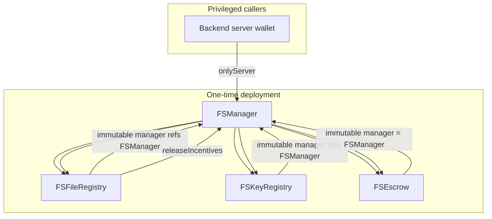

# `@filosign/contracts`

Solidity contracts for Filosign: document registration/signing (`**FSFileRegistry**`), cryptographic registration data (`**FSKeyRegistry**`), privileged orchestration (`**FSManager**`), ERC‑20 custody (`**FSEscrow**`), plus a Hardhat‑only `**MockUSDCToken**`.

---

## Contents

| Section                                                      | Audience                   |
| ------------------------------------------------------------ | -------------------------- |
| [Architecture](#architecture)                                | Everyone                   |
| [Where ERC‑20 is accounted](#where-erc20-is-accounted)       | Integrators                |
| [Contract roles](#contract-roles-and-wiring)                 | Engineers & agents         |
| [Cross-contract flows](#cross-contract-flows)                | Product & backends         |
| [Trust model](#trust-model)                                  | Risk / security            |
| [ERC‑20 guardrail](#erc20-token-guardrail)                   | Ops & future token listing |
| [This repo layout & scripts](#repository-layout-and-scripts) | Maintainers                |
| [Testing](#testing)                                        | Engineers & agents         |

---

## Architecture

Deployments are factory-style: `**FSManager**`’s constructor deploys `**FSFileRegistry**`, `**FSKeyRegistry**`, and `**FSEscrow**` and stores their addresses. Registry contracts hold an **immutable pointer** to the `**FSManager`** instance that created them (`msg.sender` in their constructors).

- **Funds** live only in `**FSEscrow`** as ERC‑20 balances.
- **Document and incentive semantics** (who signs, gross amounts per signer commitment, claimed flags, refund timestamps) live in `**FSFileRegistry`**.
- `**FSManager**` is the sole address that `**FSEscrow**` trusts to move vault assets; `**FSFileRegistry**` may call `**FSManager.releaseIncentives**` when the last signer’s signature completes the flow.

---

## Where ERC‑20 is accounted

| Layer                | What is stored                                                                       | Meaning                                                                                                                                                                                                                                                                                                                               |
| -------------------- | ------------------------------------------------------------------------------------ | ------------------------------------------------------------------------------------------------------------------------------------------------------------------------------------------------------------------------------------------------------------------------------------------------------------------------------------- |
| `**FSEscrow**`       | `balances[user][token]`, `totalLiabilities[token]`, `platformRevenue[token]`         | **Authoritative collateral accounting.** Deposits credit the **vault balance delta** from each `transferFrom` (not merely the requested pull size). Updates only through **`deposit`**, **`depositWithPermit`**, **`release`**, **`settleIncentiveRelease`**, **`withdrawPlatformRevenue`**, **`sweepStrayToken`**. |
| `**FSFileRegistry**` | Per-file `incentiveToken` / `incentiveAmount` / `incentiveClaimed` / refund schedule | **Declared incentive** per signer commitment (what the workflow records as the attach size). For **standard** ERC‑20s this matches what lands in escrow; for **deflationary/fee-on-transfer** tokens the registry can still show the requested gross while escrow credits **less**, and later settlement can **revert** (`InsufficientBalance`) if the sender’s ledger is short. |

**Operational nuance:** `**FSManager.attachIncentive**` tells the registry the **nominal** token/amount; escrow books **tokens actually received**. Keep the allowlist on **plain** ERC‑20s (e.g. USDC) so nominal and credited amounts stay aligned ([ERC‑20 guardrail](#erc20-token-guardrail)). See [`AUDIT.md`](./AUDIT.md).

Platform fee `**platformFeeBps`** is applied in `**FSEscrow.settleIncentiveRelease**` using the **manager’s fee at payout time**, not frozen at incentive attach (`FSManager.releaseIncentives` → escrow).

---

## Contract roles and wiring

### `FSManager`

| Responsibility                   | Detail                                                                                                                                                                                    |
| -------------------------------- | ----------------------------------------------------------------------------------------------------------------------------------------------------------------------------------------- |
| **Identity**                     | `server` (immutable deployer EOA/backend), `treasury` (immutable fee/stray sweep recipient).                                                                                              |
| **Registry admin**               | `onlyServer`: pause bitmask, fee bps caps, escrow policy (allowed tokens, blacklists, deposit caps), `approveSender`, incentives attach/refund, platform revenue withdrawal, stray sweep. |
| **Cross-contract orchestration** | Calls into `**FSFileRegistry`** (`setSignerIncentive`, clears, claimed flags path) and `**FSEscrow**` (deposit, release, settle with fee).                                                |
| **Delegates release**            | `releaseIncentives` callable by `**server`** **or** `**FSFileRegistry`** (when all signers signed) so payouts can finalize in one transaction with the final `registerFileSignature`.     |
| **EIP-712**                      | Domain name `**"FSManager"`**, version `**"1"**` — used for `**approveSender**` signatures (recover must equal `**recipient**`).                                                          |

### `FSFileRegistry`

| Responsibility            | Detail                                                                                                                                                                                                                                                          |
| ------------------------- | --------------------------------------------------------------------------------------------------------------------------------------------------------------------------------------------------------------------------------------------------------------- |
| **Document lifecycle**    | `registerFile` / `registerFileSignature` (`**onlyServer`**): server submits payloads that satisfy EIP-712 validations (nonce per sender/signing wallet); stores file state, signer set (by commitment), signatures.                                             |
| **Identifier**            | `cidIdentifier(string pieceCid) = keccak256(abi.encodePacked(pieceCid))`; all file state keyed by `**bytes32`** `cidId`.                                                                                                                                        |
| **Incentive bookkeeping** | `setSignerIncentive` / getters / `**markIncentiveClaimed`** / `**clearSignerIncentive**` (`**onlyManager**` = `**FSManager**` only).                                                                                                                            |
| **Completing signing**    | When `signaturesCount == signersCount`, validates commitment list hashes to stored commitment, then calls `**manager.releaseIncentives`**.                                                                                                                      |
| **EIP-712**               | Domain `**"FSFileRegistry"`**, version `**"1"**` — register/sign flows use `**nonce**` in struct hash (`nonce[sender]` / `nonce[signerWallet]` incremented after successful writes). Signature validity horizon: `**block.timestamp ≤ timestamp + 2 minutes**`. |

### `FSKeyRegistry`

| Responsibility         | Detail                                                                                                                                                  |
| ---------------------- | ------------------------------------------------------------------------------------------------------------------------------------------------------- |
| **Keygen commitments** | `registerKeygenData` (`**onlyServer`**): EIP-712 must recover `**walletAddress_**` — binds salts and post-quantum commitments on-chain for that wallet. |
| **Gate**               | `FSManager`/registry flows require sender/signer `**isRegistered`** where applicable via `**FSManager.isRegistered**` → registry read.                  |
| **EIP-712**            | Domain `**"FSKeyRegistry"`**, version `**"1"**`.                                                                                                        |

### `FSEscrow`

| Responsibility             | Detail                                                                                                                             |
| -------------------------- | ---------------------------------------------------------------------------------------------------------------------------------- |
| **Custody**                | Holds ERC‑20; `**onlyManager`** (`FSManager`) mutates ledger and transfers tokens. `**ReentrancyGuard**` + `**SafeERC20**`.        |
| `**allowedToken**`         | Deposits and platform withdrawals require token be allowlisted (`**manager**` configures via `**FSManager.setTokenAllowed**`).     |
| `**strayBalance` / sweep** | Balances exceeding `totalLiabilities + platformRevenue` treatable as accidents; `**FSManager`** can sweep stray to `**treasury**`. |

### `MockUSDCToken`

Local Hardhat: **USDC-shaped** (**6 decimals**), `**ERC20Permit`**,  `**Ownable**` `mint` — not for production.

---

## Cross-contract flows

### 1. User becomes signable on-chain

1. Server calls `**FSKeyRegistry.registerKeygenData**` with user’s EIP-712 signature over keygen fields.

### 2. File registered

1. Server calls `**FSFileRegistry.registerFile**` with sender’s registration signature; file row created, signer commitments registered.

### 3. Incentive attached (collateral moves)

1. Server calls `**FSManager.attachIncentive**` (or `**attachIncentiveWithPermit**`).
2. `**FSManager**` → `**FSFileRegistry.setSignerIncentive**` (records token, gross amount, refund delay anchor, memo hash).
3. `**FSManager**` → `**FSEscrow.deposit**` / `**depositWithPermit**`: pulls ERC‑20 from **file `sender`** and credits **`balances[sender][token]`** / **`totalLiabilities`** by the **vault’s balance increase** (delta).

### 4. Signers sign (server relay)

1. Server calls `**FSFileRegistry.registerFileSignature**` per signer; storage + nonce updates.
2. On the **last** signature, registry calls `**FSManager.releaseIncentives`**, which iterates commitments, marks claimed in registry, and calls `**FSEscrow.settleIncentiveRelease**` (net to payout, fee to `**platformRevenue**`).

### 5. Refund path (before all signed, after delay)

1. Server `**FSManager.refundSignerIncentive**` after registry checks and delay; registry clears incentive slot; escrow `**release**` gross back to **sender** (no platform fee on that path).

---

## Trust model

- `**server`** key compromise = full control over allowlist, pauses, attaching funds from senders (with approval/permit), payouts, refunds, fee rate (within cap), and treasury-stray routing. Design assumes a **controlled backend / custodial operator**.
- `**treasury`** cannot call contracts; it only **receives** withdrawals and sweeps as configured by `**server`** through `**FSManager**`.
- **Signers and senders** trust **EIP-712** payloads they sign and the **server** to relay honestly; on-chain code enforces nonces, commitments, and completion rules.

---

## ERC‑20 token guardrail

Escrow **deposit** paths credit **balance deltas**, so the vault ledger matches **tokens physically received** on each pull. **Still** keep the allowlist on **plain** ERC‑20 behaviour (e.g. canonical USDC): **`FSFileRegistry`** stores the **nominal** attach amount from the server/manager, which can **diverge** from credited escrow if a token is fee-on-transfer or otherwise non-standard—then refunds/settlement can fail until policy or product fixes the mismatch. **Rebasing** tokens remain **unsupported** without bespoke design. See **`AUDIT.md`**.

---

## Testing

Hardhat + viem tests live in **[`test/`](./test/)**. **Read [`TESTING.md`](./TESTING.md)** before changing tests or Solidity behavior (chain time, viem encodings, hex fixtures, deploy gate).

Run locally during development, in CI on every PR, and note that **`migrate` / `migrate:testnet` / `migrate:mainnet` run the full test suite before `deploy`**.

---

## Repository layout and scripts

| Path                                   | Purpose                                                                                                      |
| -------------------------------------- | ------------------------------------------------------------------------------------------------------------ |
| `[src/](./src/)`                       | Solidity sources and hand-maintained `**errors/**`                                                           |
| `[src/interfaces/](./src/interfaces/)` | **Generated** Solidity interfaces (`bun run gen:interfaces` / `scripts/interfaces.ts`) — do not edit by hand |
| `[definitions/](./definitions/)`       | **Deployed-address + ABI** TS modules (**updated by deploy**, not compile only)                              |
| `[services/](./services/)`             | TypeScript `**getContracts`**, EIP-712 helpers, piece-CID utils                                              |
| `[exports.ts](./exports.ts)`           | Package public API                                                                                           |

| Command                            | Runs                                                                                             |
| ---------------------------------- | ------------------------------------------------------------------------------------------------ |
| `bun run compile`                  | Interface generation + `hardhat compile`                                                         |
| `bun run test`                     | `compile` + **`hardhat test`** (required to pass before deploy via `migrate` scripts)             |
| `bun run deploy` (+ network flags) | `[scripts/deploy.ts](./scripts/deploy.ts)` — writes `**definitions/**` (+ local `**mock-usdc**`) |
| `bun run migrate` (+ variants)     | **`test` then `deploy`** (with env file) — deploy is skipped if tests fail                         |
| `bun run check-types`              | `tsc --noEmit`                                                                                   |

**Consumers elsewhere in the monorepo:** `@filosign/react` `**getContracts`**, `apps/server` server-side contracts, `**AGENTS.md**` at repo root maps full data flow across packages.