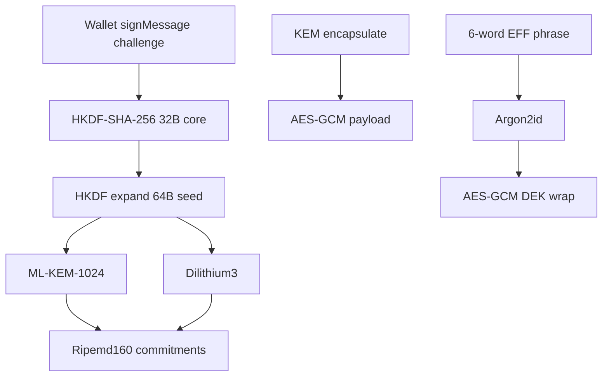

# `@filosign/crypto-utils`

ML-KEM-1024, Dilithium3, AES-GCM, wallet-bound key derivation, and cold-invite phrase wrapping for Filosign.

> **Audience:** contributors and AI agents. Read this before changing crypto primitives or adding exports.

## Quick rules

1. **Browser:** `@filosign/crypto-utils` — KEM via `mlkem`, Dilithium via [`assets/dilithium.wasm`](assets/dilithium.wasm) + [`loadBrowserDilithium`](src/browser/load-dilithium.ts), cold-invite via `argon2-browser`.
2. **Server / shared:** `@filosign/crypto-utils/node` — same algorithms; KEM via `crystals-kyber-js` (same v2.5.0 impl as `mlkem`). **No cold-invite** on `/node`.
3. **Do not change** `computeCommitment([publicKey.toString()])` encoding — on-chain commitments depend on it.
4. **Real Argon2id** is only in [`cold-invite.ts`](src/cold-invite.ts) (`COLD_INVITE_ARGON_PARAMS`). Do not confuse with removed legacy Keccak helpers.
5. **Changes:** add tests in [`lib.test.ts`](lib.test.ts) → run `bun test` in this package.

Context: root [`AGENTS.md`](../../AGENTS.md), consumers in [`packages/react-sdk`](../react-sdk).

---

## Exports

| Entry | Use |
|-------|-----|
| `@filosign/crypto-utils` | Client / SDK: default `{ encryption, hash, KEM, signatures, …utils }`, plus cold-invite named exports |
| `@filosign/crypto-utils/node` | Server / shared: same surface **without** `wrapColdInviteDek` / `unwrapColdInviteDek` |
| `@filosign/crypto-utils/browser/dilithium` | `loadBrowserDilithium()` for FilosignProvider |
| `@filosign/crypto-utils/dilithium.wasm` | Canonical Dilithium WASM (synced from `dilithium-crystals-js` on `bun install`) |

### Default namespace

| Module | Functions |
|--------|-----------|
| `KEM` | `keyGen({ seed: Uint8Array(64) })`, `encapsulate`, `decapsulate` |
| `signatures` | `dilithiumInstance()` (node only), `keyGen`, `sign`, `verify` — signs **Keccak-256 digest** of message |
| `encryption` | `encrypt` / `decrypt` — HKDF-SHA-512 → AES-GCM-256; ciphertext = `iv(12) ‖ ct` |
| `hash` | `digest` (Keccak256 for strings/bytes) — used internally by Dilithium |
| `utils` (spread + named) | See below |

### Named utils (also on default export)

| Export | Role |
|--------|------|
| `walletKeyGen` | Register: random salts → wallet `signMessage` → seed → KEM + Dilithium keypairs + commitments |
| `seedKeyGen` | Login/recovery: 64-byte seed → keypairs + commitments |
| `deriveDeterministicSeed32` / `deriveDeterministicSeed32FromSignature` | HKDF core 32B from wallet signature + salts |
| `expandDeterministicSeed` | HKDF expand to 64B seed for KEM/Dilithium |
| `generateRegisterChallenge` | `filosign:${address}:${salt}:${info}` |
| `computeCommitment` | `ripemd160(encodePacked(...))` — pubkey via `.toString()` on `Uint8Array` |
| `randomBytes`, `randomHex`, `toBytes`, `toHex` | Helpers (viem-aligned) |
| `jsonStringify` | Stable JSON for signing payloads (**plain objects only**; bigints normalized) |

### Cold invite (web entry only)

| Export | Role |
|--------|------|
| `generateColdInvitePhrase` | 6 EFF words, hyphen-separated (~77.6 bits + Argon2id) |
| `normalizeColdInvitePhrase` | User input normalization |
| `wrapColdInviteDek` / `unwrapColdInviteDek` | Argon2id + AES-GCM wrap of file DEK (`info`: `filosign:cold-invite-dek-v2`) |
| `COLD_INVITE_ARGON_PARAMS` | `{ memory: 64*1024 KiB, time: 3, parallelism: 1, hashLen: 32 }` |

---

## Cryptographic model



**HKDF info strings (do not rename without migration):**

- `filosign-keygen-v2` — register challenge context
- `fs-key-seed-core-v2` — seed core derivation
- `fs-key-seed-expand-v1` — 64-byte expand
- `filosign:cold-invite-dek-v2` — cold-invite DEK wrap
- Per-file encryption `info` — set in SDK hooks (e.g. piece CID + address)

**KEM packages:** Browser [`mlkem`](src/impl/browser/KEM.ts) and node [`crystals-kyber-js`](src/impl/node/KEM.ts) are the **same ML-KEM 1024 implementation** (v2.5.0). `utils.ts` imports the node module; the web entry re-exports browser `KEM` for encapsulation. Keep versions pinned together.

---

## Layout

```
src/
  lib-web.ts          # Browser entry
  lib-node.ts         # Node entry
  cold-invite.ts      # Phrase + Argon2id wrap (web only)
  constants.ts        # DILITHIUM_KIND
  assets/             # dilithium.wasm (sync:wasm)
  browser/            # loadBrowserDilithium
  impl/browser/       # mlkem + dilithium types
  impl/node/          # crystals-kyber-js, encryption, hash, utils, signatures
lib.test.ts           # bun test
```

---

## Development

```bash
bun install            # runs sync:wasm → assets/dilithium.wasm
bun test lib.test.ts   # from packages/crypto-utils
bun run sync:wasm      # refresh WASM after dilithium-crystals-js bump
```

Root CI does not yet run this package by default — run locally when touching crypto.

## License

AGPL-3.0-or-later
