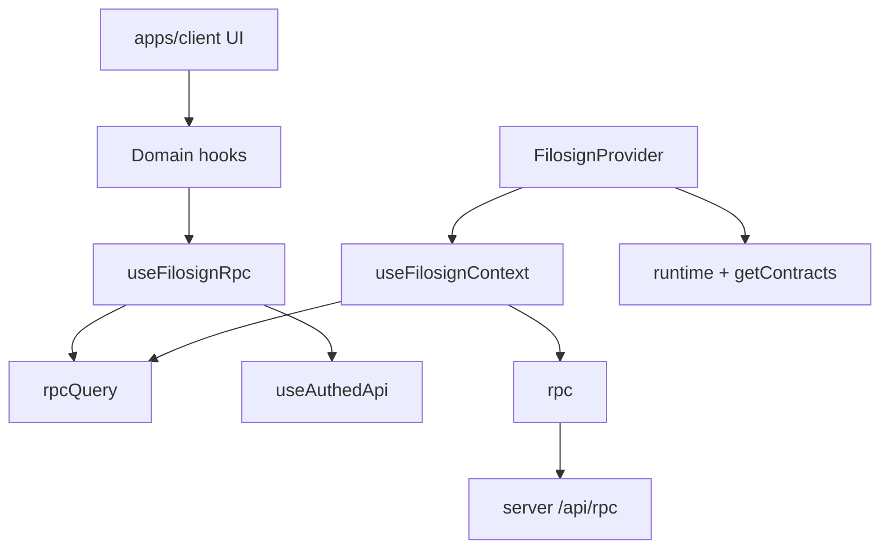

# `@filosign/react`

React SDK: **`FilosignProvider`**, typed **oRPC**, TanStack Query hooks, wallet/session/crypto. Primary consumer: **`apps/client`** (thin UI; logic lives here).

> **Audience:** contributors and AI agents. Read this before adding hooks, exports, or client API wiring.

## Quick rules

1. **API hooks:** `useFilosignRpc()` + `rpcQuery.*.queryOptions()` / `.call()`; `enabled: isAuthed` (or document public procedures).
2. **Invalidate:** `rpcQuery.<domain>.<procedure>.key()` (or parent `.key()`); profile → `useInvalidateUserProfile()`. **`filosignKeys`** only for wallet / on-chain / session—not for oRPC lists.
3. **Apps:** import `@filosign/react/{auth,files,sharing,users}` (+ `/utils`, `/runtime` if needed)—no `/hooks` barrel, no `@filosign/react/src/...`, no `fetch` to `/api/rpc`.
4. **Changes:** server procedure first → hook in matching `src/hooks/<domain>/` → client import → `turbo run check-types --filter=@filosign/client`.
5. **Never** put `rpc` inside a `queryKey` (proxy + `JSON.stringify` hazard—see root [`AGENTS.md`](../../AGENTS.md)).

Deeper context: [`AGENTS.md`](../../AGENTS.md), [api-routes.mdc](../../.cursor/rules/apps/web/api-routes.mdc).

---

## Monorepo role

| Package | Role |
|---------|------|
| [`apps/server`](../../apps/server) | API source of truth—[`api/orpc/router.ts`](../../apps/server/api/orpc/router.ts); types via [`app-router-types.ts`](src/orpc/app-router-types.ts) (`AppRouterClient`). Prefer concrete `.output` schemas in `api/orpc/schemas/`. |
| [`@filosign/shared`](../../packages/shared) | Zod, commitments, pure helpers—not HTTP. |
| [`@filosign/crypto-utils`](../../packages/crypto-utils) | KEM, Dilithium, encryption inside hooks. |
| [`@filosign/contracts`](../../apps/contracts) | `getContracts`, EIP-712; on-chain via context `contracts`. |
| [`apps/client`](../../apps/client) | Wraps provider ([`filosign-provider.tsx`](../../apps/client/src/lib/context/filosign-provider.tsx)): `apiBaseUrl`, wagmi `wallet`, `wasm.dilithium`. `ready` after `runtime` + `chainKey`. |

**Owns:** browser RPC, React Query hooks, session seed, provider, **client PostHog** (`src/analytics/`). **Not:** Hono/DB, contracts source, page UI.

**Analytics:** `FilosignAnalyticsProvider`, `useCaptureAppEvent`, `CLIENT_ANALYTICS_EVENTS` — see [`apps/server/lib/analytics/README.md`](../../apps/server/lib/analytics/README.md) (full catalog: server + client events).

---

## Public exports

| Subpath | Purpose |
|---------|---------|
| `@filosign/react` | `FilosignProvider`, `useFilosignContext` (`rpc`, `rpcQuery`, `session`, `contracts`, `runtime`, `wallet`, `wasm`) |
| `@filosign/react/auth` | Login, logout, `useAuthedApi`, registration, recovery |
| `@filosign/react/files` | Documents, cold invite, sign/ack/view/send |
| `@filosign/react/sharing` | Connections, approvals, requests |
| `@filosign/react/users` | Profile, Privy email, lookup |
| `@filosign/react/runtime` | `useRuntimeChain` |
| `@filosign/react/utils` | Piece CID, cold-invite envelope, crypto helpers |

`useFilosignRpc` is **internal** (hooks import from `src/lib/`); apps use domain hooks only.

---

## Data flow



1. Provider loads **`runtime`** (`rpcQuery.runtime`), then **`getContracts({ chainKey })`**.
2. **`FilosignSession`** stores JWT; `rpc` sends `Authorization` when set.
3. **`useAuthedApi`** runs wallet crypto + `auth.nonce` / `auth.verify` via `rpcQuery.auth.*.call`.
4. Feature hooks: **`useFilosignRpc()`** → `rpcQuery` + `isAuthed`.

TanStack helpers: [`src/orpc/rpc-query-utils.ts`](src/orpc/rpc-query-utils.ts) (`["filosign", …]` prefix).

---

## `rpcQuery` patterns

### Query

```ts
const { rpcQuery, isAuthed } = useFilosignRpc();

return useQuery({
  ...rpcQuery.users.profile.me.queryOptions(),
  enabled: isAuthed,
  staleTime: 1 * DAY,
  select: (data) => data.someField, // optional
});
```

Types: `InferClientOutputs<AppRouterClient>["users"]["profile"]["me"]`.

### Mutation

Custom `mutationFn` when adding crypto, EIP-712, or presigned `fetch`. Call **`rpcQuery.<path>.call(input)`**.

```ts
return useMutation({
  mutationFn: async (args) => {
    if (!isAuthed) throw new Error("Not authenticated");
    return rpcQuery.users.profile.update.call(payload);
  },
  onSuccess: () => invalidateUser(),
});
```

If `mutate` takes a different shape than procedure input (e.g. `string` vs `{ id }`), **do not** spread `...mutationOptions()`—use explicit `mutationFn` + `.call()`.

### Cache keys ([`filosignKeys`](src/lib/query-keys.ts))

Non-RPC only: `useAuthedApi`, `useIsLoggedIn`, `useIsRegistered`, `useStoredKeygenData`, on-chain approval caches (**`isApprovedDependentFirst` vs `isApprovedWalletFirst`—argument order differs**), `useDocumentIncentive`.

---

## Edge cases (not plain `queryOptions`)

| Case | Pattern |
|------|---------|
| JWT bootstrap | [`useAuthedApi`](src/hooks/auth/useAuthedApi.ts)—not a normal query |
| On-chain | `contracts.*.read` |
| Session seed | In-memory [`session-seed.ts`](src/hooks/auth/session-seed.ts)—never `sessionStorage` |
| Uploads | `rpcQuery.storage.presignPut.call` → **`fetch` PUT** to URL |
| File bytes | Presigned GET / Filecoin in `useViewFile` |
| Composite | e.g. `useAcceptedPeople`—multiple `.call` in one `queryFn` |
| Profile email | Keep **separate** RPCs/hooks: `profile.update` (fields/avatar), `syncPrivyEmail`, `setPrimaryEmail`; shared `useInvalidateUserProfile()` |

---

## Hook checklist

1. Add/update procedure + Zod output on server.
2. Hook under `src/hooks/{auth,files,sharing,users}/`; export from domain `index.ts` if apps need it.
3. `useFilosignRpc` + `rpcQuery`; gate with `isAuthed` unless public.
4. Invalidate with `rpcQuery.*.key()` or `filosignKeys` as appropriate.
5. Client: `@filosign/react/<domain>` only.
6. `turbo run check-types --filter=@filosign/react`; `bun run check:ci` (or scoped Biome on changed paths).

---

## Anti-patterns (not covered above)

| Avoid | Instead |
|-------|---------|
| `z.parse` on RPC when router has `.output` | `InferClientOutputs<AppRouterClient>` |
| Exporting internals (`useStoredKeygenData`) | Keep module-private unless apps require |
| God hook / merged profile RPC | Separate hooks per procedure semantics |
| Re-exporting server handlers | Types via `app-router-types.ts` only |

---

## Layout

```
index.ts              # Provider + context
package.json          # domain exports
src/context/          # FilosignProvider
src/orpc/             # client, rpc-query-utils, AppRouterClient
src/hooks/{auth,files,sharing,users}/
src/lib/              # use-filosign-rpc, query-keys, invalidate-user-profile
src/utils/
src/constants.ts      # DAY, MINUTE
```

No package-level `test` script yet—rely on client typecheck and manual flows.
